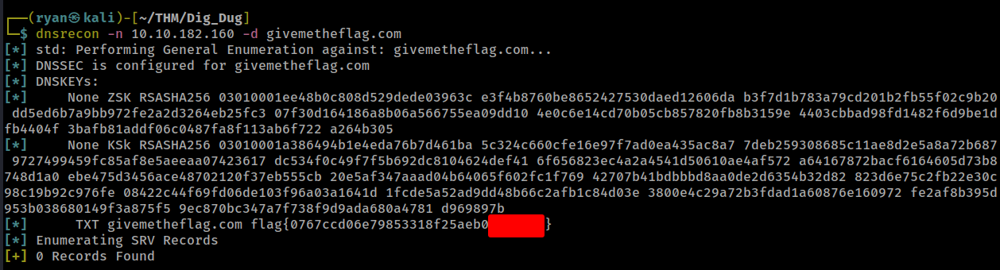

# THM - Dig Dug

#### Ip: 10.10.182.160
#### Name: Dig Dug
#### Difficulty: Easy

----------------------------------------------------------------------


```text
Oooh, turns out, this 10.10.182.160 machine is also a DNS server! If we could dig into it, I am sure we could find some interesting records! But... it seems weird, this only responds to a special type of request for a givemetheflag.com domain?
```

Using dig lets see if we can get any information from the IP:

```text
┌──(ryan㉿kali)-[~/THM/Dig_Dug]
└─$ dig 10.10.182.160              

; <<>> DiG 9.18.12-1-Debian <<>> 10.10.182.160
;; global options: +cmd
;; Got answer:
;; ->>HEADER<<- opcode: QUERY, status: NOERROR, id: 4211
;; flags: qr rd ra; QUERY: 1, ANSWER: 1, AUTHORITY: 0, ADDITIONAL: 1

;; OPT PSEUDOSECTION:
; EDNS: version: 0, flags:; MBZ: 0x0005, udp: 4096
;; QUESTION SECTION:
;10.10.182.160.			IN	A

;; ANSWER SECTION:
10.10.182.160.		5	IN	A	10.10.182.160

;; Query time: 12 msec
;; SERVER: 172.16.169.2#53(172.16.169.2) (UDP)
;; WHEN: Thu Sep 14 10:41:12 CDT 2023
;; MSG SIZE  rcvd: 58
```

Lets modify the command to target the specific domain givemetheflag.com:

```text
┌──(ryan㉿kali)-[~/THM/Dig_Dug]
└─$ dig givemetheflag.com @10.10.182.160
```

Nice that gives us the flag:


If for some reason dig wasn't available to us we could also access the flag using dnsrecon:



Thanks for following along!

-Ryan

------------------------------------------------------------------

