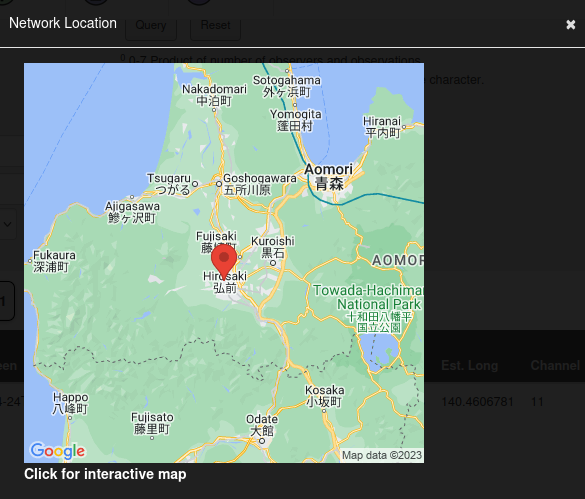

# THM - Sakura Room

#### Name: Sakura Room
#### Rating: Easy

----------------------------------------------------------------------


## INTRODUCTION 

```text
Background

This room is designed to test a wide variety of different OSINT techniques. With a bit of research, most beginner OSINT practitioners should be able to complete these challenges. This room will take you through a sample OSINT investigation in which you will be asked to identify a number of identifiers and other pieces of information in order to help catch a cybercriminal. Each section will include some pretext to help guide you in the right direction, as well as one or more questions that need to be answered in order to continue on with the investigation. Although all of the flags are staged, this room was created using working knowledge from having led and assisted in OSINT investigations both in the public and private sector. 
```

## TIP-OFF 

```text
Background

The OSINT Dojo recently found themselves the victim of a cyber attack. It seems that there is no major damage, and there does not appear to be any other significant indicators of compromise on any of our systems. However during forensic analysis our admins found an image left behind by the cybercriminals. Perhaps it contains some clues that could allow us to determine who the attackers were? 

We've copied the image left by the attacker, you can view it in your browser here.
```

### What username does the attacker go by?

Following the provided link to the image, I find this picture:


I am able to download it and run exiftool for the first question:


## RECONNAISSANCE

```text
Background

It appears that our attacker made a fatal mistake in their operational security. They seem to have reused their username across other social media platforms as well. This should make it far easier for us to gather additional information on them by locating their other social media accounts. 
```

### What is the full email address used by the attacker?

Googling the found username I find a Github page with a public PGP key in it. I can copy and paste that key block into my terminal and decode it from base64 to drop the email address associated with it:


### What is the attacker's full real name?

Finding a Twitter account, we come across this tweet, which we can confirm to be the target's name:

```text
Aiko
@SakuraLoverAiko
·
Jan 29, 2021
Silly me, I forgot to introduce myself!

Hi there! I'm @AikoAbe3!
```

## UNVEIL 

```text
Background

It seems the cybercriminal is aware that we are on to them. As we were investigating into their Github account we observed indicators that the account owner had already begun editing and deleting information in order to throw us off their trail. It is likely that they were removing this information because it contained some sort of data that would add to our investigation. Perhaps there is a way to retrieve the original information that they provided?
```

### What cryptocurrency does the attacker own a cryptocurrency wallet for?

Going back to Github we find a repo called 'ETH' which stands for Ethereum


### What is the attacker's cryptocurrency wallet address?

In the same ETH repo we can take a look at the commit history and see they had their ETH wallet hardoced at one point:


### What mining pool did the attacker receive payments from on January 23, 2021 UTC?

Similarly, the same edit also shows which mining pool was used:


### What other cryptocurrency did the attacker exchange with using their cryptocurrency wallet?

Searching for this wallet in Google we are brought to etherscan.io which shows transactions from another cryptocurrency:


## TAUNT
```text
Just as we thought, the cybercriminal is fully aware that we are gathering information about them after their attack. They were even so brazen as to message the OSINT Dojo on Twitter and taunt us for our efforts. The Twitter account which they used appears to use a different username than what we were previously tracking, maybe there is some additional information we can locate to get an idea of where they are heading to next?

We've taken a screenshot of the message sent to us by the attacker, you can view it in your browser here.
```

### What is the attacker's current Twitter handle?

Searching for the Twitter handle in the provided picture leads us to their current username:


### What is the URL for the location where the attacker saved their WiFi  SSIDs and passwords?

I actually found a post on the target's Twitter saying this account was down, and to go with the hint. Using the hint I find:

```text
deepv2w7p33xa4pwxzwi2ps4j62gfxpyp44ezjbmpttxz3owlsp4ljid.onion/show.php?md5=b2b37b3c106eb3f86e2340a3050968e2
```
### What is the BSSID for the attacker's Home WiFi?

From the question above I also knew the target's SSID, and was able to search for that in Wigle:


## HOMEBOUND 
```text
Background

Based on their tweets, it appears our cybercriminal is indeed heading home as they claimed. Their Twitter account seems to have plenty of photos which should allow us to piece together their route back home. If we follow the trail of breadcrumbs they left behind, we should be able to track their movements from one location to the next back all the way to their final destination. Once we can identify their final stops, we can identify which law enforcement organization we should forward our findings to.
```

### What airport is closest to the location the attacker shared a photo from prior to getting on their flight?

Looking back at the Tweet `Checking out some last minute cherry blossoms before heading home!` we see a picture with some cherry orchards and a monument in the background. This appears to be the Washington Munument in the US. 


Pulling up Google Maps and searching for the monument in Washington DC, we can also find a nearby airport:


And one more quick search for the correct answer format:


### What airport did the attacker have their last layover in?

For this we find another picture on Twitter


Which a quick Google shows us to be at Haneda Airport:


### What lake can be seen in the map shared by the attacker as they were on their final flight home?

For this question we take a look at the tweet `Sooo close to home! Can't wait to finally be back! :)` with a map of Japan. Pulling up Google Maps we can quickly find the name of the lake in the tweet:


### What city does the attacker likely consider "home"?

Going back to wigle.net we can take a closer look at the BSSID address and pinpoint the target's home city:



And that's that, thanks for following along!

-Ryan 

-----------------------------------------------------------------
