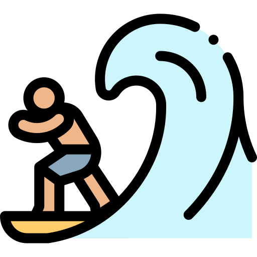
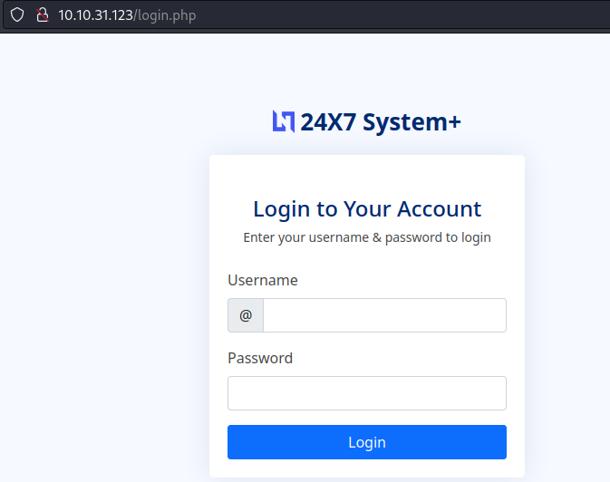
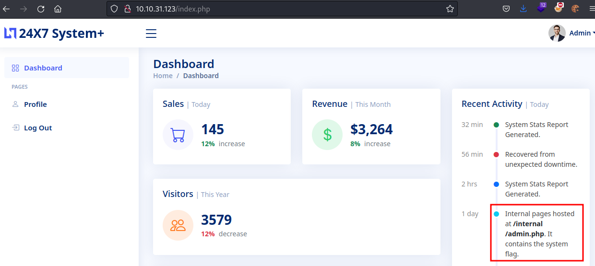
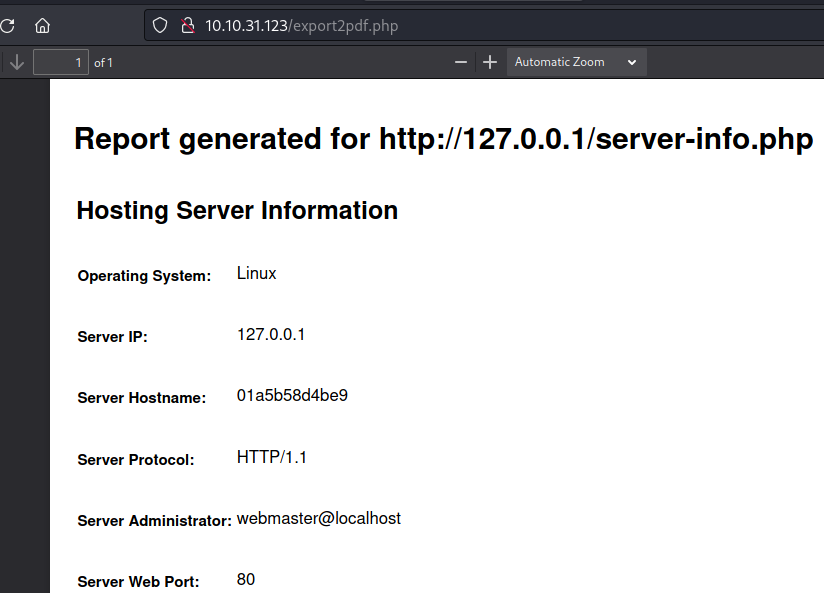
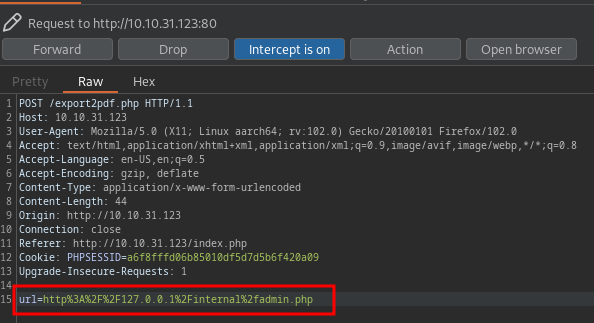
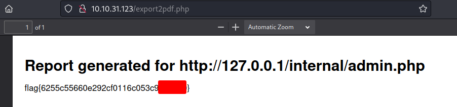

# THM - Surfer

#### Ip: 10.10.31.123
#### Name: Surfer
#### Rating: Easy

------------------------------------------------



#### Enumeration

I'll begin enumerating this box by scanning all TCP ports with Nmap and use the `--min-rate 10000` flag to speed things up. I'll also use the `-sC` and `-sV` to use basic Nmap scripts and to enumerate versions:

```
┌──(ryan㉿kali)-[~/THM/Surfer]
└─$ sudo nmap -p- --min-rate 10000 -sC -sV 10.10.31.123
[sudo] password for ryan: 
Starting Nmap 7.93 ( https://nmap.org ) at 2025-01-03 10:11 CST
Nmap scan report for 10.10.31.123
Host is up (0.13s latency).
Not shown: 65533 closed tcp ports (reset)
PORT   STATE SERVICE VERSION
22/tcp open  ssh     OpenSSH 8.2p1 Ubuntu 4ubuntu0.4 (Ubuntu Linux; protocol 2.0)
| ssh-hostkey: 
|   3072 34087073a982faf8c46d0ed799d7c77e (RSA)
|   256 f320e32130826e39af7a9aff78ee5bbc (ECDSA)
|_  256 beff538cdb88dae2020de25126588e72 (ED25519)
80/tcp open  http    Apache httpd 2.4.38 ((Debian))
| http-robots.txt: 1 disallowed entry 
|_/backup/chat.txt
| http-cookie-flags: 
|   /: 
|     PHPSESSID: 
|_      httponly flag not set
| http-title: 24X7 System+
|_Requested resource was /login.php
|_http-server-header: Apache/2.4.38 (Debian)
Service Info: OS: Linux; CPE: cpe:/o:linux:linux_kernel

Service detection performed. Please report any incorrect results at https://nmap.org/submit/ .
Nmap done: 1 IP address (1 host up) scanned in 19.54 seconds
```

Looking at the robots.txt entry found by Nmap we find this chat:

```
Admin: I have finished setting up the new export2pdf tool.
Kate: Thanks, we will require daily system reports in pdf format.
Admin: Yes, I am updated about that.
Kate: Have you finished adding the internal server.
Admin: Yes, it should be serving flag from now.
Kate: Also Don't forget to change the creds, plz stop using your username as password.
Kate: Hello.. ?
```

Looking at the site on port 80 we are directed to `/login.php` and there is a 24x7 System+ login screen:



Luckily we can login with the credentials `admin:admin`:



Here we also see the note:

```
Internal pages hosted at /internal/admin.php. It contains the system flag.
```

Trying to simply navigate to this endpoint in the browser we get the error:

```
This page can only be accessed locally.
```

Scrolling to the bottom of the page we find the export2pdf feature mentioned in the chat:


If we click on this a PDF of server information for localhost is generated:



Let's capture this in Burp and manually update the endpoint to `/internal/admin.php` to try retriving the flag:



Forwarding the request we find the challenge's flag in the newly created PDF:



Thanks for following along!

-Ryan

------------------------------------------------------
